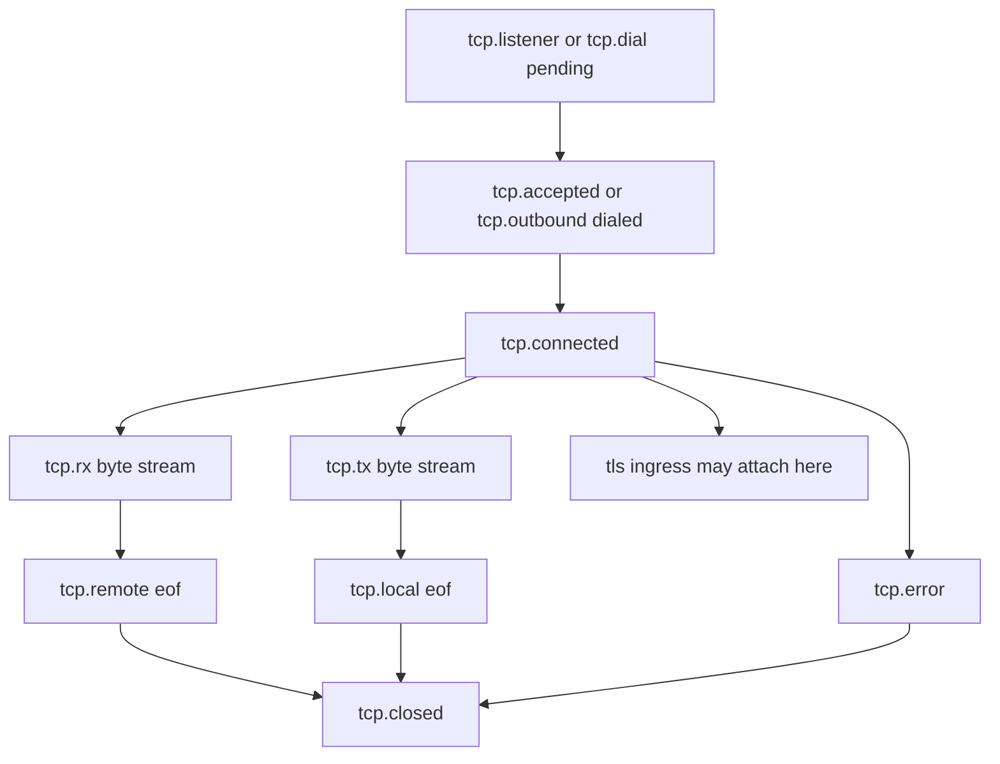
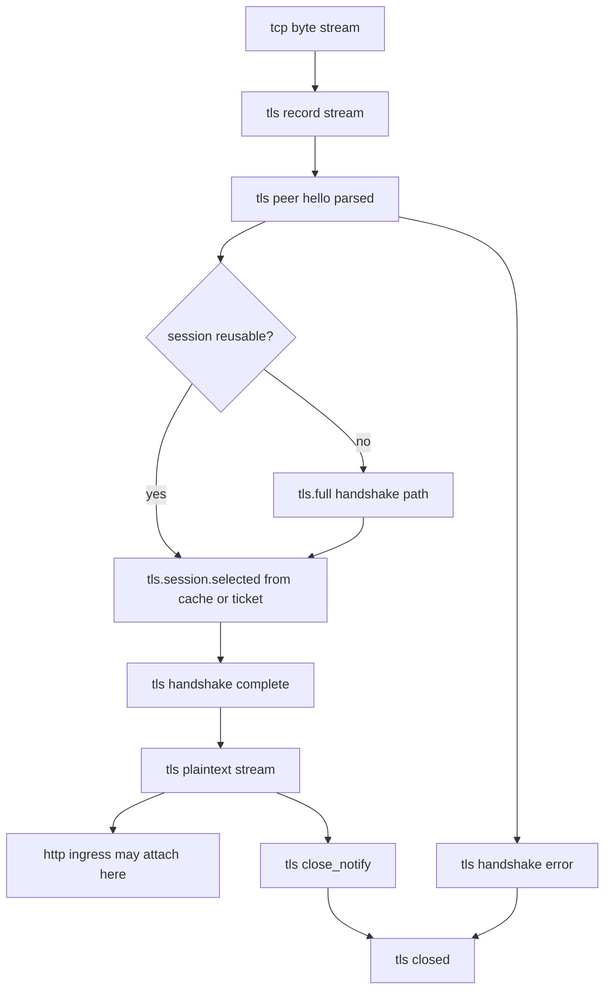
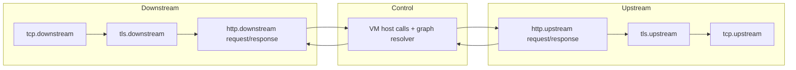

# pd-edge

`pd-edge` is the edge runtime crate for running VM programs at the edge.

This crate now ships two binaries with different scopes:

- `pd-edge-http-proxy`: full HTTP data plane runtime (proxy path + admin API + optional active control-plane client)
- `pd-edge-console`: interactive local console runtime (stdin/stdout/stderr host APIs + optional active control-plane client)

## Contents

- [Binary Scope](#binary-scope)
  - [pd-edge-http-proxy](#pd-edge-http-proxy)
  - [pd-edge-console](#pd-edge-console)
- [Quick Start](#quick-start)
  - [HTTP Proxy Mode](#http-proxy-mode)
  - [Console Mode](#console-mode)
- [HTTP Proxy Admin API](#http-proxy-admin-api)
- [CLI](#cli)
  - [pd-edge-http-proxy](#pd-edge-http-proxy-1)
  - [pd-edge-console](#pd-edge-console-1)
- [Active Control-Plane RPC](#active-control-plane-rpc)
  - [Example](#example)
- [HTTP Proxy Performance Framework](#http-proxy-performance-framework)
  - [Latest Snapshot (2026-03-11, Local Windows x86_64 Dev Machine)](#latest-snapshot-2026-03-11-local-windows-x8664-dev-machine)
- [Layered DAGs](#layered-dags)
- [ABI Source of Truth](#abi-source-of-truth)
- [Release Artifacts](#release-artifacts)
- [Docker](#docker)
- [Codebase Layout](#codebase-layout)

## Binary Scope

### `pd-edge-http-proxy`

- Handles HTTP traffic on a data plane listener
- Exposes local admin APIs for program upload, health, metrics, telemetry, and debug session lifecycle
- Can run standalone (admin upload only) or with active control-plane RPC
- Registers HTTP host ABI + runtime host ABI + built-in IO overrides

Default listeners:

- Data plane: `0.0.0.0:8080`
- Admin API: `127.0.0.1:8081`

### `pd-edge-console`

- No HTTP proxy listeners
- Runs an interactive shell to load and execute VM programs locally
- Supports console host APIs: `console::stdin::read_line()`, `console::stdin::read_all()`, `console::stdout::write(text)`, `console::stdout::flush()`, `console::stderr::write(text)`, `console::stderr::flush()`
- Registers runtime host ABI (`runtime::sleep`, `rate_limit::allow`) plus the console host APIs above

## Quick Start

### HTTP Proxy Mode

1. Start proxy + admin endpoints:

```powershell
cargo run -p pd-edge --bin pd-edge-http-proxy
```

2. Compile and upload sample program:

```powershell
cargo run -p pd-edge --example build_sample_program
```

3. Send traffic to data plane:

```powershell
curl -i "http://127.0.0.1:8080/anything" -H "x-client-id: demo-client"
```

The sample program in `examples/sample_proxy_program.*` uses `rate_limit::allow` and writes response headers/body via `http::response::*`.

### Console Mode

Start the interactive console:

```powershell
cargo run -p pd-edge --bin pd-edge-console
```

Optional: preload a local source or `.vmbc` program:

```powershell
cargo run -p pd-edge --bin pd-edge-console -- --program path\to\program.rss
```

Interactive commands:

- `.help`
- `.status`
- `.load <PATH>`
- `.run`
- `.quit`

## HTTP Proxy Admin API

Admin endpoints are served by `pd-edge-http-proxy` only:

- `PUT /program` (requires `content-type: application/octet-stream`)
- `GET /healthz`
- `GET /metrics`
- `GET /telemetry`
- `PUT /debug/session`
- `GET /debug/session`
- `DELETE /debug/session`

Program upload limit defaults to `1048576` bytes and can be changed with `--max-program-bytes`.

## CLI

### `pd-edge-http-proxy`

```text
Usage: pd-edge-http-proxy [options]

--proxy-addr <ADDR>                   Proxy/data-plane listen address (default: 0.0.0.0:8080)
--data-addr <ADDR>                    Alias for --proxy-addr
--admin-addr <ADDR>                   Admin listen address (default: 127.0.0.1:8081)
--max-program-bytes <BYTES>           Max program/upload size in bytes (default: 1048576)
--vm-fuel <UNITS>                     Enable cooperative VM fuel slices per request
--vm-fuel-check-interval <OPS>        Fuel check interval when --vm-fuel is enabled (default: 1)
--vm-epoch-deadline <TICKS>           Enable cooperative VM epoch slices per request (1 tick = 1ms wall clock)
--vm-epoch-check-interval <OPS>       Epoch check interval when --vm-epoch-deadline is enabled (default: 1)
--vm-execution-mode <MODE>            VM execution mode: async|threading (default: async)
--control-plane-url <URL>             Enable active control-plane RPC client
--edge-id <UUID>                      Explicit edge UUID for active control-plane mode
--edge-name <NAME>                    Edge display name (default: hostname)
--edge-id-path <PATH>                 UUID persistence path (default: .pd-edge/edge-id)
--control-plane-poll-interval-ms <MS> Poll interval for active control-plane mode
--control-plane-rpc-timeout-ms <MS>   RPC timeout for active control-plane mode
-V, --version
-h, --help
```

Notes:

- `--vm-fuel` and `--vm-epoch-deadline` are mutually exclusive.
- `--vm-fuel-check-interval` and `--vm-epoch-check-interval` are mutually exclusive.
- `--vm-epoch-check-interval` requires `--vm-epoch-deadline`.
- In epoch mode, the edge runtime advances the shared VM epoch every `1ms` with a Tokio timer, so `1` epoch tick maps to `1ms` of wall-clock time in `pd-edge`.

### `pd-edge-console`

```text
Usage: pd-edge-console [options]

--program <PATH>                      Optional source/.vmbc to load at startup
--max-program-bytes <BYTES>           Max program size in bytes (default: 1048576)
--vm-fuel <UNITS>                     Enable cooperative VM fuel slices per run
--vm-fuel-check-interval <OPS>        Fuel check interval when --vm-fuel is enabled (default: 1)
--vm-epoch-deadline <TICKS>           Enable cooperative VM epoch slices per run (1 tick = 1ms wall clock)
--vm-epoch-check-interval <OPS>       Epoch check interval when --vm-epoch-deadline is enabled (default: 1)
--control-plane-url <URL>             Enable active control-plane RPC client
--edge-id <UUID>                      Explicit edge UUID for active control-plane mode
--edge-name <NAME>                    Edge display name (default: hostname)
--edge-id-path <PATH>                 UUID persistence path (default: .pd-edge/edge-id)
--control-plane-poll-interval-ms <MS> Poll interval for active control-plane mode
--control-plane-rpc-timeout-ms <MS>   RPC timeout for active control-plane mode
-V, --version
-h, --help
```

The same interruption exclusivity rules apply in console mode: fuel and epoch cannot both be enabled for the same VM run.

## Active Control-Plane RPC

Both binaries can run with active control-plane polling when `--control-plane-url` is set.

- Poll endpoint: `POST /rpc/v1/edge/poll`
- Result endpoint: `POST /rpc/v1/edge/result`

If `--control-plane-url` is not provided, control-plane-related flags are rejected.

Supported command types:

- `apply_program`
- `start_debug_session`
- `debug_command`
- `stop_debug_session`
- `get_health`
- `get_metrics`
- `get_telemetry`
- `ping`

`debug_command` supports both structured commands and raw debugger text. Raw text is passed through to the
interactive VM debugger, so remote clients can issue commands such as `epoch`, `epoch tick 1`,
`epoch deadline 3`, `epoch clear`, `fuel`, or `continue`.

### Example

```powershell
cargo run -p pd-edge --bin pd-edge-http-proxy -- `
  --control-plane-url "http://127.0.0.1:9100" `
  --edge-id "3f626ca0-c2ec-41a6-a5da-6fbc53aa857f" `
  --control-plane-poll-interval-ms "1000" `
  --control-plane-rpc-timeout-ms "5000"
```

## HTTP Proxy Performance Framework

Run the built-in framework to benchmark these scenarios:

- raw `pd-edge-http-proxy` (no program loaded)
- proxy with a compute-only program (no host calls; baseline workload)
- proxy with additive async HTTP host calls on top of the same workload (`get_method/get_path/get_header/get_body` + `set_header/set_body`) and explicit termination (no upstream target)

Detailed report with charts: [`docs/HTTP_PROXY_PERF_REPORT_2026-03-11.md`](docs/HTTP_PROXY_PERF_REPORT_2026-03-11.md)

Build the proxy binary once before running benchmarks so the framework does not accidentally run a stale executable:

```bash
cargo build -p pd-edge --bin pd-edge-http-proxy --release
```

Standard mode comparison (same benchmark shape, different VM execution mode):

```bash
cargo run -p pd-edge --example http_proxy_perf_framework --release -- \
  --vm-execution-mode async \
  --requests 12000 \
  --warmup-requests 2000 \
  --concurrency 128 \
  --json-out target/http_proxy_perf_mode_async.json

cargo run -p pd-edge --example http_proxy_perf_framework --release -- \
  --vm-execution-mode threading \
  --requests 12000 \
  --warmup-requests 2000 \
  --concurrency 128 \
  --json-out target/http_proxy_perf_mode_threading.json
```

Fuel-impact latency sweep (proxy harness, scenario `no_host_calls_program`):

```bash
cargo run -p pd-edge --example http_proxy_perf_framework --release -- \
  --vm-execution-mode async \
  --fuel-latency-sweep \
  --scenario no_host_calls_program \
  --requests 3000 \
  --warmup-requests 300 \
  --concurrency 64 \
  --fuel-latency-fuels "1,2,4,8,10,16,32,64,512,4096,50000" \
  --fuel-latency-check-intervals "1,4,16,64" \
  --json-out target/http_proxy_fuel_sweep_async.json

cargo run -p pd-edge --example http_proxy_perf_framework --release -- \
  --vm-execution-mode threading \
  --fuel-latency-sweep \
  --scenario no_host_calls_program \
  --requests 3000 \
  --warmup-requests 300 \
  --concurrency 64 \
  --fuel-latency-fuels "1,2,4,8,10,16,32,64,512,4096,50000" \
  --fuel-latency-check-intervals "1,4,16,64" \
  --json-out target/http_proxy_fuel_sweep_threading.json
```

Second harness (VM-only microbenchmark in `pd-vm`):

```bash
cargo test -p pd-vm --release --test jit_tests perf_cooperative_fuel_configuration_impacts_latency -- --ignored --nocapture
```

### Latest Snapshot (2026-03-11, Local Windows x86_64 Dev Machine)

Harness A: HTTP end-to-end (`pd-edge/examples/http_proxy_perf_framework.rs`)

| Scenario | Async (RPS / p50 / p95 / p99 ms) | Threading (RPS / p50 / p95 / p99 ms) |
|---|---:|---:|
| `raw_no_program` | `98,941 / 1.233 / 2.032 / 2.523` | `104,751 / 1.144 / 1.983 / 2.433` |
| `no_host_calls_program` | `43,846 / 2.801 / 4.866 / 5.945` | `42,757 / 2.613 / 6.357 / 9.942` |
| `host_calls_terminate` | `42,250 / 2.937 / 5.002 / 6.171` | `41,393 / 2.749 / 6.115 / 9.715` |

Fuel sweep (fixed interval `1`, scenario `no_host_calls_program`):

| Fuel | Async (p50 / p95 / p99 ms / RPS) | Threading (p50 / p95 / p99 ms / RPS) |
|---:|---:|---:|
| `1` | `105.298 / 138.863 / 146.916 / 600` | `76.729 / 124.234 / 135.187 / 715` |
| `8` | `9.134 / 11.424 / 27.760 / 6,688` | `9.254 / 15.927 / 27.765 / 5,827` |
| `64` | `2.054 / 3.890 / 5.488 / 27,917` | `2.156 / 3.773 / 4.252 / 27,694` |
| `512` | `1.376 / 2.521 / 3.460 / 42,025` | `1.501 / 2.678 / 3.070 / 39,060` |
| `4096` | `1.172 / 3.052 / 4.685 / 44,031` | `1.319 / 3.478 / 4.366 / 40,453` |
| `50000` | `1.423 / 2.424 / 2.990 / 42,500` | `1.073 / 3.328 / 6.703 / 44,639` |

Fuel-check-interval sweep (fixed fuel `50000`, scenario `no_host_calls_program`):

| Interval | Async (p50 / p95 / p99 ms / RPS) | Threading (p50 / p95 / p99 ms / RPS) |
|---:|---:|---:|
| `1` | `1.491 / 2.738 / 3.577 / 39,865` | `1.048 / 3.239 / 6.844 / 45,973` |
| `4` | `1.391 / 2.585 / 3.354 / 42,300` | `1.077 / 3.207 / 5.883 / 45,722` |
| `16` | `1.350 / 2.438 / 3.047 / 43,372` | `1.077 / 3.184 / 6.435 / 45,500` |
| `64` | `1.324 / 2.328 / 2.987 / 45,168` | `1.044 / 3.111 / 6.276 / 46,496` |

Harness B: VM microbenchmark (`pd-vm/tests/jit/perf_tests.rs::perf_cooperative_fuel_configuration_impacts_latency`)

Baseline (`fuel disabled`): median latency `16,487 us`

Fuel sweep (`fixed_check_interval=1`):

| Fuel | Median Latency (us) | Median Yields | Slowdown vs Baseline |
|---:|---:|---:|---:|
| `1` | `66,886` | `4,100,091` | `4.06x` |
| `2` | `48,050` | `2,050,045` | `2.91x` |
| `4` | `40,954` | `1,025,022` | `2.48x` |
| `8` | `37,086` | `512,511` | `2.25x` |
| `16` | `35,881` | `256,255` | `2.18x` |
| `32` | `34,548` | `128,127` | `2.10x` |
| `64` | `33,860` | `64,063` | `2.05x` |
| `128` | `33,601` | `32,031` | `2.04x` |
| `256` | `33,025` | `16,015` | `2.00x` |
| `512` | `33,544` | `8,007` | `2.03x` |
| `1024` | `33,002` | `4,003` | `2.00x` |
| `2048` | `33,222` | `2,001` | `2.02x` |
| `4096` | `32,882` | `1,000` | `1.99x` |
| `8192` | `32,980` | `500` | `2.00x` |

Fuel-check-interval sweep (`fixed_fuel=4096`):

| Interval | Median Latency (us) | Median Yields | Slowdown vs Baseline |
|---:|---:|---:|---:|
| `1` | `33,223` | `1,000` | `2.02x` |
| `2` | `36,420` | `1,000` | `2.21x` |
| `4` | `32,622` | `1,000` | `1.98x` |
| `8` | `32,898` | `1,000` | `2.00x` |
| `16` | `33,880` | `1,000` | `2.05x` |
| `32` | `33,361` | `1,000` | `2.02x` |
| `64` | `32,521` | `1,000` | `1.97x` |
| `128` | `32,741` | `1,000` | `1.99x` |
| `256` | `32,604` | `1,000` | `1.98x` |

Artifacts written by these runs:

- `target/http_proxy_perf_mode_async.json`
- `target/http_proxy_perf_mode_threading.json`
- `target/http_proxy_fuel_sweep_async.json`
- `target/http_proxy_fuel_sweep_threading.json`
- `target/pd_vm_perf_cooperative_fuel_2026-03-11.txt`

## Layered DAGs

Current state:

- HTTP is implemented today as an explicit graph in [`pd-edge/src/abi_impl/http/state.rs`](src/abi_impl/http/state.rs).
- TCP and TLS DAGs below are the target architecture for the next layers. They describe how the stack should evolve; they are not fully implemented yet.

Core model:

- Each subsystem owns its own forward-only DAG.
- A node in one DAG may export a capability that becomes the ingress node of a deeper DAG.
- The same DAG schema can be instantiated multiple times, for example once for downstream and once for upstream.
- Callers may jump directly to any reachable node if the jump is monotonic: all prerequisite edges are already satisfied or can be advanced forward by the engine.
- No subsystem is allowed to move another subsystem backward.

### TCP DAG

TCP is the outer transport DAG. It owns socket lifecycle, byte availability, and connection teardown.

Rules:

- `tcp.connected` is the outer capability that permits deeper protocol parsing.
- `tcp.rx` and `tcp.tx` are monotonic byte streams. Reading and writing advance offsets; they do not rewind.
- Half-close and full close are terminal forward states, not side channels.
- TLS attaches to the TCP DAG through the exported byte-stream capability, not by bypassing TCP state.



### TLS DAG

TLS is a DAG over the TCP byte stream. Its job is not just handshake; it also owns the mapping between ciphertext records and plaintext application bytes.

Rules:

- TLS enters only after `tcp.connected` exists and a TLS parser is attached to the TCP byte stream.
- `tls.session.selected` is a logical node, not a hardcoded code path. It may be reached by a full handshake or by session reuse.
- `tls.plaintext` is the exported capability for HTTP or another application protocol.
- `tls.close_notify`, transport close, and handshake failure are forward exits from the TLS DAG.



TLS session reuse is exactly why advancement must be generic. The system should not special-case reuse at every call site. Instead, the DAG engine should be able to satisfy the goal `tls.handshake complete` by selecting one of multiple legal forward paths:

- full handshake
- resumed session
- future variants such as 0-RTT, if supported later

### HTTP DAG

HTTP is the application DAG over the plaintext stream. Today this is the most concrete part of the model and is represented in [`pd-edge/src/abi_impl/http/state.rs`](src/abi_impl/http/state.rs).

Rules:

- `request.head` is eager and immutable. It comes from already-parsed request metadata, so exposing it is not additional network I/O.
- `request.body` starts unread and only advances when a host call or resolver consumes bytes.
- `outbound.request` starts as a draft seeded from `request.head`.
- `response.output` starts empty and is populated by VM host calls for local response construction.
- `upstream.response` starts as `NotStarted` and becomes `Ready` only when the DAG actually needs upstream response data.

```mermaid
flowchart TD
    A[http ingress admitted] --> B[request.head ready]
    A --> C[request.body unread stream]
    B --> D[VM execution]
    C -. http.request.body::* / io::read* consume real IO .-> D
    D -->|http.upstream.request::*| E[outbound.request draft]
    D -->|http.response::*| F[response.output draft]
    D -->|http.upstream.response::* or io reads| G{upstream.response ready?}
    E --> G
    G -->|no| H[host call or resolver performs upstream exchange]
    C -. if no outbound body override .-> H
    H --> I[upstream.response headers + stream]
    G -->|yes| I
    I -->|body::next_chunk / get_body / eof| D
    D --> J[graph resolver after VM halt]
    E --> J
    F --> J
    I --> J
    J -->|response.output.body set| K[build client response from response.output]
    J -->|otherwise and upstream target exists| L[start upstream if needed and materialize response]
    K --> M[return client response]
    L --> M
```

### Entering And Leaving A Deeper DAG

A deeper DAG is entered when the outer DAG publishes an ingress capability for it.

Examples:

- TCP exports `tcp.connected` plus the TCP byte stream. TLS can attach there.
- TLS exports `tls.plaintext stream`. HTTP can attach there.
- HTTP may export a response body stream that is handed back upward to TLS plaintext framing, then to TCP transmission.

Rules for entering:

- Entering a deeper DAG does not replace the outer DAG. The outer DAG remains the owner of transport, buffering, and teardown.
- The inner DAG can request more outer progress, but only through declared advance goals.
- The inner DAG cannot mutate outer history that has already been published.

Rules for leaving:

- You leave a deeper DAG when it reaches an exported egress node such as `http message complete`, `tls close_notify`, or `tls handshake error`.
- Leaving does not imply the outer DAG is done. The outer DAG may continue with another message, another handshake branch, or connection teardown.
- Returning to a shallower layer is valid if it is still a forward move in the combined graph.

### Generic Advancement Mechanism

To avoid writing one-off state machine code for every feature, each DAG should expose goals rather than bespoke step functions.

Suggested model:

- `advance(goal)`: move the subsystem to a requested node or exported capability.
- `goal` is declared in terms of a node, not a concrete procedure.
- each goal has one or more legal transition paths with explicit prerequisites and side effects.
- transitions are idempotent once their output node is published.
- transitions may consume I/O, parse buffered data, allocate derived state, or reuse cached state.

In that model, TLS session reuse becomes a normal transition set:

- `advance(tls.handshake complete)` may choose `full_handshake`
- or `advance(tls.handshake complete)` may choose `resume_session`

The caller asks for the node, not the path.

### Downstream And Upstream As Independent DAG Instances

The clean model is to treat downstream and upstream as separate DAG instances with explicit connection points.

- downstream TCP/TLS/HTTP describe bytes and messages coming from the client toward the VM
- upstream TCP/TLS/HTTP describe bytes and messages going from the VM toward the origin
- the VM and graph resolver connect them, but they do not collapse them into one giant implicit state machine



This gives the flexibility target:

- you can jump into TCP, TLS, or HTTP as long as the target node is reachable from the current frontier
- you can jump back out from HTTP to TLS or TCP when the inner DAG has exported a forward egress node
- you can materialize only the parts you need, late
- you do not need a custom driver for every feature such as TLS session reuse, early response generation, or future non-HTTP protocols

Node ownership in current code:

- HTTP nodes and resolver: [`pd-edge/src/abi_impl/http/state.rs`](src/abi_impl/http/state.rs)
- HTTP validation and map conversion helpers: [`pd-edge/src/abi_impl/http/helpers.rs`](src/abi_impl/http/helpers.rs)
- HTTP host-call entrypoints that mutate or read nodes: [`pd-edge/src/abi_impl/http/`](src/abi_impl/http/)
- data-plane orchestration as black-box VM execution plus graph resolution: [`pd-edge/src/runtime/http_plane/proxy_path.rs`](src/runtime/http_plane/proxy_path.rs)

## ABI Source of Truth

Host-call ABI metadata is centralized in `pd-edge-abi`:

- Rust constants + metadata: `edge_abi::FUNCTIONS`
- ABI version: `edge_abi::ABI_VERSION`
- Manifest: [`pd-edge-abi/abi.json`](../pd-edge-abi/abi.json)

For embedding with a VM:

```rust
let async_ops = edge::new_shared_vm_async_ops();
edge::register_http_plane_host_module(&mut vm, context, async_ops)?;
```

Use `register_host_module` when only runtime ABI is needed.

## Release Artifacts

Release workflow publishes Linux tarballs for:

- `pd-edge-http-proxy-<tag>-linux-x86_64.tar.gz`
- `pd-edge-console-<tag>-linux-x86_64.tar.gz`
- `pd-controller-<tag>-linux-x86_64.tar.gz`
- `pd-vm-run-<tag>-linux-x86_64.tar.gz`

## Docker

Docker release image currently packages `pd-edge-http-proxy`:

- `fffonion/pd-edge:<tag>`
- `fffonion/pd-edge:latest`

Run:

```powershell
docker run --rm -p 8080:8080 -p 8081:8081 fffonion/pd-edge:latest
```

## Codebase Layout

- `pd-edge/src/bin/pd-edge-http-proxy.rs`: HTTP proxy binary entrypoint and CLI
- `pd-edge/src/bin/pd-edge-console.rs`: console binary entrypoint and CLI
- `pd-edge/src/runtime.rs`: shared runtime state, telemetry, program apply/load, exports
- `pd-edge/src/runtime/http_plane/`: HTTP data/admin plane handlers
- `pd-edge/src/abi_impl/runtime.rs`: protocol-independent runtime host ABI
- `pd-edge/src/abi_impl/http/`: HTTP-specific host ABI
- `pd-edge/src/active_control_plane.rs`: active control-plane poll/report loop
- `pd-edge/src/debug_session.rs`: on-demand debug session lifecycle
