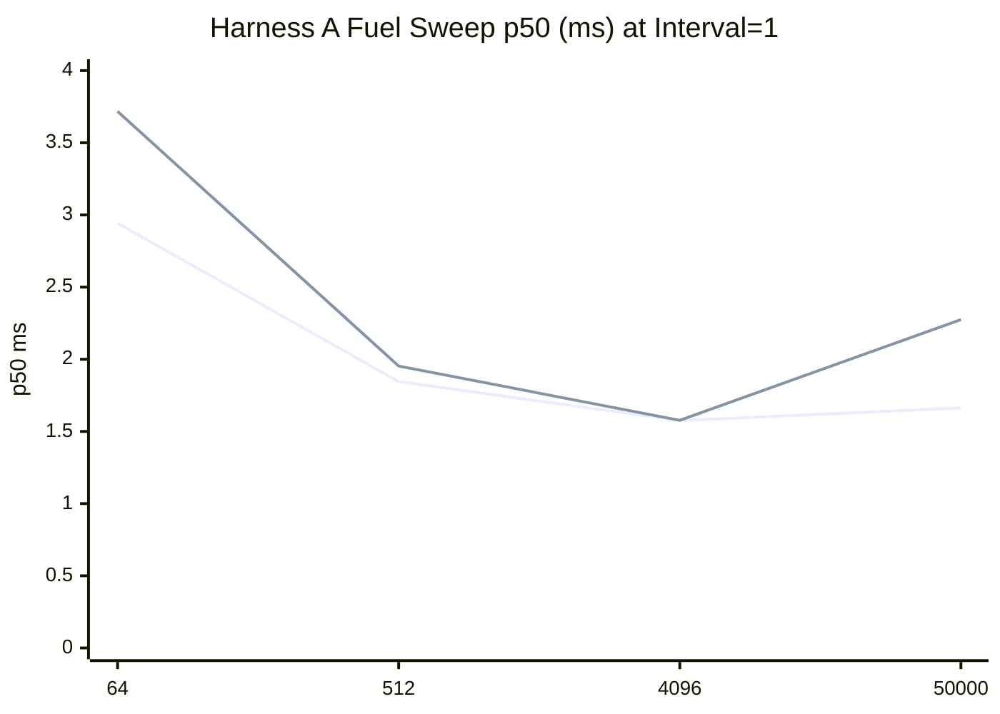
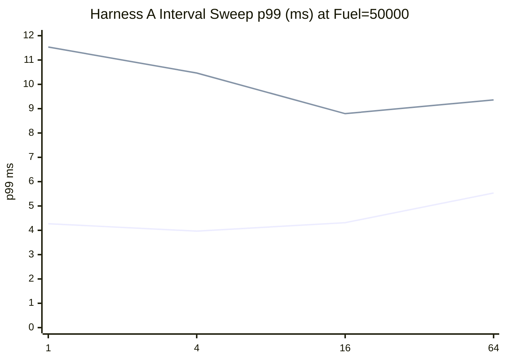
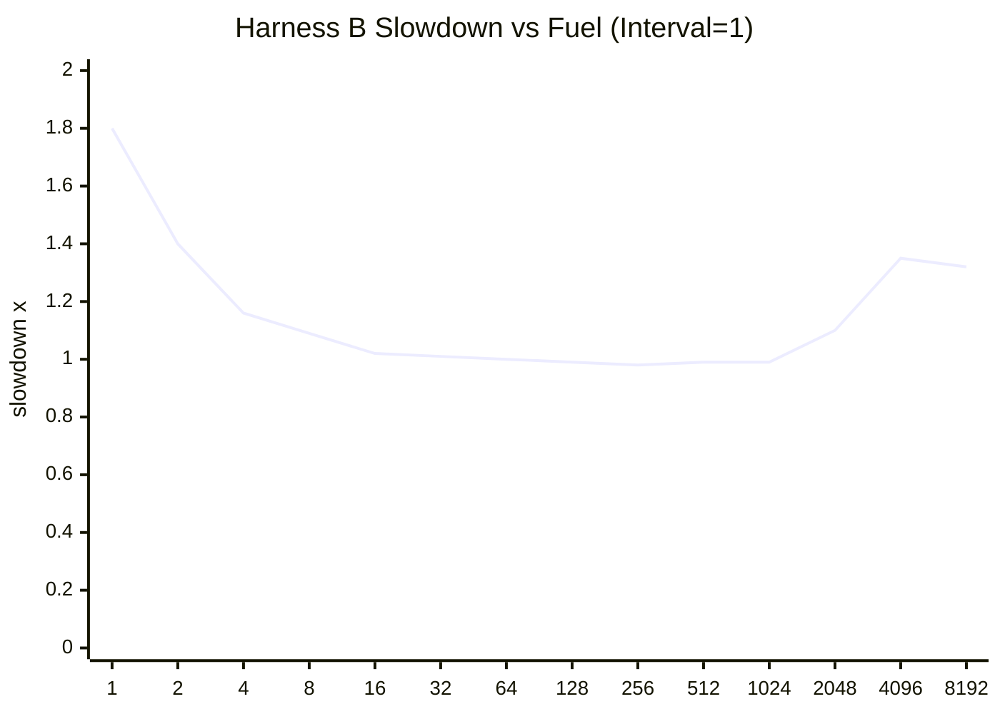
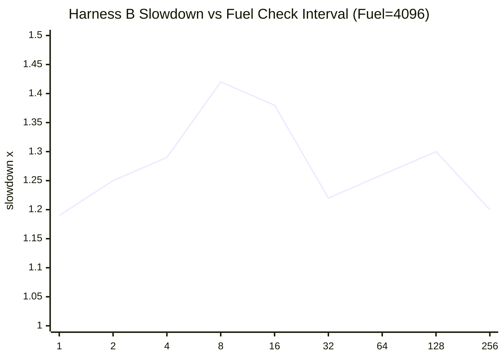

# pd-edge Perf Report (2026-03-07)

This report summarizes the latest async vs threading VM execution benchmarks and cooperative fuel sensitivity runs.

Data sources:

- `target/http_proxy_perf_mode_async.json`
- `target/http_proxy_perf_mode_threading.json`
- `target/http_proxy_fuel_sweep_async.json`
- `target/http_proxy_fuel_sweep_threading.json`
- `target/pd_vm_perf_cooperative_fuel_2026-03-07.txt`

## 1) Standard Proxy Comparison (Harness A)

Config:

- `requests=12000`
- `warmup_requests=2000`
- `concurrency=128`
- `vm_fuel=50000`
- `vm_fuel_check_interval=32`

| Scenario | Async RPS | Async p50 (ms) | Async p95 (ms) | Async p99 (ms) | Threading RPS | Threading p50 (ms) | Threading p95 (ms) | Threading p99 (ms) |
|---|---:|---:|---:|---:|---:|---:|---:|---:|
| `raw_no_program` | 80,753.16 | 1.485 | 2.612 | 3.195 | 84,774.38 | 1.414 | 2.544 | 3.207 |
| `no_host_calls_program` | 31,213.58 | 3.918 | 6.972 | 8.831 | 26,598.49 | 3.812 | 10.454 | 30.124 |
| `host_calls_terminate` | 25,382.71 | 4.768 | 8.925 | 11.742 | 27,020.55 | 4.172 | 9.454 | 14.503 |

```mermaid
xychart-beta
    title "Harness A Throughput (RPS, higher is better)"
    x-axis ["raw_no_program", "no_host_calls_program", "host_calls_terminate"]
    y-axis "RPS" 0 --> 90000
    bar "async" [80753, 31214, 25383]
    bar "threading" [84774, 26598, 27021]
```

```mermaid
xychart-beta
    title "Harness A Tail Latency p99 (ms, lower is better)"
    x-axis ["raw_no_program", "no_host_calls_program", "host_calls_terminate"]
    y-axis "p99 ms" 0 --> 32
    bar "async" [3.195, 8.831, 11.742]
    bar "threading" [3.207, 30.124, 14.503]
```

## 2) Proxy Fuel and Check-Interval Sweeps (Harness A)

Fuel sweep (`scenario=no_host_calls_program`, fixed interval `1`):

| Fuel | Async p50 (ms) | Async p95 (ms) | Async p99 (ms) | Async RPS | Threading p50 (ms) | Threading p95 (ms) | Threading p99 (ms) | Threading RPS |
|---:|---:|---:|---:|---:|---:|---:|---:|---:|
| 1 | error | error | error | 0 | error | error | error | 0 |
| 8 | error | error | error | 0 | error | error | error | 0 |
| 64 | 2.942 | 6.614 | 9.705 | 18,565.45 | 3.717 | 5.890 | 8.271 | 16,681.60 |
| 512 | 1.845 | 3.838 | 5.393 | 30,840.72 | 1.953 | 6.535 | 11.394 | 24,239.45 |
| 4096 | 1.575 | 3.193 | 4.811 | 36,327.49 | 1.577 | 9.448 | 15.266 | 24,068.95 |
| 50000 | 1.663 | 3.420 | 4.755 | 34,398.50 | 2.275 | 6.642 | 12.567 | 22,094.79 |

Notes:

- Fuel `1` and `8` failed in both modes in this run (request errors / no successful samples).
- Graph below plots only successful fuel points.

Interval sweep (`scenario=no_host_calls_program`, fixed fuel `50000`):

| Interval | Async p50 (ms) | Async p95 (ms) | Async p99 (ms) | Async RPS | Threading p50 (ms) | Threading p95 (ms) | Threading p99 (ms) | Threading RPS |
|---:|---:|---:|---:|---:|---:|---:|---:|---:|
| 1 | 1.668 | 3.005 | 4.271 | 35,319.84 | 2.095 | 5.502 | 11.535 | 24,527.74 |
| 4 | 1.682 | 2.890 | 3.966 | 35,946.70 | 1.695 | 5.410 | 10.466 | 28,842.19 |
| 16 | 1.711 | 3.021 | 4.313 | 34,909.54 | 1.531 | 4.711 | 8.795 | 32,238.31 |
| 64 | 1.808 | 3.670 | 5.534 | 32,246.52 | 1.356 | 4.129 | 9.361 | 35,536.64 |

## 3) VM-only Microbenchmark (Harness B)

Test: `pd-vm/tests/perf_tests.rs::perf_cooperative_fuel_configuration_impacts_latency`

Baseline:

- `fuel=disabled`
- median latency `42,667 us`

Fuel sweep (`fixed_check_interval=1`):

| Fuel | Median Latency (us) | Slowdown vs Baseline |
|---:|---:|---:|
| 1 | 76,903 | 1.80x |
| 2 | 59,548 | 1.40x |
| 4 | 49,541 | 1.16x |
| 8 | 46,577 | 1.09x |
| 16 | 43,663 | 1.02x |
| 32 | 43,189 | 1.01x |
| 64 | 42,624 | 1.00x |
| 128 | 42,370 | 0.99x |
| 256 | 41,822 | 0.98x |
| 512 | 42,189 | 0.99x |
| 1024 | 42,078 | 0.99x |
| 2048 | 47,115 | 1.10x |
| 4096 | 57,562 | 1.35x |
| 8192 | 56,234 | 1.32x |

Interval sweep (`fixed_fuel=4096`):

| Interval | Median Latency (us) | Slowdown vs Baseline |
|---:|---:|---:|
| 1 | 50,944 | 1.19x |
| 2 | 53,379 | 1.25x |
| 4 | 55,211 | 1.29x |
| 8 | 60,637 | 1.42x |
| 16 | 58,917 | 1.38x |
| 32 | 52,209 | 1.22x |
| 64 | 53,674 | 1.26x |
| 128 | 55,537 | 1.30x |
| 256 | 51,369 | 1.20x |

## 4) Short Interpretation

- For pure pass-through (`raw_no_program`), both modes are close; threading was slightly higher throughput in this run.
- For VM-heavy scenarios, async had better tail behavior in this run (`no_host_calls_program` p99: `8.831ms` async vs `30.124ms` threading).
- Very low fuel budgets (`1`, `8`) are not viable for proxy request path under this workload.
- Fuel and check interval tuning changes both latency and throughput materially; one fixed setting is unlikely to be best for all workloads.
