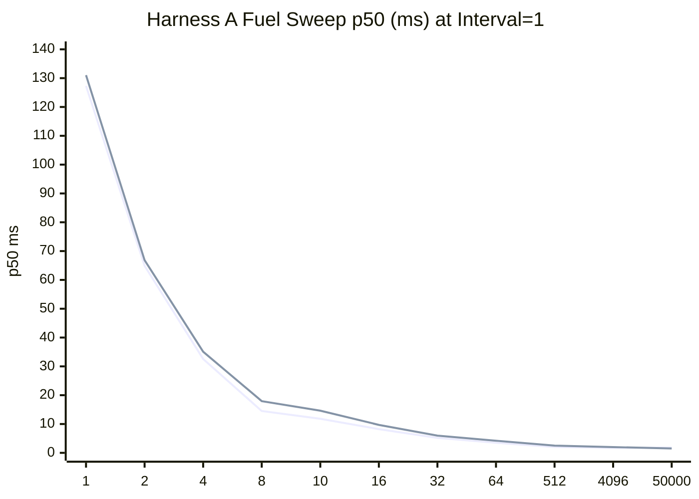
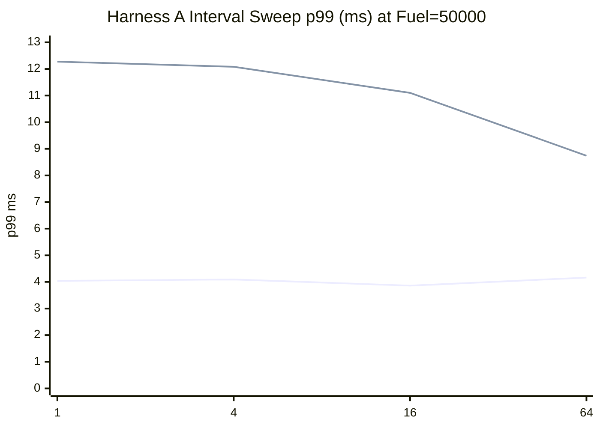
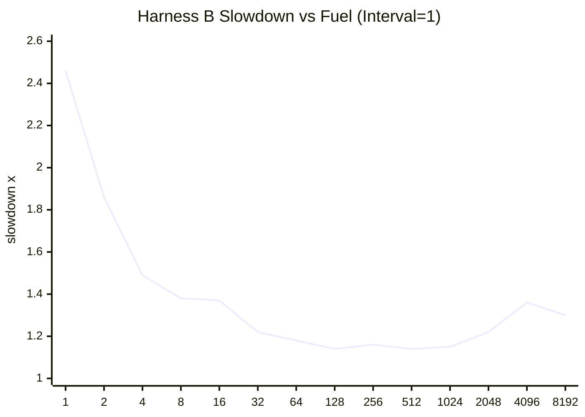
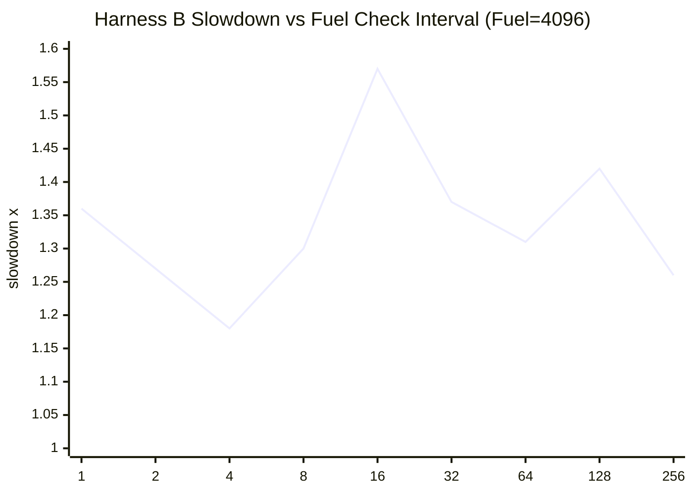

# pd-edge Perf Report (2026-03-08)

This rerun follows the same benchmark workflow as `HTTP_PROXY_PERF_REPORT_2026-03-07.md`, with extended low-fuel verification.

Data sources:

- `target/http_proxy_perf_mode_async_2026-03-08.json`
- `target/http_proxy_perf_mode_threading_2026-03-08.json`
- `target/http_proxy_fuel_sweep_async_2026-03-08.json`
- `target/http_proxy_fuel_sweep_threading_2026-03-08.json`
- `target/pd_vm_perf_cooperative_fuel_2026-03-08.txt`

## 1) Standard Proxy Comparison (Harness A)

Config:

- `requests=12000`
- `warmup_requests=2000`
- `concurrency=128`
- `vm_fuel=50000`
- `vm_fuel_check_interval=32`

Baseline ratio columns use each mode's `raw_no_program` row as `100%`.

| Scenario | Async RPS | Async Baseline Ratio | Async p50 (ms) | Async p95 (ms) | Async p99 (ms) | Threading RPS | Threading Baseline Ratio | Threading p50 (ms) | Threading p95 (ms) | Threading p99 (ms) |
|---|---:|---:|---:|---:|---:|---:|---:|---:|---:|---:|
| `raw_no_program` | 94,610.14 | 100.00% | 1.289 | 2.149 | 2.654 | 97,513.01 | 100.00% | 1.236 | 2.099 | 2.600 |
| `no_host_calls_program` | 32,524.19 | 34.38% | 3.781 | 6.842 | 8.727 | 31,401.95 | 32.20% | 3.627 | 8.329 | 13.114 |
| `host_calls_terminate` | 31,799.88 | 33.61% | 3.852 | 7.005 | 8.874 | 29,824.71 | 30.59% | 3.803 | 8.246 | 13.877 |

```mermaid
xychart-beta
    title "Harness A Throughput (RPS, higher is better)"
    x-axis ["raw_no_program", "no_host_calls_program", "host_calls_terminate"]
    y-axis "RPS" 0 --> 100000
    bar "async" [94610, 32524, 31800]
    bar "threading" [97513, 31402, 29825]
```

```mermaid
xychart-beta
    title "Harness A Tail Latency p99 (ms, lower is better)"
    x-axis ["raw_no_program", "no_host_calls_program", "host_calls_terminate"]
    y-axis "p99 ms" 0 --> 15
    bar "async" [2.654, 8.727, 8.874]
    bar "threading" [2.600, 13.114, 13.877]
```

## 2) Proxy Fuel and Check-Interval Sweeps (Harness A)

Fuel sweep (`scenario=no_host_calls_program`, fixed interval `1`):

| Fuel | Async p50 (ms) | Async p95 (ms) | Async p99 (ms) | Async RPS | Threading p50 (ms) | Threading p95 (ms) | Threading p99 (ms) | Threading RPS |
|---:|---:|---:|---:|---:|---:|---:|---:|---:|
| 1 | 127.298 | 134.315 | 137.475 | 521.31 | 131.031 | 213.445 | 238.432 | 436.04 |
| 2 | 64.889 | 75.164 | 92.747 | 984.24 | 66.849 | 127.281 | 130.122 | 847.45 |
| 4 | 32.565 | 38.484 | 52.562 | 1,944.67 | 35.088 | 60.360 | 68.514 | 1,581.85 |
| 8 | 14.521 | 18.166 | 36.823 | 4,199.78 | 17.942 | 29.028 | 39.561 | 3,047.95 |
| 10 | 11.826 | 14.930 | 31.678 | 5,196.58 | 14.629 | 26.251 | 38.942 | 3,616.36 |
| 16 | 8.231 | 10.825 | 12.095 | 7,599.63 | 9.703 | 15.571 | 16.524 | 5,763.66 |
| 32 | 5.193 | 7.462 | 9.153 | 11,831.07 | 5.970 | 10.117 | 10.883 | 9,475.44 |
| 64 | 3.486 | 5.584 | 7.272 | 17,145.30 | 4.214 | 6.497 | 7.293 | 14,365.21 |
| 512 | 2.012 | 3.735 | 7.088 | 28,036.44 | 2.522 | 4.649 | 6.420 | 23,738.18 |
| 4096 | 1.708 | 3.600 | 5.429 | 32,653.63 | 2.000 | 5.009 | 5.550 | 27,030.68 |
| 50000 | 1.804 | 3.204 | 4.147 | 33,158.55 | 1.511 | 5.100 | 9.351 | 31,173.72 |

Interval sweep (`scenario=no_host_calls_program`, fixed fuel `50000`):

| Interval | Async p50 (ms) | Async p95 (ms) | Async p99 (ms) | Async RPS | Threading p50 (ms) | Threading p95 (ms) | Threading p99 (ms) | Threading RPS |
|---:|---:|---:|---:|---:|---:|---:|---:|---:|
| 1 | 1.806 | 3.022 | 4.040 | 33,621.39 | 1.508 | 5.106 | 12.274 | 31,045.65 |
| 4 | 1.800 | 3.198 | 4.092 | 33,341.78 | 1.547 | 5.220 | 12.081 | 30,318.62 |
| 16 | 1.822 | 3.097 | 3.860 | 33,253.45 | 1.587 | 5.328 | 11.101 | 30,181.72 |
| 64 | 1.797 | 3.148 | 4.162 | 33,307.39 | 1.603 | 5.043 | 8.741 | 31,199.20 |

## 3) VM-only Microbenchmark (Harness B)

Test: `pd-vm/tests/jit/perf_tests.rs::perf_cooperative_fuel_configuration_impacts_latency`

Baseline:

- `fuel=disabled`
- median latency `36,777 us`

Fuel sweep (`fixed_check_interval=1`):

| Fuel | Median Latency (us) | Slowdown vs Baseline |
|---:|---:|---:|
| 1 | 90,426 | 2.46x |
| 2 | 68,309 | 1.86x |
| 4 | 54,775 | 1.49x |
| 8 | 50,715 | 1.38x |
| 16 | 50,562 | 1.37x |
| 32 | 44,913 | 1.22x |
| 64 | 43,477 | 1.18x |
| 128 | 41,966 | 1.14x |
| 256 | 42,578 | 1.16x |
| 512 | 42,075 | 1.14x |
| 1024 | 42,335 | 1.15x |
| 2048 | 44,947 | 1.22x |
| 4096 | 50,019 | 1.36x |
| 8192 | 47,825 | 1.30x |

Interval sweep (`fixed_fuel=4096`):

| Interval | Median Latency (us) | Slowdown vs Baseline |
|---:|---:|---:|
| 1 | 50,066 | 1.36x |
| 2 | 46,820 | 1.27x |
| 4 | 43,349 | 1.18x |
| 8 | 47,729 | 1.30x |
| 16 | 57,734 | 1.57x |
| 32 | 50,373 | 1.37x |
| 64 | 48,245 | 1.31x |
| 128 | 52,123 | 1.42x |
| 256 | 46,509 | 1.26x |

## 4) Short Interpretation

- The very low proxy fuel points (`1`, `2`, `4`, `8`, `10`) now complete successfully in both execution modes instead of erroring out.
- Extremely low fuel is still expensive (for example `fuel=1`), but it now yields valid latency/RPS data.
- For this run, async remains better on `no_host_calls_program` and `host_calls_terminate` tail latency, while raw mode is close between modes.
