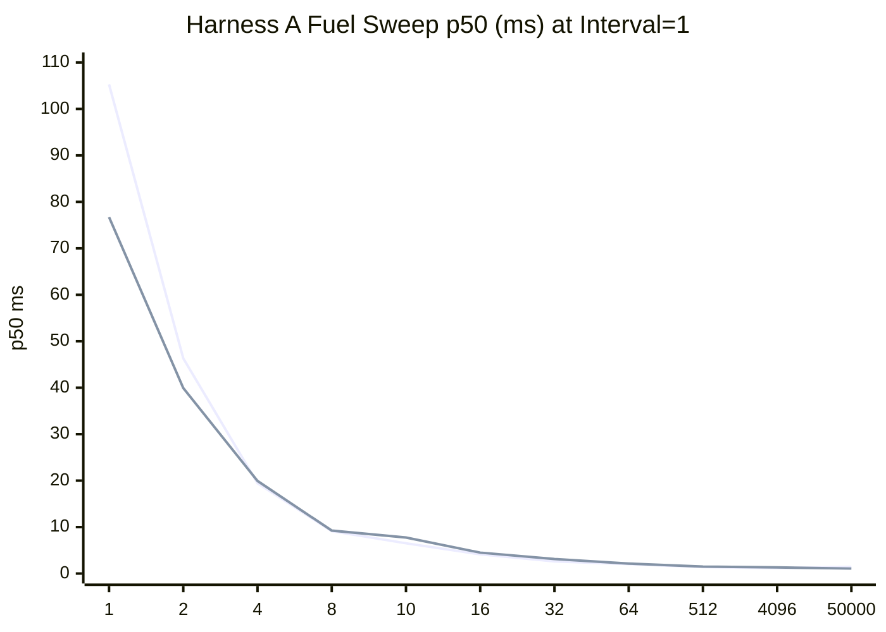
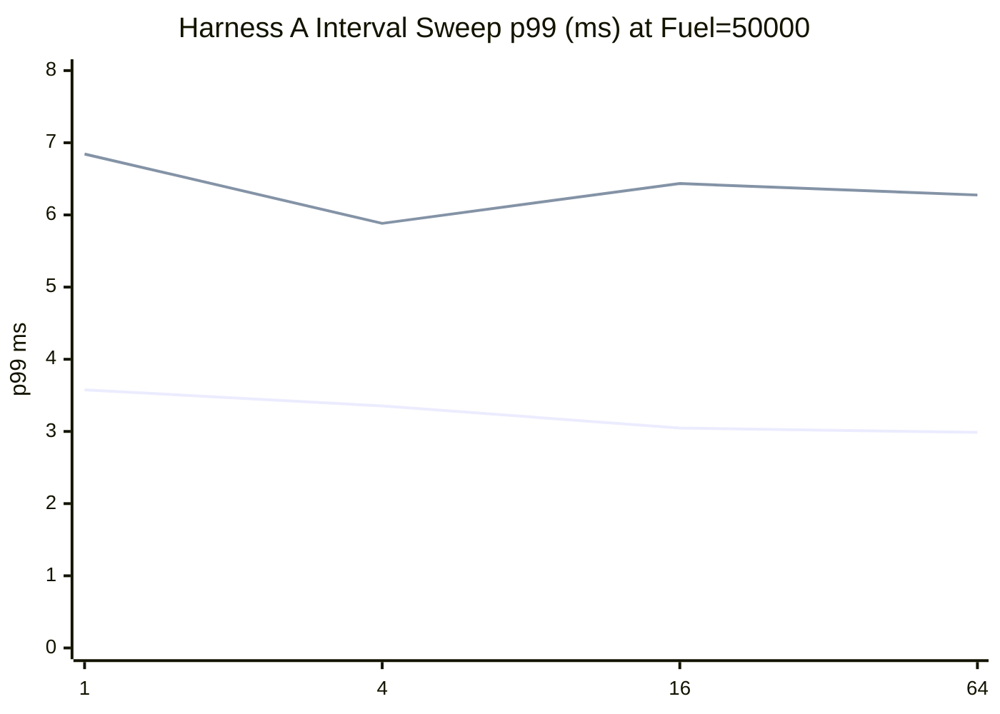
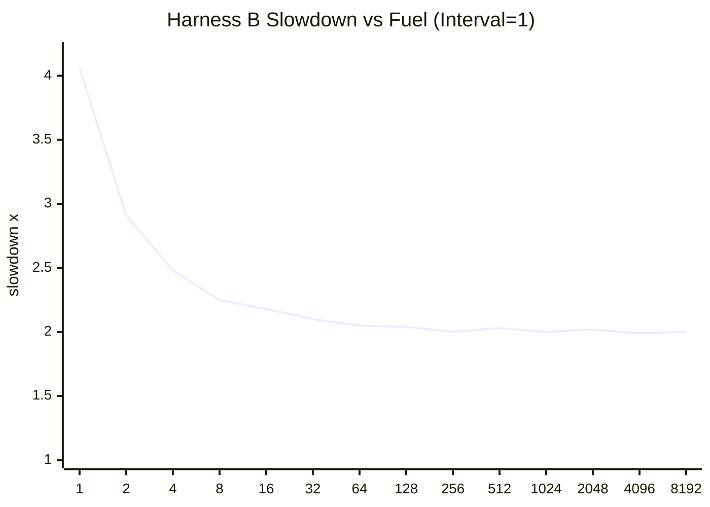
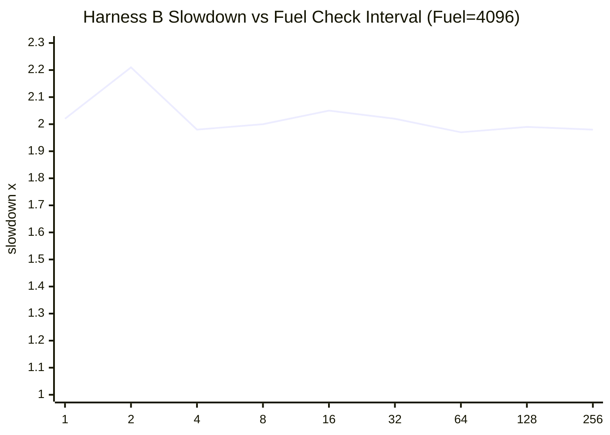

# pd-edge Perf Report (2026-03-11)

This rerun follows the same benchmark workflow as `HTTP_PROXY_PERF_REPORT_2026-03-08.md`, executed serially with an explicit timeout on each command.

Data sources:

- `target/http_proxy_perf_mode_async_2026-03-11.json`
- `target/http_proxy_perf_mode_threading_2026-03-11.json`
- `target/http_proxy_fuel_sweep_async_2026-03-11.json`
- `target/http_proxy_fuel_sweep_threading_2026-03-11.json`
- `target/pd_vm_perf_cooperative_fuel_2026-03-11.txt`

## 1) Standard Proxy Comparison (Harness A)

Config:

- `requests=12000`
- `warmup_requests=2000`
- `concurrency=128`
- `vm_fuel=50000`
- `vm_fuel_check_interval=32`

Baseline ratio columns use each mode's `raw_no_program` row as `100%`.

| Scenario | Async RPS | Async Baseline Ratio | Async p50 (ms) | Async p95 (ms) | Async p99 (ms) | Threading RPS | Threading Baseline Ratio | Threading p50 (ms) | Threading p95 (ms) | Threading p99 (ms) |
|---|---:|---:|---:|---:|---:|---:|---:|---:|---:|---:|
| `raw_no_program` | 98,940.92 | 100.00% | 1.233 | 2.032 | 2.523 | 104,750.71 | 100.00% | 1.144 | 1.983 | 2.433 |
| `no_host_calls_program` | 43,845.58 | 44.31% | 2.801 | 4.866 | 5.945 | 42,756.66 | 40.82% | 2.613 | 6.357 | 9.942 |
| `host_calls_terminate` | 42,250.31 | 42.70% | 2.937 | 5.002 | 6.171 | 41,393.00 | 39.52% | 2.749 | 6.115 | 9.715 |

```mermaid
xychart-beta
    title "Harness A Throughput (RPS, higher is better)"
    x-axis ["raw_no_program", "no_host_calls_program", "host_calls_terminate"]
    y-axis "RPS" 0 --> 110000
    bar "async" [98941, 43846, 42250]
    bar "threading" [104751, 42757, 41393]
```

```mermaid
xychart-beta
    title "Harness A Tail Latency p99 (ms, lower is better)"
    x-axis ["raw_no_program", "no_host_calls_program", "host_calls_terminate"]
    y-axis "p99 ms" 0 --> 11
    bar "async" [2.523, 5.945, 6.171]
    bar "threading" [2.433, 9.942, 9.715]
```

## 2) Proxy Fuel and Check-Interval Sweeps (Harness A)

Fuel sweep (`scenario=no_host_calls_program`, fixed interval `1`):

| Fuel | Async p50 (ms) | Async p95 (ms) | Async p99 (ms) | Async RPS | Threading p50 (ms) | Threading p95 (ms) | Threading p99 (ms) | Threading RPS |
|---:|---:|---:|---:|---:|---:|---:|---:|---:|
| 1 | 105.298 | 138.863 | 146.916 | 600.47 | 76.729 | 124.234 | 135.187 | 715.33 |
| 2 | 46.318 | 60.224 | 64.761 | 1,396.09 | 39.933 | 63.283 | 71.254 | 1,375.40 |
| 4 | 19.448 | 24.402 | 26.237 | 3,244.77 | 19.929 | 31.455 | 33.285 | 2,759.90 |
| 8 | 9.134 | 11.424 | 27.760 | 6,688.38 | 9.254 | 15.927 | 27.765 | 5,827.40 |
| 10 | 6.508 | 7.855 | 8.324 | 9,771.14 | 7.753 | 13.169 | 13.769 | 7,138.30 |
| 16 | 4.127 | 5.633 | 6.520 | 14,987.90 | 4.502 | 8.015 | 8.708 | 11,770.37 |
| 32 | 2.621 | 5.122 | 9.156 | 21,204.22 | 3.137 | 4.614 | 5.128 | 19,406.37 |
| 64 | 2.054 | 3.890 | 5.488 | 27,916.64 | 2.156 | 3.773 | 4.252 | 27,693.88 |
| 512 | 1.376 | 2.521 | 3.460 | 42,025.05 | 1.501 | 2.678 | 3.070 | 39,059.50 |
| 4096 | 1.172 | 3.052 | 4.685 | 44,030.75 | 1.319 | 3.478 | 4.366 | 40,453.07 |
| 50000 | 1.423 | 2.424 | 2.990 | 42,500.38 | 1.073 | 3.328 | 6.703 | 44,639.20 |

Interval sweep (`scenario=no_host_calls_program`, fixed fuel `50000`):

| Interval | Async p50 (ms) | Async p95 (ms) | Async p99 (ms) | Async RPS | Threading p50 (ms) | Threading p95 (ms) | Threading p99 (ms) | Threading RPS |
|---:|---:|---:|---:|---:|---:|---:|---:|---:|
| 1 | 1.491 | 2.738 | 3.577 | 39,865.20 | 1.048 | 3.239 | 6.844 | 45,973.21 |
| 4 | 1.391 | 2.585 | 3.354 | 42,299.99 | 1.077 | 3.207 | 5.883 | 45,722.37 |
| 16 | 1.350 | 2.438 | 3.047 | 43,372.41 | 1.077 | 3.184 | 6.435 | 45,500.11 |
| 64 | 1.324 | 2.328 | 2.987 | 45,168.27 | 1.044 | 3.111 | 6.276 | 46,495.84 |

## 3) VM-only Microbenchmark (Harness B)

Test: `pd-vm/tests/jit/perf_tests.rs::perf_cooperative_fuel_configuration_impacts_latency`

Baseline:

- `fuel=disabled`
- median latency `16,487 us`

Fuel sweep (`fixed_check_interval=1`):

| Fuel | Median Latency (us) | Slowdown vs Baseline |
|---:|---:|---:|
| 1 | 66,886 | 4.06x |
| 2 | 48,050 | 2.91x |
| 4 | 40,954 | 2.48x |
| 8 | 37,086 | 2.25x |
| 16 | 35,881 | 2.18x |
| 32 | 34,548 | 2.10x |
| 64 | 33,860 | 2.05x |
| 128 | 33,601 | 2.04x |
| 256 | 33,025 | 2.00x |
| 512 | 33,544 | 2.03x |
| 1024 | 33,002 | 2.00x |
| 2048 | 33,222 | 2.02x |
| 4096 | 32,882 | 1.99x |
| 8192 | 32,980 | 2.00x |

Interval sweep (`fixed_fuel=4096`):

| Interval | Median Latency (us) | Slowdown vs Baseline |
|---:|---:|---:|
| 1 | 33,223 | 2.02x |
| 2 | 36,420 | 2.21x |
| 4 | 32,622 | 1.98x |
| 8 | 32,898 | 2.00x |
| 16 | 33,880 | 2.05x |
| 32 | 33,361 | 2.02x |
| 64 | 32,521 | 1.97x |
| 128 | 32,741 | 1.99x |
| 256 | 32,604 | 1.98x |

## 4) Short Interpretation

- `threading` still wins the raw proxy path, but `async` is now better on both VM-heavy scenarios for throughput and p99 latency.
- The low-fuel proxy runs now complete cleanly all the way down to `fuel=1` in both execution modes.
- For `async`, higher check intervals improved the `fuel=50000` no-host-call case across both throughput and p99 in this sample.
- In the VM-only fuel test, the no-fuel baseline improved sharply, but cooperative fuel still costs about `2x` latency across most of the tested range once fuel is enabled.
