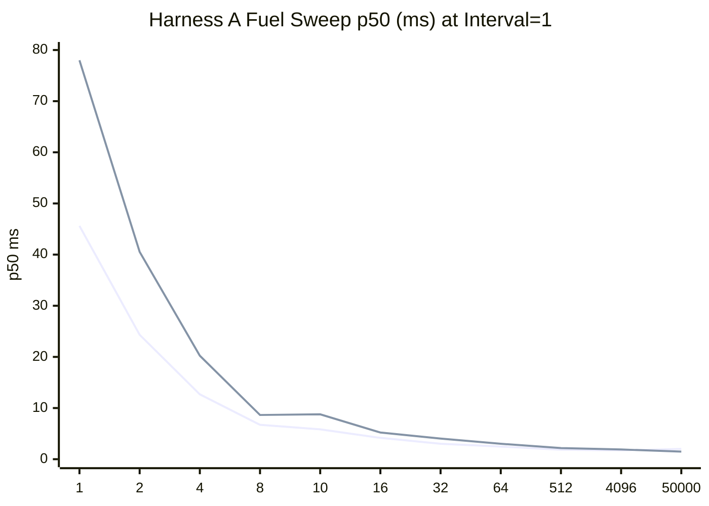
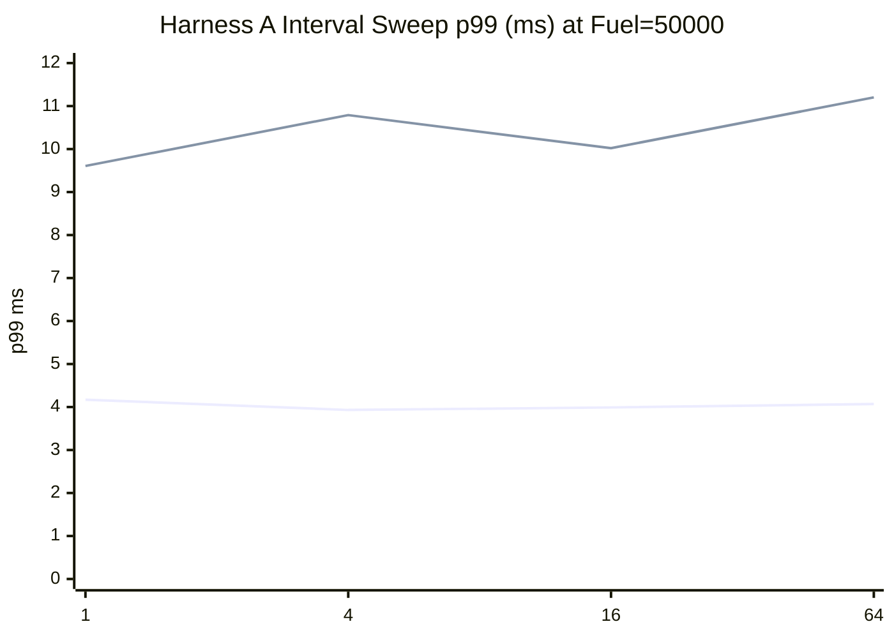
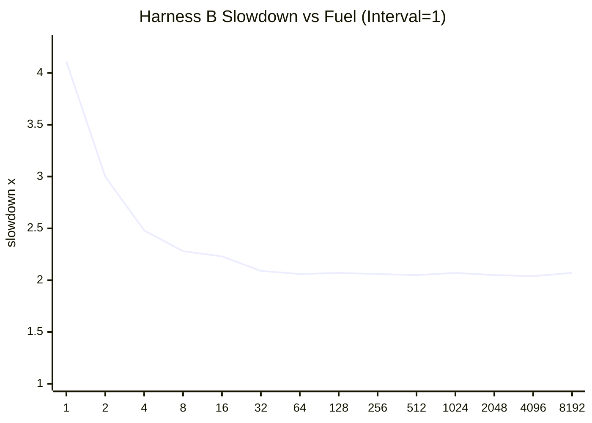
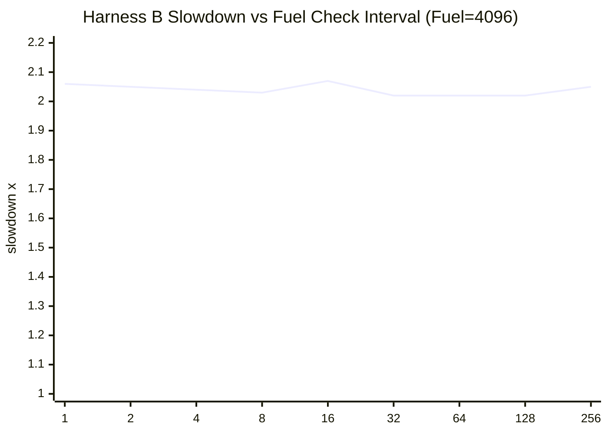

# pd-edge Perf Report (2026-03-13)

This rerun follows the same benchmark workflow as `HTTP_PROXY_PERF_REPORT_2026-03-11.md`, executed serially with an explicit timeout on each command. Harness A now includes `host_calls_upstream_roundtrip` so the standard comparison covers the real default-upstream HTTP path touched by recent upstream-path work.

Data sources:

- `target/http_proxy_perf_mode_async_2026-03-13.json`
- `target/http_proxy_perf_mode_threading_2026-03-13.json`
- `target/http_proxy_fuel_sweep_async_2026-03-13.json`
- `target/http_proxy_fuel_sweep_threading_2026-03-13.json`
- `target/pd_vm_perf_cooperative_fuel_2026-03-13.txt`

## 1) Standard Proxy Comparison (Harness A)

Config:

- `requests=12000`
- `warmup_requests=2000`
- `concurrency=128`
- `vm_fuel=50000`
- `vm_fuel_check_interval=32`

Baseline ratio columns use each mode's `raw_no_program` row as `100%`.

| Scenario | Async RPS | Async Baseline Ratio | Async p50 (ms) | Async p95 (ms) | Async p99 (ms) | Threading RPS | Threading Baseline Ratio | Threading p50 (ms) | Threading p95 (ms) | Threading p99 (ms) |
|---|---:|---:|---:|---:|---:|---:|---:|---:|---:|---:|
| `raw_no_program` | 88,849.47 | 100.00% | 1.375 | 2.266 | 2.775 | 101,270.18 | 100.00% | 1.207 | 1.987 | 2.377 |
| `no_host_calls_program` | 29,716.91 | 33.45% | 4.077 | 7.516 | 9.457 | 31,988.47 | 31.59% | 3.480 | 8.140 | 12.080 |
| `host_calls_terminate` | 37,686.25 | 42.42% | 3.322 | 5.563 | 6.948 | 36,144.57 | 35.69% | 3.189 | 6.805 | 10.604 |
| `host_calls_upstream_roundtrip` | 26,646.39 | 29.99% | 4.680 | 6.975 | 8.247 | 27,599.50 | 27.25% | 4.332 | 7.534 | 10.382 |

```mermaid
xychart-beta
    title "Harness A Throughput (RPS, higher is better)"
    x-axis ["raw_no_program", "no_host_calls_program", "host_calls_terminate", "host_calls_upstream_roundtrip"]
    y-axis "RPS" 0 --> 105000
    bar "async" [88849, 29717, 37686, 26646]
    bar "threading" [101270, 31988, 36145, 27600]
```

```mermaid
xychart-beta
    title "Harness A Tail Latency p99 (ms, lower is better)"
    x-axis ["raw_no_program", "no_host_calls_program", "host_calls_terminate", "host_calls_upstream_roundtrip"]
    y-axis "p99 ms" 0 --> 13
    bar "async" [2.775, 9.457, 6.948, 8.247]
    bar "threading" [2.377, 12.080, 10.604, 10.382]
```

## 2) Proxy Fuel and Check-Interval Sweeps (Harness A)

These sweeps still use `scenario=no_host_calls_program` so they stay focused on VM scheduling cost rather than network-path variability.

Fuel sweep (`scenario=no_host_calls_program`, fixed interval `1`):

| Fuel | Async p50 (ms) | Async p95 (ms) | Async p99 (ms) | Async RPS | Threading p50 (ms) | Threading p95 (ms) | Threading p99 (ms) | Threading RPS |
|---:|---:|---:|---:|---:|---:|---:|---:|---:|
| 1 | 45.618 | 57.086 | 65.254 | 1,383.84 | 78.003 | 127.241 | 145.106 | 711.98 |
| 2 | 24.321 | 37.706 | 50.319 | 2,473.55 | 40.545 | 63.954 | 72.166 | 1,355.59 |
| 4 | 12.680 | 17.335 | 21.860 | 4,869.32 | 20.235 | 35.870 | 42.217 | 2,658.34 |
| 8 | 6.725 | 8.319 | 10.255 | 9,370.23 | 8.645 | 17.310 | 27.368 | 5,729.63 |
| 10 | 5.830 | 7.841 | 10.929 | 10,635.64 | 8.770 | 13.339 | 15.508 | 6,659.76 |
| 16 | 4.171 | 6.669 | 10.900 | 14,158.82 | 5.218 | 9.371 | 26.452 | 9,709.79 |
| 32 | 3.021 | 4.370 | 6.152 | 20,047.53 | 4.027 | 5.992 | 8.235 | 15,562.71 |
| 64 | 2.470 | 3.828 | 5.220 | 24,241.97 | 3.022 | 4.388 | 5.933 | 20,953.35 |
| 512 | 1.861 | 3.481 | 5.647 | 30,650.68 | 2.185 | 3.618 | 4.151 | 28,535.20 |
| 4096 | 1.727 | 4.665 | 7.181 | 30,141.48 | 1.895 | 4.258 | 4.963 | 29,070.53 |
| 50000 | 2.011 | 3.365 | 4.106 | 30,416.80 | 1.486 | 5.326 | 11.058 | 31,014.55 |

Interval sweep (`scenario=no_host_calls_program`, fixed fuel `50000`):

| Interval | Async p50 (ms) | Async p95 (ms) | Async p99 (ms) | Async RPS | Threading p50 (ms) | Threading p95 (ms) | Threading p99 (ms) | Threading RPS |
|---:|---:|---:|---:|---:|---:|---:|---:|---:|
| 1 | 2.033 | 3.369 | 4.171 | 30,174.95 | 1.548 | 5.701 | 9.606 | 29,937.22 |
| 4 | 1.937 | 3.367 | 3.931 | 31,552.91 | 1.587 | 5.455 | 10.790 | 29,566.67 |
| 16 | 1.957 | 3.395 | 3.990 | 31,039.61 | 1.724 | 5.358 | 10.021 | 28,354.85 |
| 64 | 2.023 | 3.399 | 4.069 | 30,580.57 | 1.366 | 5.120 | 11.202 | 32,495.42 |

## 3) VM-only Microbenchmark (Harness B)

Test: `pd-vm/tests/jit/perf_tests.rs::perf_cooperative_fuel_configuration_impacts_latency`

Baseline:

- `fuel=disabled`
- median latency `14,899 us`

Fuel sweep (`fixed_check_interval=1`):

| Fuel | Median Latency (us) | Slowdown vs Baseline |
|---:|---:|---:|
| 1 | 61,218 | 4.11x |
| 2 | 44,695 | 3.00x |
| 4 | 36,967 | 2.48x |
| 8 | 33,995 | 2.28x |
| 16 | 33,249 | 2.23x |
| 32 | 31,098 | 2.09x |
| 64 | 30,698 | 2.06x |
| 128 | 30,817 | 2.07x |
| 256 | 30,659 | 2.06x |
| 512 | 30,613 | 2.05x |
| 1024 | 30,791 | 2.07x |
| 2048 | 30,520 | 2.05x |
| 4096 | 30,449 | 2.04x |
| 8192 | 30,793 | 2.07x |

Interval sweep (`fixed_fuel=4096`):

| Interval | Median Latency (us) | Slowdown vs Baseline |
|---:|---:|---:|
| 1 | 30,630 | 2.06x |
| 2 | 30,527 | 2.05x |
| 4 | 30,380 | 2.04x |
| 8 | 30,213 | 2.03x |
| 16 | 30,780 | 2.07x |
| 32 | 30,085 | 2.02x |
| 64 | 30,079 | 2.02x |
| 128 | 30,158 | 2.02x |
| 256 | 30,553 | 2.05x |

## 4) Short Interpretation

- `host_calls_upstream_roundtrip` is new in Harness A. It was added because recent upstream-path work is not visible in the terminate-only scenario.
- `threading` still leads the raw no-program path on throughput and also edges out `async` on throughput for `no_host_calls_program` and `host_calls_upstream_roundtrip`, but `async` keeps lower p99 on every VM-mediated scenario in this run.
- On the new upstream round-trip case, `threading` is only slightly ahead on throughput (`27,599.50` vs `26,646.39` RPS), while `async` keeps a meaningfully lower p99 (`8.247 ms` vs `10.382 ms`).
- The terminate-only host-call scenario remains materially cheaper than the real upstream round-trip in both modes, so the new case is worth keeping as separate coverage.
- In the async proxy sweep, `fuel=50000` with interval `4` produced the best combined p99/throughput result in this sample. In the threading sweep, interval `64` improved throughput most, but not tail latency.
- In the VM-only fuel test, the no-fuel baseline improved again to `14,899 us`, but once fuel is enabled the steady-state cost still settles at roughly `2x` latency.
