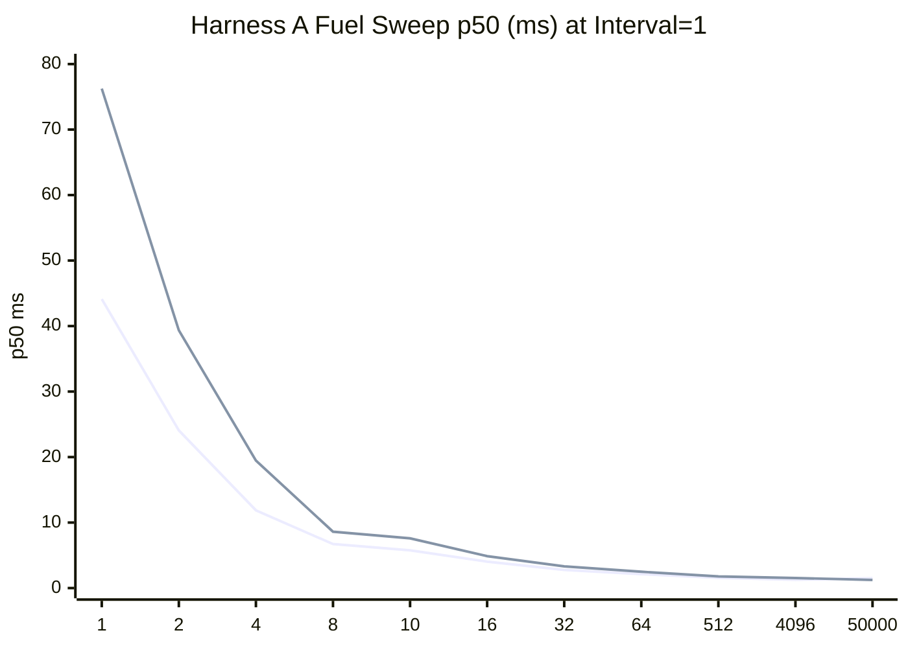
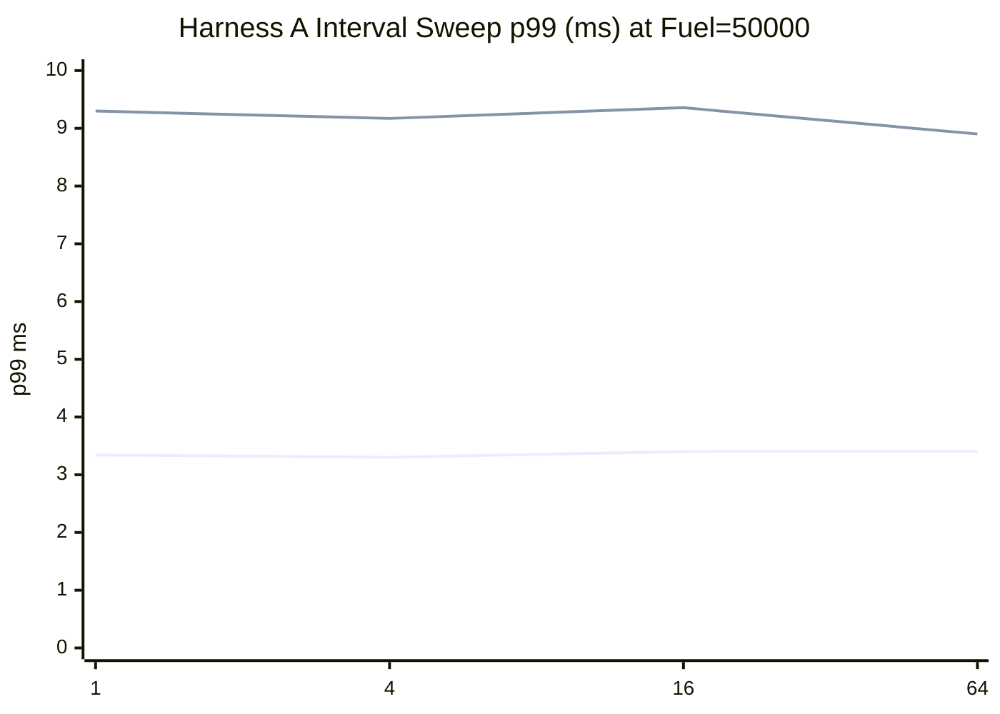
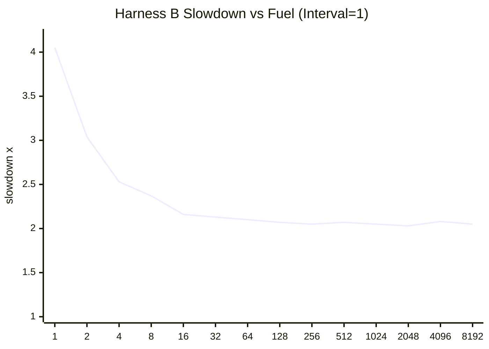
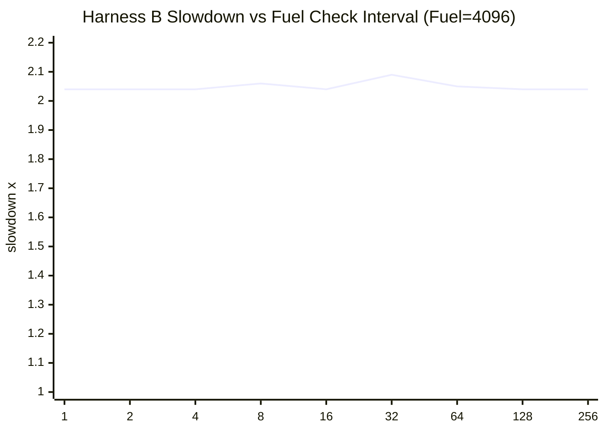

# pd-edge Perf Report (2026-03-14)

This rerun supersedes the earlier March 14 corrected note with a full benchmark pass at larger sample sizes.

- `raw_http_upstream` means the perf client hits the plaintext HTTP upstream fixture directly.
- `raw_http2_upstream` means the perf client hits the HTTPS HTTP/2 upstream fixture directly.
- Harness A standard comparison was rerun with `requests=120000` and VM fuel disabled.
- Harness A fuel sweeps and Harness B were kept from the earlier same-day run.
- All HTTP/2 coverage in this report uses TLS + ALPN only. No h2c was used.

Data sources:

- `target/http_proxy_perf_mode_async_2026-03-14-r120000-nofuel.json`
- `target/http_proxy_perf_mode_threading_2026-03-14-r120000-nofuel.json`
- `target/http_proxy_fuel_sweep_async_2026-03-14-r120000.json`
- `target/http_proxy_fuel_sweep_threading_2026-03-14-r120000.json`
- `target/pd_vm_perf_cooperative_fuel_2026-03-14-r120000.txt`

## 1) Standard Proxy Comparison (Harness A)

Config:

- `requests=120000`
- `warmup_requests=20000`
- `concurrency=128`
- `vm_fuel=disabled`
- `vm_fuel_check_interval=32`
- HTTP/2 cases use TLS only. No h2c was used.

| Scenario | Async RPS | Async p50 (ms) | Async p95 (ms) | Async p99 (ms) | Threading RPS | Threading p50 (ms) | Threading p95 (ms) | Threading p99 (ms) |
|---|---:|---:|---:|---:|---:|---:|---:|---:|
| `raw_no_program` | 110,944.99 | 1.113 | 1.791 | 2.144 | 114,265.67 | 1.079 | 1.746 | 2.094 |
| `no_host_calls_program` | 49,873.75 | 2.486 | 4.186 | 5.143 | 47,284.51 | 2.352 | 5.621 | 9.418 |
| `host_calls_terminate` | 45,896.72 | 2.709 | 4.573 | 5.654 | 44,035.37 | 2.588 | 5.657 | 9.621 |
| `raw_http_upstream` | 67,925.07 | 1.846 | 2.776 | 3.288 | 71,136.22 | 1.762 | 2.657 | 3.098 |
| `host_calls_upstream_roundtrip` | 29,197.30 | 4.298 | 6.215 | 7.199 | 29,516.36 | 4.025 | 7.197 | 10.133 |
| `raw_http2_upstream` | 59,904.95 | 2.086 | 2.992 | 3.503 | 59,586.63 | 2.099 | 2.974 | 3.402 |
| `host_calls_upstream_roundtrip_http2_upstream` | 27,998.45 | 4.505 | 6.314 | 7.242 | 27,231.87 | 4.409 | 7.455 | 10.996 |
| `host_calls_upstream_roundtrip_downstream_http2` | 26,288.26 | 4.798 | 6.786 | 7.748 | 26,066.47 | 4.762 | 7.160 | 8.989 |

```mermaid
xychart-beta
    title "Harness A Throughput (RPS, higher is better)"
    x-axis ["raw_no_program", "no_host_calls_program", "host_calls_terminate", "raw_http_upstream", "host_calls_upstream_roundtrip", "raw_http2_upstream", "host_calls_upstream_roundtrip_http2_upstream", "host_calls_upstream_roundtrip_downstream_http2"]
    y-axis "RPS" 0 --> 115000
    bar "async" [110945, 49874, 45897, 67925, 29197, 59905, 27998, 26288]
    bar "threading" [114266, 47285, 44035, 71136, 29516, 59587, 27232, 26066]
```

```mermaid
xychart-beta
    title "Harness A Tail Latency p99 (ms, lower is better)"
    x-axis ["raw_no_program", "no_host_calls_program", "host_calls_terminate", "raw_http_upstream", "host_calls_upstream_roundtrip", "raw_http2_upstream", "host_calls_upstream_roundtrip_http2_upstream", "host_calls_upstream_roundtrip_downstream_http2"]
    y-axis "p99 ms" 0 --> 12
    bar "async" [2.144, 5.143, 5.654, 3.288, 7.199, 3.503, 7.242, 7.748]
    bar "threading" [2.094, 9.418, 9.621, 3.098, 10.133, 3.402, 10.996, 8.989]
```





## 2) Proxy Fuel and Check-Interval Sweeps (Harness A)

These sweeps still use `scenario=no_host_calls_program` so they stay focused on VM scheduling cost rather than network-path variability.
This section is unchanged from the earlier same-day run because it intentionally characterizes fuel cost.

Config:

- `requests=120000`
- `warmup_requests=12000`
- `concurrency=64`
- fixed scenario `no_host_calls_program`

Fuel sweep (`scenario=no_host_calls_program`, fixed interval `1`):

| Fuel | Async p50 (ms) | Async p95 (ms) | Async p99 (ms) | Async RPS | Threading p50 (ms) | Threading p95 (ms) | Threading p99 (ms) | Threading RPS |
|---:|---:|---:|---:|---:|---:|---:|---:|---:|
| 1 | 44.128 | 53.652 | 64.305 | 1,443.51 | 76.252 | 133.746 | 140.167 | 709.84 |
| 2 | 24.072 | 30.624 | 42.779 | 2,614.91 | 39.345 | 62.692 | 71.156 | 1,380.69 |
| 4 | 11.872 | 15.314 | 27.945 | 5,245.68 | 19.467 | 31.384 | 34.121 | 2,764.90 |
| 8 | 6.719 | 9.289 | 24.447 | 8,994.04 | 8.602 | 16.130 | 17.089 | 5,897.13 |
| 10 | 5.765 | 8.211 | 13.634 | 10,512.79 | 7.591 | 12.355 | 13.261 | 7,163.16 |
| 16 | 4.039 | 5.783 | 8.600 | 15,048.89 | 4.871 | 8.343 | 9.399 | 11,280.10 |
| 32 | 2.766 | 4.204 | 6.201 | 21,787.98 | 3.310 | 5.432 | 6.283 | 17,721.77 |
| 64 | 2.129 | 3.390 | 5.238 | 27,848.88 | 2.490 | 3.876 | 4.601 | 24,423.59 |
| 512 | 1.566 | 2.913 | 4.758 | 36,974.56 | 1.773 | 3.426 | 4.421 | 33,154.75 |
| 4096 | 1.261 | 3.527 | 6.242 | 40,311.88 | 1.538 | 3.837 | 4.823 | 35,282.35 |
| 50000 | 1.509 | 2.554 | 3.312 | 40,725.30 | 1.243 | 4.073 | 9.089 | 38,984.86 |



Interval sweep (`scenario=no_host_calls_program`, fixed fuel `50000`):

| Interval | Async p50 (ms) | Async p95 (ms) | Async p99 (ms) | Async RPS | Threading p50 (ms) | Threading p95 (ms) | Threading p99 (ms) | Threading RPS |
|---:|---:|---:|---:|---:|---:|---:|---:|---:|
| 1 | 1.500 | 2.545 | 3.343 | 40,969.62 | 1.238 | 4.105 | 9.299 | 38,934.88 |
| 4 | 1.505 | 2.540 | 3.302 | 40,937.90 | 1.247 | 4.079 | 9.171 | 38,921.81 |
| 16 | 1.511 | 2.579 | 3.402 | 40,569.07 | 1.246 | 4.220 | 9.357 | 38,424.74 |
| 64 | 1.521 | 2.596 | 3.408 | 40,323.60 | 1.248 | 4.085 | 8.902 | 39,074.28 |



## 3) VM-only Microbenchmark (Harness B)

Test: `pd-vm/tests/jit/perf_tests.rs::perf_cooperative_fuel_configuration_impacts_latency`

Baseline:

- `fuel=disabled`
- median latency `14,970 us`

Fuel sweep (`fixed_check_interval=1`):

| Fuel | Median Latency (us) | Slowdown vs Baseline |
|---:|---:|---:|
| 1 | 60,680 | 4.05x |
| 2 | 45,497 | 3.04x |
| 4 | 37,815 | 2.53x |
| 8 | 35,442 | 2.37x |
| 16 | 32,346 | 2.16x |
| 32 | 31,900 | 2.13x |
| 64 | 31,495 | 2.10x |
| 128 | 30,957 | 2.07x |
| 256 | 30,751 | 2.05x |
| 512 | 30,933 | 2.07x |
| 1024 | 30,665 | 2.05x |
| 2048 | 30,396 | 2.03x |
| 4096 | 31,149 | 2.08x |
| 8192 | 30,720 | 2.05x |



Interval sweep (`fixed_fuel=4096`):

| Interval | Median Latency (us) | Slowdown vs Baseline |
|---:|---:|---:|
| 1 | 30,542 | 2.04x |
| 2 | 30,524 | 2.04x |
| 4 | 30,530 | 2.04x |
| 8 | 30,800 | 2.06x |
| 16 | 30,591 | 2.04x |
| 32 | 31,316 | 2.09x |
| 64 | 30,732 | 2.05x |
| 128 | 30,485 | 2.04x |
| 256 | 30,569 | 2.04x |



## 4) Short Interpretation

- Disabling VM fuel for Harness A materially improved every VM-mediated standard-comparison scenario. The raw proxy baseline moved up to `110,944.99` RPS in async and `114,265.67` RPS in threading.
- The compute-only and terminate-only proxy cases improved the most from removing fuel.
  - `no_host_calls_program`: `49,873.75 / 47,284.51` RPS vs `40,726.52 / 37,639.86`
  - `host_calls_terminate`: `45,896.72 / 44,035.37` RPS vs `38,154.59 / 36,491.39`
- Direct HTTPS HTTP/2 upstream remained close to direct plaintext HTTP throughput.
  - async: `59,904.95` vs `67,925.07` RPS (`-11.8%`)
  - threading: `59,586.63` vs `71,136.22` RPS (`-16.2%`)
- For the proxy-backed header-transform path, upstream HTTPS HTTP/2 stayed close to upstream plaintext HTTP.
  - async: `27,998.45` vs `29,197.30` RPS (`-4.1%`)
  - threading: `27,231.87` vs `29,516.36` RPS (`-7.7%`)
- The downstream HTTPS HTTP/2 proxy case remains the slowest proxy-backed protocol mix on throughput, but without fuel it is still within roughly `10%` of the comparable plaintext-downstream path.
  - async: `26,288.26` RPS vs `29,197.30` (`-10.0%`)
  - threading: `26,066.47` RPS vs `29,516.36` (`-11.7%`)
- Sections 2 and 3 remain useful as separate fuel characterization. They were not rerun after this no-fuel Harness A adjustment.

## 5) Commands Used

```bash
cargo build -p pd-edge --bin pd-edge-http-proxy --release --features http2,tls

cargo run -p pd-edge --example http_proxy_perf_framework --release --features http2,tls -- \
  --vm-execution-mode async \
  --no-vm-fuel \
  --requests 120000 \
  --warmup-requests 20000 \
  --concurrency 128 \
  --skip-build \
  --json-out target/http_proxy_perf_mode_async_2026-03-14-r120000-nofuel.json

cargo run -p pd-edge --example http_proxy_perf_framework --release --features http2,tls -- \
  --vm-execution-mode threading \
  --no-vm-fuel \
  --requests 120000 \
  --warmup-requests 20000 \
  --concurrency 128 \
  --skip-build \
  --json-out target/http_proxy_perf_mode_threading_2026-03-14-r120000-nofuel.json

cargo run -p pd-edge --example http_proxy_perf_framework --release --features http2,tls -- \
  --vm-execution-mode async \
  --fuel-latency-sweep \
  --scenario no_host_calls_program \
  --vm-fuel 50000 \
  --requests 120000 \
  --warmup-requests 12000 \
  --concurrency 64 \
  --fuel-latency-fuels "1,2,4,8,10,16,32,64,512,4096,50000" \
  --fuel-latency-check-intervals "1,4,16,64" \
  --skip-build \
  --json-out target/http_proxy_fuel_sweep_async_2026-03-14-r120000.json

cargo run -p pd-edge --example http_proxy_perf_framework --release --features http2,tls -- \
  --vm-execution-mode threading \
  --fuel-latency-sweep \
  --scenario no_host_calls_program \
  --vm-fuel 50000 \
  --requests 120000 \
  --warmup-requests 12000 \
  --concurrency 64 \
  --fuel-latency-fuels "1,2,4,8,10,16,32,64,512,4096,50000" \
  --fuel-latency-check-intervals "1,4,16,64" \
  --skip-build \
  --json-out target/http_proxy_fuel_sweep_threading_2026-03-14-r120000.json

cargo test -p pd-vm --release --test jit_tests perf_cooperative_fuel_configuration_impacts_latency -- --ignored --nocapture
```
