# pd-edge Perf Report (2026-03-15)

This report captures the `proxy::forward` experiment on Harness A.

- The benchmark proxy program now uses the generic `proxy::forward(downstream, upstream_stream)` API instead of calling `http::exchange::send(upstream)` directly.
- `proxy::forward` is a native-only fast path: it uses runtime handoff when available, while `proxy::bridge` remains the buffered fallback.
- This rerun only covers the Harness A standard comparison.
- VM fuel remained disabled.
- All HTTP/2 coverage uses TLS + ALPN only. No h2c was used.

Data sources:

- `target/http_proxy_perf_mode_async_2026-03-15-r120000-nofuel-proxy_forward.json`
- `target/http_proxy_perf_mode_threading_2026-03-15-r120000-nofuel-proxy_forward.json`
- Baseline for deltas: `target/http_proxy_perf_mode_async_2026-03-14-r120000-nofuel.json`
- Baseline for deltas: `target/http_proxy_perf_mode_threading_2026-03-14-r120000-nofuel.json`

## 1) Standard Proxy Comparison (Harness A)

Config:

- `requests=120000`
- `warmup_requests=20000`
- `concurrency=128`
- `vm_fuel=disabled`
- `vm_fuel_check_interval=32`

Baseline ratio columns use each mode's `raw_no_program` row as `100%`.

| Scenario | Async RPS | Async Baseline Ratio | Async p50 (ms) | Async p95 (ms) | Async p99 (ms) | Threading RPS | Threading Baseline Ratio | Threading p50 (ms) | Threading p95 (ms) | Threading p99 (ms) |
|---|---:|---:|---:|---:|---:|---:|---:|---:|---:|---:|
| `raw_no_program` | 109,717.08 | 100.00% | 1.125 | 1.816 | 2.178 | 113,554.94 | 100.00% | 1.089 | 1.757 | 2.098 |
| `no_host_calls_program` | 50,418.35 | 45.95% | 2.460 | 4.103 | 5.042 | 48,539.91 | 42.75% | 2.301 | 5.390 | 9.136 |
| `host_calls_terminate` | 47,587.70 | 43.37% | 2.615 | 4.337 | 5.301 | 45,996.16 | 40.51% | 2.482 | 5.360 | 9.208 |
| `raw_http_upstream` | 71,330.08 | 65.01% | 1.762 | 2.600 | 3.013 | 72,909.69 | 64.21% | 1.725 | 2.566 | 2.995 |
| `host_calls_upstream_roundtrip` | 31,794.33 | 28.98% | 3.942 | 5.692 | 6.614 | 33,168.96 | 29.21% | 3.639 | 6.151 | 8.114 |
| `raw_http2_upstream` | 61,259.31 | 55.83% | 2.036 | 2.874 | 3.360 | 61,338.33 | 54.02% | 2.039 | 2.858 | 3.318 |
| `host_calls_upstream_roundtrip_http2_upstream` | 30,867.51 | 28.13% | 4.094 | 5.722 | 6.547 | 30,056.11 | 26.47% | 4.069 | 6.399 | 8.662 |
| `host_calls_upstream_roundtrip_downstream_http2` | 28,875.51 | 26.32% | 4.378 | 6.163 | 6.968 | 28,690.54 | 25.27% | 4.344 | 6.444 | 7.864 |

```mermaid
xychart-beta
    title "Harness A Throughput with proxy::forward (RPS, higher is better)"
    x-axis ["raw_no_program", "no_host_calls_program", "host_calls_terminate", "raw_http_upstream", "host_calls_upstream_roundtrip", "raw_http2_upstream", "host_calls_upstream_roundtrip_http2_upstream", "host_calls_upstream_roundtrip_downstream_http2"]
    y-axis "RPS" 0 --> 115000
    bar "async" [109717, 50418, 47588, 71330, 31794, 61259, 30868, 28876]
    bar "threading" [113555, 48540, 45996, 72910, 33169, 61338, 30056, 28691]
```

```mermaid
xychart-beta
    title "Harness A Tail Latency p99 with proxy::forward (ms, lower is better)"
    x-axis ["raw_no_program", "no_host_calls_program", "host_calls_terminate", "raw_http_upstream", "host_calls_upstream_roundtrip", "raw_http2_upstream", "host_calls_upstream_roundtrip_http2_upstream", "host_calls_upstream_roundtrip_downstream_http2"]
    y-axis "p99 ms" 0 --> 10
    bar "async" [2.178, 5.042, 5.301, 3.013, 6.614, 3.360, 6.547, 6.968]
    bar "threading" [2.098, 9.136, 9.208, 2.995, 8.114, 3.318, 8.662, 7.864]
```





## 2) Proxy-Row Delta vs 2026-03-14 Baseline

All three proxy-backed rows completed with `120000/120000` expected responses and zero request or status errors in both VM modes.

| Scenario | Async RPS Delta | Threading RPS Delta |
|---|---:|---:|
| `host_calls_upstream_roundtrip` | +8.89% | +12.37% |
| `host_calls_upstream_roundtrip_http2_upstream` | +10.25% | +10.37% |
| `host_calls_upstream_roundtrip_downstream_http2` | +9.84% | +10.07% |

```mermaid
xychart-beta
    title "proxy::forward Throughput Delta vs 2026-03-14 Baseline"
    x-axis ["host_calls_upstream_roundtrip", "host_calls_upstream_roundtrip_http2_upstream", "host_calls_upstream_roundtrip_downstream_http2"]
    y-axis "delta %" 0 --> 13
    bar "async" [8.89, 10.25, 9.84]
    bar "threading" [12.37, 10.37, 10.07]
```



## 3) Interpretation

- `proxy::forward` works as an explicit generic forwarding API for the default HTTP downstream to default upstream exchange path, and it benchmarks cleanly.
- It materially improves over the March 14 baseline on the proxy-backed rows.
  - async: `+8.89%`, `+10.25%`, `+9.84%`
  - threading: `+12.37%`, `+10.37%`, `+10.07%`
- It is still slightly behind the earlier implicit passthrough shape that used `http::exchange::send(upstream)` directly.
  - async: `-1.89%`, `-0.35%`, `-0.67%` versus the March 15 send-based passthrough run
  - threading: `-0.69%`, `+0.41%`, `-1.60%` versus the March 15 send-based passthrough run
- The gap is consistent with control-path cost, not transport-path cost: `proxy::forward` currently pays for two proxy stream-handle allocations plus the extra forwarding host call.
- So the API is successful as a generic primitive, but if the goal is absolute peak HTTP proxy throughput, the lower-level implicit passthrough path is still marginally faster.

## 4) Commands Used

```bash
cargo build -p pd-edge --bin pd-edge-http-proxy --release --features http2,tls

cargo run -p pd-edge --example http_proxy_perf_framework --release --features http2,tls -- \
  --vm-execution-mode async \
  --no-vm-fuel \
  --requests 120000 \
  --warmup-requests 20000 \
  --concurrency 128 \
  --skip-build \
  --json-out target/http_proxy_perf_mode_async_2026-03-15-r120000-nofuel-proxy_forward.json

cargo run -p pd-edge --example http_proxy_perf_framework --release --features http2,tls -- \
  --vm-execution-mode threading \
  --no-vm-fuel \
  --requests 120000 \
  --warmup-requests 20000 \
  --concurrency 128 \
  --skip-build \
  --json-out target/http_proxy_perf_mode_threading_2026-03-15-r120000-nofuel-proxy_forward.json
```
