# pd-edge Perf Report (2026-03-17)

This rerun refreshes today's sequential Harness A matrix after fixing the intermittent `500` regressions in the native plaintext HTTP/1 fast path.

- Runs were executed sequentially, not in parallel.
- `requests=120000`
- `warmup_requests=20000`
- `concurrency=128`
- `vm_fuel=disabled`
- The harness spins the benchmark upstream as a separate child process.
- `PD_EDGE_PERF_USE_COMBINED_DEFAULT_FORWARD=1` was enabled for this rerun.
- All HTTP/2 coverage uses TLS + ALPN only.
- All HTTP/3 coverage uses HTTPS over QUIC with ALPN-negotiated `h3`.
- The plaintext HTTP upstream fixture still uses the minimal Hyper server, not Axum routing.
- Throughput comparisons are baseline-relative, not raw cross-group comparisons.
- Matched baselines: `raw_no_program` for `no_host_calls_program` and `host_calls_terminate`.
- Matched baselines: `raw_http_upstream` for `http_proxy` and `http2->http`.
- Matched baselines: `raw_http_upstream_body_read` for `http_proxy_body_read`.
- Matched baselines: `raw_http2_upstream` for `http->http2` and `http2->http2`.
- Matched baselines: `raw_http3_upstream` for `http3->http3`.

Data sources:

- `target/http_proxy_perf_mode_async_2026-03-17-current-combined-bodyfix-fallback.json`
- `target/http_proxy_perf_mode_threading_2026-03-17-current-combined-bodyfix-fallback.json`

## 1) Standard Proxy Comparison (Harness A)

| Scenario | Async RPS | Async Category Ratio | Async p50 (ms) | Async p95 (ms) | Async p99 (ms) | Threading RPS | Threading Category Ratio | Threading p50 (ms) | Threading p95 (ms) | Threading p99 (ms) |
|---|---:|---:|---:|---:|---:|---:|---:|---:|---:|---:|
| `raw_no_program` | 122,117.31 | 100.00% | 1.006 | 1.654 | 1.997 | 122,120.85 | 100.00% | 1.009 | 1.642 | 1.978 |
| `no_host_calls_program` | 54,869.64 | 44.93% | 2.265 | 3.753 | 4.658 | 50,519.19 | 41.37% | 2.220 | 4.940 | 9.026 |
| `host_calls_terminate` | 51,875.84 | 42.48% | 2.378 | 4.009 | 5.160 | 48,653.46 | 39.84% | 2.331 | 5.009 | 8.797 |
| `raw_http_upstream` | 120,938.96 | 100.00% | 1.019 | 1.639 | 1.956 | 119,841.55 | 100.00% | 1.023 | 1.670 | 2.057 |
| `http_proxy` | 35,164.32 | 29.08% | 3.548 | 5.469 | 6.351 | 34,648.31 | 28.91% | 3.357 | 6.605 | 10.175 |
| `raw_http_upstream_body_read` | 114,841.11 | 100.00% | 1.068 | 1.767 | 2.172 | 112,430.48 | 100.00% | 1.080 | 1.837 | 2.333 |
| `http_proxy_body_read` | 32,428.07 | 28.24% | 3.851 | 5.930 | 6.971 | 32,456.20 | 28.87% | 3.598 | 7.071 | 10.489 |
| `raw_http2_upstream` | 69,488.30 | 100.00% | 1.783 | 2.574 | 3.020 | 69,195.11 | 100.00% | 1.820 | 2.487 | 2.851 |
| `http->http2` | 36,881.68 | 53.08% | 3.418 | 4.864 | 5.566 | 30,288.64 | 43.77% | 3.768 | 7.857 | 12.076 |
| `http2->http` | 34,665.97 | 28.66% | 3.622 | 5.294 | 6.144 | 33,694.10 | 28.12% | 3.717 | 5.475 | 6.577 |
| `http2->http2` | 30,210.19 | 43.48% | 4.183 | 6.109 | 7.018 | 29,533.87 | 42.68% | 4.251 | 6.339 | 7.447 |
| `raw_http3_upstream` | 165,732.49 | 100.00% | 0.688 | 1.484 | 2.242 | 180,379.74 | 100.00% | 0.636 | 1.347 | 2.025 |
| `http3->http3` | 30,456.72 | 18.38% | 4.035 | 6.629 | 8.381 | 28,058.24 | 15.56% | 3.534 | 11.242 | 17.982 |

```mermaid
xychart-beta
    title "Harness A Throughput Ratio vs Matched Baseline (%)"
    x-axis ["raw_no_program", "no_host_calls_program", "host_calls_terminate", "raw_http_upstream", "http_proxy", "raw_http_upstream_body_read", "http_proxy_body_read", "raw_http2_upstream", "http->http2", "http2->http", "http2->http2", "raw_http3_upstream", "http3->http3"]
    y-axis "Matched Baseline %" 0 --> 110
    bar "async" [100, 44.93, 42.48, 100, 29.08, 100, 28.24, 100, 53.08, 28.66, 43.48, 100, 18.38]
    bar "threading" [100, 41.37, 39.84, 100, 28.91, 100, 28.87, 100, 43.77, 28.12, 42.68, 100, 15.56]
```

```mermaid
xychart-beta
    title "Harness A Tail Latency p99 (ms, lower is better)"
    x-axis ["raw_no_program", "no_host_calls_program", "host_calls_terminate", "raw_http_upstream", "http_proxy", "raw_http_upstream_body_read", "http_proxy_body_read", "raw_http2_upstream", "http->http2", "http2->http", "http2->http2", "raw_http3_upstream", "http3->http3"]
    y-axis "p99 ms" 0 --> 19
    bar "async" [1.997, 4.658, 5.160, 1.956, 6.351, 2.172, 6.971, 3.020, 5.566, 6.144, 7.018, 2.242, 8.381]
    bar "threading" [1.978, 9.026, 8.797, 2.057, 10.175, 2.333, 10.489, 2.851, 12.076, 6.577, 7.447, 2.025, 17.982]
```





## 2) Notes

- All 13 rows completed with `120000/120000` responses, zero request errors, and zero unexpected-status errors in both execution modes.
- The earlier `500` regressions were traced to the native plaintext HTTP/1 sender-pool fast path.
- The current build keeps the fast path only for known-empty request bodies and falls back to the generic upstream path on pooled-sender failure.
- The throughput chart above is baseline-relative by scenario group. It should not be read as a single normalization against `raw_no_program`.

## 3) Short Interpretation

- The local VM-only rows still consume more than half the raw baseline before any upstream work starts.
- `no_host_calls_program` landed at `44.93%` of `raw_no_program` in async mode and `41.37%` in threading mode.
- `host_calls_terminate` was close at `42.48%` async and `39.84%` threading, so host-call dispatch itself still does not look like the first-order limiter.
- The clean plaintext proxy rows now land just under `29%` of their matched direct baselines in both execution modes.
- `http_proxy` landed at `29.08%` async and `28.91%` threading of `raw_http_upstream`.
- `http_proxy_body_read` landed at `28.24%` async and `28.87%` threading of `raw_http_upstream_body_read`.
- The async `http->http2` row is the strongest mixed-transport result in this matrix at `53.08%` of direct H2, while `http2->http2` landed at `43.48%` async and `42.68%` threading.
- `http2->http` remains much closer to the plaintext proxy rows than to the H2-only rows, at `28.66%` async and `28.12%` threading of `raw_http_upstream`.
- End-to-end H3 still remains far below direct H3 even after staying within the H3 baseline group.
- `http3->http3` landed at `18.38%` async and `15.56%` threading of `raw_http3_upstream`.
- The main takeaway from this rerun is that the matrix is clean again after the `500` fix, but the default Harness A proxy rows are still dominated by fixed VM plus forwarding cost relative to their direct baselines.

## 4) Commands Used

```powershell
cargo build -p pd-edge --bin pd-edge-http-proxy --example http_proxy_perf_framework --release --features http2,tls,http3

$env:PD_EDGE_PERF_USE_COMBINED_DEFAULT_FORWARD='1'
.\target\release\examples\http_proxy_perf_framework.exe `
  --binary .\target\release\pd-edge-http-proxy.exe `
  --skip-build `
  --vm-execution-mode async `
  --no-vm-fuel `
  --requests 120000 `
  --warmup-requests 20000 `
  --concurrency 128 `
  --json-out .\target\http_proxy_perf_mode_async_2026-03-17-current-combined-bodyfix-fallback.json

$env:PD_EDGE_PERF_USE_COMBINED_DEFAULT_FORWARD='1'
.\target\release\examples\http_proxy_perf_framework.exe `
  --binary .\target\release\pd-edge-http-proxy.exe `
  --skip-build `
  --vm-execution-mode threading `
  --no-vm-fuel `
  --requests 120000 `
  --warmup-requests 20000 `
  --concurrency 128 `
  --json-out .\target\http_proxy_perf_mode_threading_2026-03-17-current-combined-bodyfix-fallback.json
```
