# pd-edge Perf Report (2026-03-17)

This rerun refreshes today's sequential Harness A matrix after the VM request path allocation-trimming changes.

- Runs were executed sequentially, not in parallel.
- `requests=120000`
- `warmup_requests=20000`
- `concurrency=128`
- `vm_fuel=disabled`
- All HTTP/2 coverage uses TLS + ALPN only.
- All HTTP/3 coverage uses HTTPS over QUIC with ALPN-negotiated `h3`.
- The plaintext HTTP upstream fixture still uses the minimal Hyper server, not Axum routing.
- Throughput comparisons are baseline-relative, not raw cross-group comparisons.
- Matched baselines: `raw_no_program` for `no_host_calls_program` and `host_calls_terminate`.
- Matched baselines: `raw_http_upstream` for `http_proxy`.
- Matched baselines: `raw_http_upstream_body_read` for `http_proxy_body_read`.
- Matched baselines: `raw_http2_upstream` for `http->http2`, `http2->http`, and `http2->http2`.
- Matched baselines: `raw_http3_upstream` for `http3->http3`.

Data sources:

- `target/http_proxy_perf_mode_async_2026-03-17-vmtrim.json`
- `target/http_proxy_perf_mode_threading_2026-03-17-vmtrim.json`

## 1) Standard Proxy Comparison (Harness A)

| Scenario | Async RPS | Async Category Ratio | Async p50 (ms) | Async p95 (ms) | Async p99 (ms) | Threading RPS | Threading Category Ratio | Threading p50 (ms) | Threading p95 (ms) | Threading p99 (ms) |
|---|---:|---:|---:|---:|---:|---:|---:|---:|---:|---:|
| `raw_no_program` | 91,514.63 | 100.00% | 1.332 | 2.256 | 2.765 | 92,511.27 | 100.00% | 1.309 | 2.276 | 2.878 |
| `no_host_calls_program` | 37,457.29 | 40.93% | 3.314 | 5.619 | 7.055 | 31,819.90 | 34.40% | 3.565 | 7.985 | 12.518 |
| `host_calls_terminate` | 36,330.46 | 39.70% | 3.429 | 5.803 | 7.105 | 31,569.27 | 34.12% | 3.603 | 8.010 | 12.676 |
| `raw_http_upstream` | 58,760.30 | 100.00% | 2.130 | 3.226 | 3.753 | 57,052.95 | 100.00% | 2.183 | 3.413 | 4.046 |
| `http_proxy` | 25,523.20 | 43.44% | 4.907 | 7.341 | 8.675 | 24,719.86 | 43.33% | 4.793 | 8.695 | 12.508 |
| `raw_http_upstream_body_read` | 54,809.77 | 100.00% | 2.247 | 3.626 | 4.565 | 52,291.76 | 100.00% | 2.379 | 3.806 | 4.567 |
| `http_proxy_body_read` | 26,051.43 | 47.53% | 4.819 | 7.107 | 8.313 | 23,000.64 | 43.99% | 5.064 | 9.775 | 14.497 |
| `raw_http2_upstream` | 79,856.10 | 100.00% | 1.567 | 2.264 | 2.609 | 65,448.20 | 100.00% | 1.897 | 2.830 | 3.388 |
| `http->http2` | 27,939.70 | 34.99% | 4.525 | 6.444 | 7.474 | 23,685.11 | 36.19% | 4.998 | 9.083 | 13.576 |
| `http2->http` | 25,527.41 | 31.97% | 4.969 | 7.095 | 8.226 | 23,881.47 | 36.49% | 5.149 | 7.939 | 10.265 |
| `http2->http2` | 24,609.57 | 30.82% | 5.170 | 7.317 | 8.757 | 24,704.52 | 37.75% | 5.031 | 7.807 | 10.003 |
| `raw_http3_upstream` | 170,521.71 | 100.00% | 0.732 | 1.146 | 1.351 | 165,945.40 | 100.00% | 0.750 | 1.193 | 1.423 |
| `http3->http3` | 24,498.77 | 14.37% | 5.008 | 8.494 | 10.934 | 22,095.78 | 13.32% | 5.171 | 11.215 | 16.215 |

```mermaid
xychart-beta
    title "Harness A Throughput Ratio vs Matched Baseline (%)"
    x-axis ["raw_no_program", "no_host_calls_program", "host_calls_terminate", "raw_http_upstream", "http_proxy", "raw_http_upstream_body_read", "http_proxy_body_read", "raw_http2_upstream", "http->http2", "http2->http", "http2->http2", "raw_http3_upstream", "http3->http3"]
    y-axis "Matched Baseline %" 0 --> 110
    bar "async" [100, 40.93, 39.70, 100, 43.44, 100, 47.53, 100, 34.99, 31.97, 30.82, 100, 14.37]
    bar "threading" [100, 34.40, 34.12, 100, 43.33, 100, 43.99, 100, 36.19, 36.49, 37.75, 100, 13.32]
```

```mermaid
xychart-beta
    title "Harness A Tail Latency p99 (ms, lower is better)"
    x-axis ["raw_no_program", "no_host_calls_program", "host_calls_terminate", "raw_http_upstream", "http_proxy", "raw_http_upstream_body_read", "http_proxy_body_read", "raw_http2_upstream", "http->http2", "http2->http", "http2->http2", "raw_http3_upstream", "http3->http3"]
    y-axis "p99 ms" 0 --> 18
    bar "async" [2.765, 7.055, 7.105, 3.753, 8.675, 4.565, 8.313, 2.609, 7.474, 8.226, 8.757, 1.351, 10.934]
    bar "threading" [2.878, 12.518, 12.676, 4.046, 12.508, 4.567, 14.497, 3.388, 13.576, 10.265, 10.003, 1.423, 16.215]
```





## 2) Notes

- All 13 rows completed with `120000/120000` responses and zero request or unexpected-status errors in both execution modes.
- The harness still printed two `http2 upstream benchmark connection ended: connection error` lines during fixture teardown after the measured phase. The JSON outputs were already written, and the measured rows completed cleanly.
- The throughput chart above is baseline-relative by scenario group. It should not be read as a single normalization against `raw_no_program`.

## 3) Short Interpretation

- The local VM-only rows are still the biggest proportional drop before any real upstream work happens.
- `no_host_calls_program` landed at `40.93%` of `raw_no_program` in async mode and `34.40%` in threading mode.
- `host_calls_terminate` was almost the same at `39.70%` async and `34.12%` threading, so host calls still do not look like the first-order issue.
- Plaintext proxying stayed in roughly the same band as earlier runs once compared to its own direct baseline.
- `http_proxy` landed at `43.44%` async and `43.33%` threading of `raw_http_upstream`.
- `http_proxy_body_read` landed at `47.53%` async and `43.99%` threading of `raw_http_upstream_body_read`.
- The HTTP/2 transport-mix rows remain materially lower than their own direct H2 baseline.
- Async H2 proxy ratios were `34.99%`, `31.97%`, and `30.82%`.
- Threading H2 proxy ratios were `36.19%`, `36.49%`, and `37.75%`.
- End-to-end H3 still remains far below direct H3 even after comparing only within the H3 group.
- `http3->http3` landed at `14.37%` async and `13.32%` threading of `raw_http3_upstream`.
- Compared with the earlier March 17 snapshot, this change set did not produce a broad category-relative win in the default benchmark. The removed allocations are real, but under the default synthetic workload they do not appear to be the dominant limiter yet.

## 4) Commands Used

```bash
cargo build -p pd-edge --bin pd-edge-http-proxy --example http_proxy_perf_framework --release --features http2,tls,http3

cargo run -p pd-edge --example http_proxy_perf_framework --release --features http2,tls,http3 -- \
  --vm-execution-mode async \
  --no-vm-fuel \
  --requests 120000 \
  --warmup-requests 20000 \
  --concurrency 128 \
  --skip-build \
  --json-out target/http_proxy_perf_mode_async_2026-03-17-vmtrim.json

cargo run -p pd-edge --example http_proxy_perf_framework --release --features http2,tls,http3 -- \
  --vm-execution-mode threading \
  --no-vm-fuel \
  --requests 120000 \
  --warmup-requests 20000 \
  --concurrency 128 \
  --skip-build \
  --json-out target/http_proxy_perf_mode_threading_2026-03-17-vmtrim.json
```
