# pd-edge Perf Report (2026-03-17)

This rerun refreshes today's sequential Harness A matrix after tightening the scenario names, restoring the missing downstream-HTTP/2 plus upstream-HTTP/2 proxy case, and removing Axum from the plain HTTP upstream fixture.

- The default direct-upstream and proxy-upstream rows are now header-only.
- Explicit body-reading coverage is kept as separate plaintext HTTP rows:
  - `raw_http_upstream_body_read`
  - `http_proxy_body_read`
- Proxy transport-mix rows now use shorter labels:
  - `http_proxy`
  - `http->http2`
  - `http2->http`
  - `http2->http2`
- Runs were executed sequentially, not in parallel.
- VM fuel remained disabled.
- All HTTP/2 coverage uses TLS + ALPN only. No h2c was used.
- The plain HTTP upstream fixture now uses a minimal Hyper server, not Axum routing.

Data sources:

- `target/http_proxy_perf_mode_async_2026-03-17-r120000-nofuel-noaxum.json`
- `target/http_proxy_perf_mode_threading_2026-03-17-r120000-nofuel-noaxum.json`

## 1) Standard Proxy Comparison (Harness A)

Config:

- `requests=120000`
- `warmup_requests=20000`
- `concurrency=128`
- `vm_fuel=disabled`
- `vm_fuel_check_interval=32`

Category ratio columns use the first row in each adjacent group as `100%`.

| Scenario | Async RPS | Async Category Ratio | Async p50 (ms) | Async p95 (ms) | Async p99 (ms) | Threading RPS | Threading Category Ratio | Threading p50 (ms) | Threading p95 (ms) | Threading p99 (ms) |
|---|---:|---:|---:|---:|---:|---:|---:|---:|---:|---:|
| `raw_no_program` | 97,654.26 | 100.00% | 1.261 | 2.066 | 2.502 | 100,842.17 | 100.00% | 1.215 | 2.007 | 2.446 |
| `no_host_calls_program` | 41,426.17 | 42.42% | 3.022 | 4.981 | 6.040 | 39,400.06 | 39.07% | 2.885 | 6.412 | 10.758 |
| `host_calls_terminate` | 40,275.32 | 41.24% | 3.114 | 5.097 | 6.198 | 39,215.95 | 38.89% | 2.920 | 6.295 | 10.544 |
| `raw_http_upstream` | 62,646.07 | 100.00% | 2.005 | 3.014 | 3.504 | 63,883.41 | 100.00% | 1.957 | 2.978 | 3.444 |
| `http_proxy` | 27,212.33 | 43.44% | 4.599 | 6.744 | 8.023 | 27,927.10 | 43.72% | 4.244 | 7.593 | 11.123 |
| `raw_http_upstream_body_read` | 61,012.03 | 100.00% | 2.055 | 3.129 | 3.677 | 62,363.60 | 100.00% | 2.013 | 3.072 | 3.584 |
| `http_proxy_body_read` | 26,632.17 | 43.65% | 4.699 | 6.976 | 8.181 | 26,511.75 | 42.51% | 4.451 | 8.181 | 12.072 |
| `raw_http2_upstream` | 70,842.36 | 100.00% | 1.774 | 2.479 | 2.818 | 72,527.64 | 100.00% | 1.734 | 2.440 | 2.757 |
| `http->http2` | 28,234.34 | 39.86% | 4.455 | 6.382 | 7.431 | 27,267.11 | 37.60% | 4.356 | 7.592 | 11.748 |
| `http2->http` | 25,184.71 | 35.55% | 5.040 | 7.192 | 8.220 | 25,941.24 | 35.77% | 4.778 | 7.246 | 9.172 |
| `http2->http2` | 24,285.40 | 34.28% | 5.191 | 7.474 | 9.224 | 25,274.21 | 34.85% | 4.850 | 7.558 | 9.748 |

```mermaid
xychart-beta
    title "Harness A Throughput (RPS, higher is better)"
    x-axis ["raw_no_program", "no_host_calls_program", "host_calls_terminate", "raw_http_upstream", "http_proxy", "raw_http_upstream_body_read", "http_proxy_body_read", "raw_http2_upstream", "http->http2", "http2->http", "http2->http2"]
    y-axis "RPS" 0 --> 100000
    bar "async" [97654, 41426, 40275, 62646, 27212, 61012, 26632, 70842, 28234, 25185, 24285]
    bar "threading" [100842, 39400, 39216, 63883, 27927, 62364, 26512, 72528, 27267, 25941, 25274]
```

```mermaid
xychart-beta
    title "Harness A Tail Latency p99 (ms, lower is better)"
    x-axis ["raw_no_program", "no_host_calls_program", "host_calls_terminate", "raw_http_upstream", "http_proxy", "raw_http_upstream_body_read", "http_proxy_body_read", "raw_http2_upstream", "http->http2", "http2->http", "http2->http2"]
    y-axis "p99 ms" 0 --> 13
    bar "async" [2.502, 6.040, 6.198, 3.504, 8.023, 3.677, 8.181, 2.818, 7.431, 8.220, 9.224]
    bar "threading" [2.446, 10.758, 10.544, 3.444, 11.123, 3.584, 12.072, 2.757, 11.748, 9.172, 9.748]
```





## 2) Notes

- All rows completed with `120000/120000` responses and zero request or unexpected-status errors in both execution modes.
- The restored `http2->http2` proxy case ran cleanly in both modes.
- The plain HTTP upstream direct rows now reflect the no-Axum fixture, so they are a cleaner transport baseline than the earlier March 17 report.

## 3) Short Interpretation

- The ratio columns are now category-relative instead of all being normalized to `raw_no_program`.
  - `raw_no_program` group covers compute-only local proxy cost.
  - `raw_http_upstream` and `raw_http_upstream_body_read` each baseline their matching plaintext proxy rows.
  - `raw_http2_upstream` baselines the three h2-mix proxy rows.
- Direct upstream HTTPS HTTP/2 is still the fastest upstream fixture path in this matrix by absolute throughput.
  - async: `70,842.36` RPS, `72.54%` of `raw_no_program`
  - threading: `72,527.64` RPS, `71.92%`
- Removing Axum from the plain HTTP upstream fixture materially lifted `raw_http_upstream`, but it still remains below `raw_no_program` because `raw_no_program` is a local fast-reject path while `raw_http_upstream` is still a real upstream server response path.
  - async: `64.15%` of baseline
  - threading: `63.35%`
- In the plaintext no-body group, `http_proxy` lands at about `43%` of `raw_http_upstream`.
  - async: `43.44%`
  - threading: `43.72%`
- In the plaintext body-read group, `http_proxy_body_read` lands at about `43%` of `raw_http_upstream_body_read`.
  - async: `43.65%`
  - threading: `42.51%`
- In the h2-upstream group, the proxy transport-mix rows land in the `34-40%` range of `raw_http2_upstream`.
  - async: `39.86%`, `35.55%`, `34.28%`
  - threading: `37.60%`, `35.77%`, `34.85%`

## 4) Commands Used

```bash
cargo build -p pd-edge --bin pd-edge-http-proxy --release --features http2,tls

cargo run -p pd-edge --example http_proxy_perf_framework --release --features http2,tls -- \
  --vm-execution-mode async \
  --no-vm-fuel \
  --requests 120000 \
  --warmup-requests 20000 \
  --concurrency 128 \
  --skip-build \
  --json-out target/http_proxy_perf_mode_async_2026-03-17-r120000-nofuel-noaxum.json

cargo run -p pd-edge --example http_proxy_perf_framework --release --features http2,tls -- \
  --vm-execution-mode threading \
  --no-vm-fuel \
  --requests 120000 \
  --warmup-requests 20000 \
  --concurrency 128 \
  --skip-build \
  --json-out target/http_proxy_perf_mode_threading_2026-03-17-r120000-nofuel-noaxum.json
```
