# pd-edge Perf Report (2026-03-17)

This rerun refreshes today's sequential Harness A matrix after adding HTTP/3 coverage to the protocol baseline set and correcting the H3 baseline with tuned client/server transport settings.

- The default direct-upstream and proxy-upstream rows remain header-only.
- Explicit body-reading coverage remains separate for plaintext HTTP:
  - `raw_http_upstream_body_read`
  - `http_proxy_body_read`
- The transport-mix rows now include an HTTP/3 group:
  - `raw_http3_upstream`
  - `http3->http3`
- Runs were executed sequentially, not in parallel.
- VM fuel remained disabled.
- All HTTP/2 coverage uses TLS + ALPN only. No h2c was used.
- All HTTP/3 coverage uses HTTPS over QUIC with ALPN-negotiated `h3`.
- The plain HTTP upstream fixture still uses the minimal Hyper server, not Axum routing.

Data sources:

- `target/http_proxy_perf_mode_async_2026-03-17-r120000-nofuel-noaxum-http3.json`
- `target/http_proxy_perf_mode_threading_2026-03-17-r120000-nofuel-noaxum-http3.json`
- `target/http_proxy_perf_async_raw_http3_upstream_2026-03-17-h3tuned.json`
- `target/http_proxy_perf_threading_raw_http3_upstream_2026-03-17-h3tuned.json`
- `target/http_proxy_perf_async_http3_to_http3_2026-03-17-runtimeh3-pool3.json`
- `target/http_proxy_perf_threading_http3_to_http3_2026-03-17-runtimeh3-pool3.json`

## 1) Standard Proxy Comparison (Harness A)

Config:

- `requests=120000`
- `warmup_requests=20000`
- `concurrency=128`
- `vm_fuel=disabled`
- `vm_fuel_check_interval=32`

Category ratio columns use the first row in each adjacent group as `100%`.

| Scenario | Async RPS | Async Category Ratio | Async p50 (ms) | Async p95 (ms) | Async p99 (ms) | Threading RPS | Threading Category Ratio | Threading p50 (ms) | Threading p95 (ms) | Threading p99 (ms) |
|---|---:|---:|---:|---:|---:|---:|---:|---:|---:|---:|
| `raw_no_program` | 82,020.63 | 100.00% | 1.477 | 2.561 | 3.183 | 91,649.47 | 100.00% | 1.324 | 2.283 | 2.892 |
| `no_host_calls_program` | 37,738.20 | 46.01% | 3.289 | 5.571 | 6.908 | 36,008.77 | 39.29% | 3.159 | 6.962 | 11.250 |
| `host_calls_terminate` | 37,827.97 | 46.12% | 3.266 | 5.538 | 7.029 | 34,356.80 | 37.49% | 3.293 | 7.257 | 12.026 |
| `raw_http_upstream` | 59,459.67 | 100.00% | 2.110 | 3.154 | 3.645 | 61,783.65 | 100.00% | 2.031 | 3.056 | 3.567 |
| `http_proxy` | 25,306.15 | 42.56% | 4.950 | 7.275 | 8.479 | 26,193.84 | 42.40% | 4.541 | 8.066 | 11.744 |
| `raw_http_upstream_body_read` | 56,076.96 | 100.00% | 2.234 | 3.389 | 3.948 | 59,942.43 | 100.00% | 2.094 | 3.172 | 3.690 |
| `http_proxy_body_read` | 25,217.16 | 44.97% | 4.957 | 7.388 | 8.667 | 23,150.29 | 38.62% | 5.043 | 9.683 | 14.278 |
| `raw_http2_upstream` | 69,262.30 | 100.00% | 1.790 | 2.603 | 3.091 | 51,998.84 | 100.00% | 1.979 | 5.648 | 7.852 |
| `http->http2` | 26,597.31 | 38.40% | 4.735 | 6.891 | 8.022 | 23,458.90 | 45.11% | 5.016 | 9.166 | 13.813 |
| `http2->http` | 23,279.52 | 33.61% | 5.353 | 7.871 | 9.325 | 22,601.00 | 43.46% | 5.431 | 8.721 | 11.074 |
| `http2->http2` | 23,061.14 | 33.30% | 5.457 | 7.894 | 9.444 | 22,880.93 | 44.00% | 5.358 | 8.567 | 11.380 |
| `raw_http3_upstream` | 160,037.85 | 100.00% | 0.775 | 1.249 | 1.507 | 165,935.08 | 100.00% | 0.753 | 1.181 | 1.396 |
| `http3->http3` | 24,806.31 | 15.50% | 4.918 | 8.539 | 11.005 | 22,252.77 | 13.41% | 4.836 | 13.238 | 16.890 |

```mermaid
xychart-beta
    title "Harness A Throughput (RPS, higher is better)"
    x-axis ["raw_no_program", "no_host_calls_program", "host_calls_terminate", "raw_http_upstream", "http_proxy", "raw_http_upstream_body_read", "http_proxy_body_read", "raw_http2_upstream", "http->http2", "http2->http", "http2->http2", "raw_http3_upstream", "http3->http3"]
    y-axis "RPS" 0 --> 180000
    bar "async" [82021, 37738, 37828, 59460, 25306, 56077, 25217, 69262, 26597, 23280, 23061, 160038, 24806]
    bar "threading" [91649, 36009, 34357, 61784, 26194, 59942, 23150, 51999, 23459, 22601, 22881, 165935, 22253]
```

```mermaid
xychart-beta
    title "Harness A Tail Latency p99 (ms, lower is better)"
    x-axis ["raw_no_program", "no_host_calls_program", "host_calls_terminate", "raw_http_upstream", "http_proxy", "raw_http_upstream_body_read", "http_proxy_body_read", "raw_http2_upstream", "http->http2", "http2->http", "http2->http2", "raw_http3_upstream", "http3->http3"]
    y-axis "p99 ms" 0 --> 18
    bar "async" [3.183, 6.908, 7.029, 3.645, 8.479, 3.948, 8.667, 3.091, 8.022, 9.325, 9.444, 1.507, 11.005]
    bar "threading" [2.892, 11.250, 12.026, 3.567, 11.744, 3.690, 14.278, 7.852, 13.813, 11.074, 11.380, 1.396, 16.890]
```





## 2) Notes

- All 13 rows completed with `120000/120000` responses and zero request or unexpected-status errors in both execution modes.
- The two new HTTP/3 rows ran cleanly in both modes.
- The measured direct H3 load used a small pooled client set, while the H3 reuse probe still stayed on one QUIC/H3 connection.
- The upstream HTTP/2 and HTTP/3 fixture probes confirmed multiplex + reuse on the upstream side before the measured phase.
- The Harness A table above reflects the corrected H3 baseline plus the kept proxy-side QUIC/socket tuning and a small reusable upstream H3 session pool.

## 3) Short Interpretation

- The ratio columns remain category-relative rather than normalizing everything to `raw_no_program`.
  - `raw_no_program` covers local proxy cost with no upstream.
  - `raw_http_upstream` baselines the plaintext header-only proxy row.
  - `raw_http_upstream_body_read` baselines the plaintext body-read proxy row.
  - `raw_http2_upstream` baselines the three h2 transport-mix proxy rows.
  - `raw_http3_upstream` baselines the new end-to-end h3 proxy row.
- With the corrected/tuned direct H3 baseline, `raw_http3_upstream` is now the fastest direct-upstream row in the matrix.
  - async: `160,037.85` RPS direct
  - threading: `165,935.08` RPS direct
- The proxied H3 row improved materially once the upstream H3 path stopped forcing all traffic through one reusable session, but it still remains well below direct H3.
  - async `http3->http3`: `24,806.31` RPS, `15.50%` of direct H3
  - threading `http3->http3`: `22,252.77` RPS, `13.41%` of direct H3
- The existing plaintext and h2 groups still show the same broad pattern as the earlier March 17 no-Axum rerun:
  - local no-upstream rows are much cheaper than any real upstream path
  - plaintext proxying lands around `42-45%` of its direct-upstream baseline
  - h2 proxy transport-mix rows land around `33-45%` of their direct h2 baseline

## 4) HTTP/3 Tuning Follow-Up

I reran only the two H3 rows after tuning the harness-side HTTP/3 client path and then tuning the kept proxy/runtime H3 path:

- enabled a small pooled H3 client set for measured load instead of one shared QUIC/H3 connection
- widened QUIC stream/connection receive windows and send window
- enabled QUIC keepalive
- raised UDP send/receive socket buffers on both the H3 benchmark client sockets and the H3 upstream fixture socket
- applied the same generic QUIC window/keepalive/socket-buffer tuning on the proxy-side H3 listener and upstream H3 endpoint creation paths
- replaced the single reusable upstream H3 session per origin with a small per-origin session pool that selects the least-loaded reusable session

Those reruns were still sequential and used the same `requests=120000`, `warmup_requests=20000`, `concurrency=128`, `vm_fuel=disabled` settings.

Data sources:

- `target/http_proxy_perf_async_raw_http3_upstream_2026-03-17-h3tuned.json`
- `target/http_proxy_perf_async_http3_to_http3_2026-03-17-runtimeh3-pool3.json`
- `target/http_proxy_perf_threading_raw_http3_upstream_2026-03-17-h3tuned.json`
- `target/http_proxy_perf_threading_http3_to_http3_2026-03-17-runtimeh3-pool3.json`

| Scenario | Previous Async RPS | Tuned Async RPS | Async Delta | Previous Threading RPS | Tuned Threading RPS | Threading Delta |
|---|---:|---:|---:|---:|---:|---:|
| `raw_http3_upstream` | 17,182.86 | 160,037.85 | +831.39% | 16,640.44 | 165,935.08 | +897.18% |
| `http3->http3` | 11,885.74 | 24,806.31 | +108.73% | 10,807.38 | 22,252.77 | +105.91% |

With the kept raw H3 and runtime-tuned proxy H3 results, the updated H3 category ratios are:

- async `http3->http3`: `15.50%`
- threading `http3->http3`: `13.41%`

Interpretation:

- The original low `raw_http3_upstream` number was mostly a harness limitation.
- The kept proxy-side QUIC/socket tuning plus the small reusable upstream H3 session pool roughly doubled `http3->http3`.
- Lock profiling on the H3 path showed the shared H3 store/dag std mutexes were not the main limiter; the real issue was forcing all upstream H3 traffic through one reusable session.
- The proxy/runtime H3 path is still the bottleneck versus direct H3, but it is materially better than the first corrected H3 pass.
- So the H3 baseline is now much fairer, and the gap between direct H3 and proxied H3 is now real signal rather than client-harness distortion.

## 5) Commands Used

```bash
cargo build -p pd-edge --bin pd-edge-http-proxy --release --features http2,tls,http3

cargo run -p pd-edge --example http_proxy_perf_framework --release --features http2,tls,http3 -- \
  --vm-execution-mode async \
  --no-vm-fuel \
  --requests 120000 \
  --warmup-requests 20000 \
  --concurrency 128 \
  --skip-build \
  --json-out target/http_proxy_perf_mode_async_2026-03-17-r120000-nofuel-noaxum-http3.json

cargo run -p pd-edge --example http_proxy_perf_framework --release --features http2,tls,http3 -- \
  --vm-execution-mode threading \
  --no-vm-fuel \
  --requests 120000 \
  --warmup-requests 20000 \
  --concurrency 128 \
  --skip-build \
  --json-out target/http_proxy_perf_mode_threading_2026-03-17-r120000-nofuel-noaxum-http3.json

cargo run -p pd-edge --example http_proxy_perf_framework --release --features http2,tls,http3 -- \
  --vm-execution-mode async \
  --no-vm-fuel \
  --requests 120000 \
  --warmup-requests 20000 \
  --concurrency 128 \
  --skip-build \
  --scenario raw_http3_upstream \
  --json-out target/http_proxy_perf_async_raw_http3_upstream_2026-03-17-h3tuned.json

cargo run -p pd-edge --example http_proxy_perf_framework --release --features http2,tls,http3 -- \
  --vm-execution-mode async \
  --no-vm-fuel \
  --requests 120000 \
  --warmup-requests 20000 \
  --concurrency 128 \
  --skip-build \
  --scenario http3->http3 \
  --json-out target/http_proxy_perf_async_http3_to_http3_2026-03-17-runtimeh3-pool3.json

cargo run -p pd-edge --example http_proxy_perf_framework --release --features http2,tls,http3 -- \
  --vm-execution-mode threading \
  --no-vm-fuel \
  --requests 120000 \
  --warmup-requests 20000 \
  --concurrency 128 \
  --skip-build \
  --scenario raw_http3_upstream \
  --json-out target/http_proxy_perf_threading_raw_http3_upstream_2026-03-17-h3tuned.json

cargo run -p pd-edge --example http_proxy_perf_framework --release --features http2,tls,http3 -- \
  --vm-execution-mode threading \
  --no-vm-fuel \
  --requests 120000 \
  --warmup-requests 20000 \
  --concurrency 128 \
  --skip-build \
  --scenario http3->http3 \
  --json-out target/http_proxy_perf_threading_http3_to_http3_2026-03-17-runtimeh3-pool3.json
```
