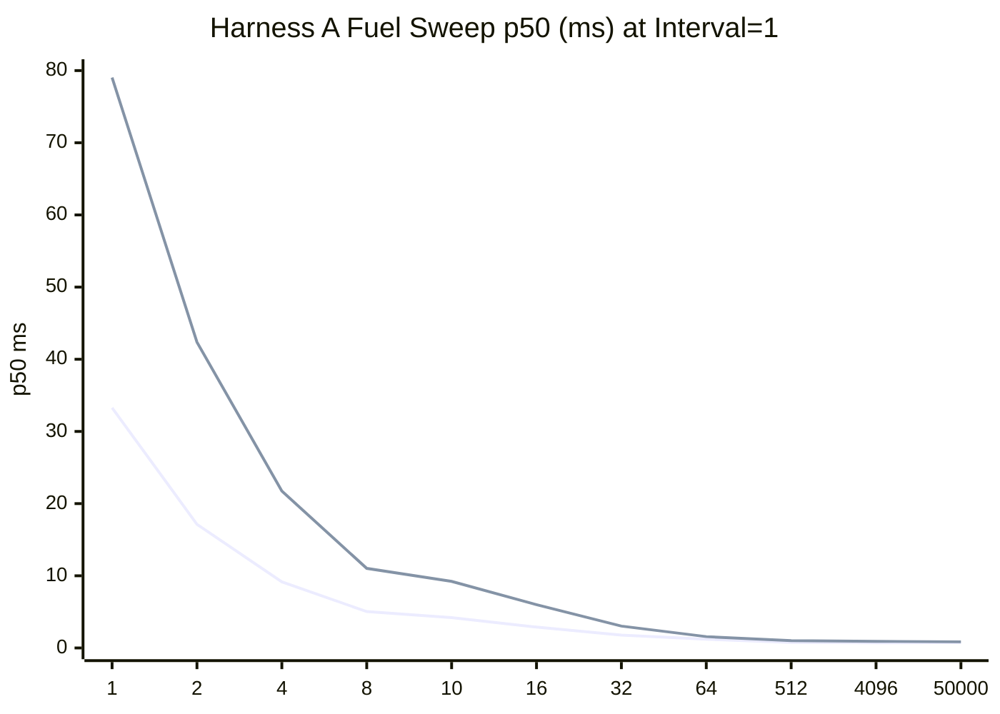
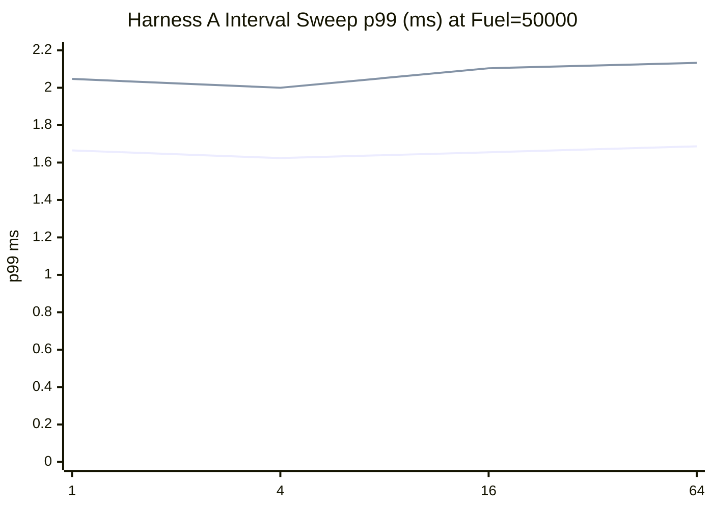
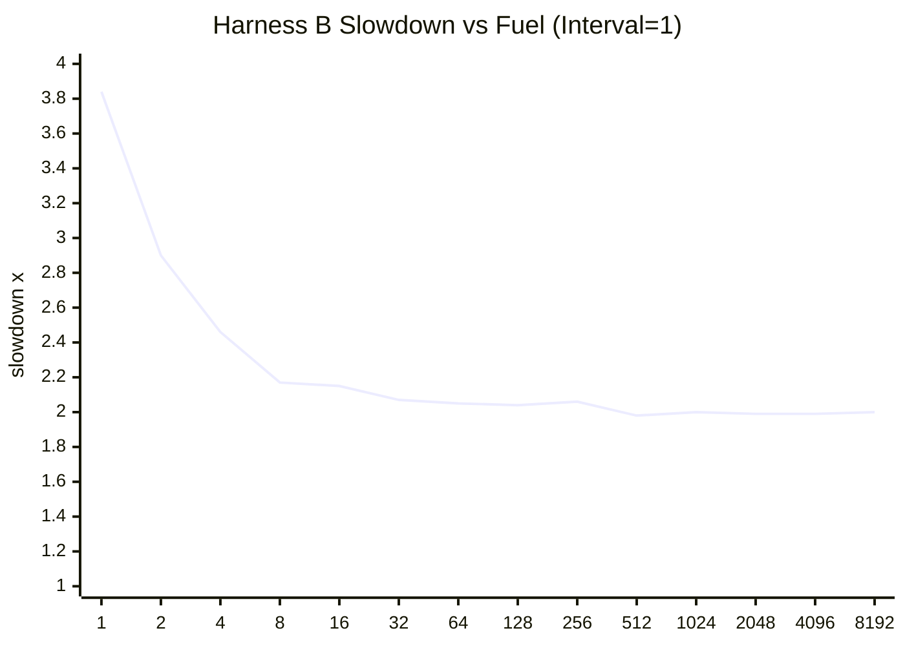
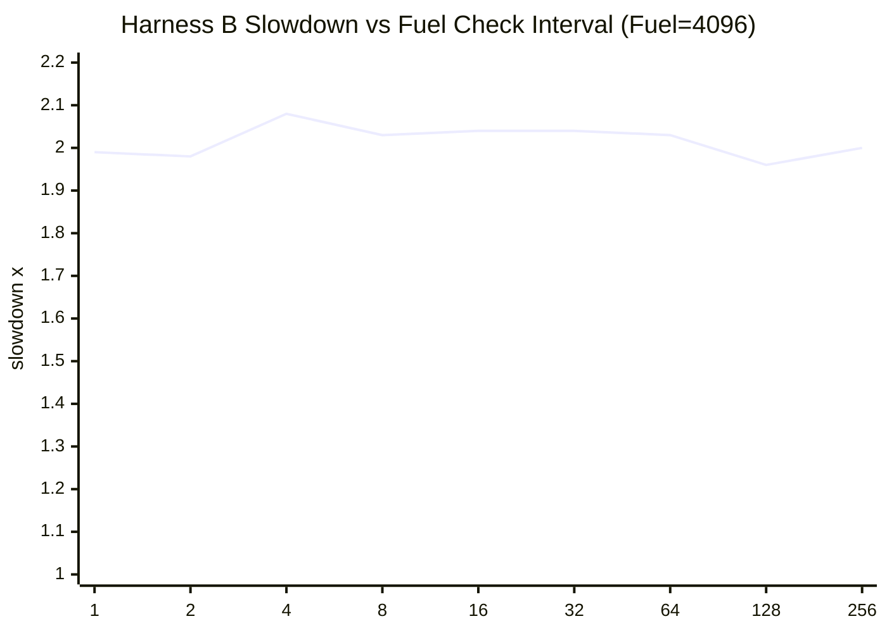

# pd-edge Perf Report (2026-03-18)

This is a full same-day rerun on the current tree after the HTTP/1 fast-path cleanup, detach documentation, and semantics verification work.

- Runs were executed sequentially, not in parallel.
- `raw_http_upstream` means the perf client hits the plaintext HTTP upstream fixture directly.
- `raw_http2_upstream` means the perf client hits the HTTPS HTTP/2 upstream fixture directly.
- `raw_http3_upstream` means the perf client hits the HTTPS HTTP/3 upstream fixture directly.
- Harness A standard comparison was rerun with `requests=120000` and VM fuel disabled.
- Harness A fuel/check-interval sweeps were rerun the same day with `scenario=no_host_calls_program`.
- Harness B was rerun the same day from `pd-vm/tests/jit/perf_tests.rs`.
- The harness spins the benchmark upstream as a separate child process.
- `PD_EDGE_PERF_USE_COMBINED_DEFAULT_FORWARD=1` was enabled for the Harness A reruns.
- All HTTP/2 coverage uses TLS + ALPN only.
- All HTTP/3 coverage uses HTTPS over QUIC with ALPN-negotiated `h3`.
- The plaintext HTTP upstream fixture still uses the minimal Hyper server, not Axum routing.
- Throughput comparisons in Section 1 are baseline-relative by scenario group, not raw cross-group comparisons.
- Matched baselines: `raw_no_program` for `no_host_calls_program` and `host_calls_terminate`.
- Matched baselines: `raw_http_upstream` for `http_proxy` and `http2->http`.
- Matched baselines: `raw_http_upstream_body_read` for `http_proxy_body_read`.
- Matched baselines: `raw_http2_upstream` for `http->http2` and `http2->http2`.
- Matched baselines: `raw_http3_upstream` for `http3->http3`.

Data sources:

- `target/http_proxy_perf_mode_async_2026-03-18_full.json`
- `target/http_proxy_perf_mode_threading_2026-03-18_full.json`
- `target/http_proxy_fuel_sweep_async_2026-03-18.json`
- `target/http_proxy_fuel_sweep_threading_2026-03-18.json`
- `target/pd_vm_perf_cooperative_fuel_2026-03-18.txt`

## 1) Standard Proxy Comparison (Harness A)

Config:

- `requests=120000`
- `warmup_requests=20000`
- `concurrency=128`
- `vm_fuel=disabled`
- The harness spins the upstream fixture as a separate child process.
- HTTP/2 cases use TLS only. No h2c was used.
- HTTP/3 cases use QUIC + ALPN `h3`.

| Scenario | Async RPS | Async Category Ratio | Async p50 (ms) | Async p95 (ms) | Async p99 (ms) | Threading RPS | Threading Category Ratio | Threading p50 (ms) | Threading p95 (ms) | Threading p99 (ms) |
|---|---:|---:|---:|---:|---:|---:|---:|---:|---:|---:|
| `raw_no_program` | 117,443.61 | 100.00% | 1.054 | 1.699 | 2.041 | 122,347.23 | 100.00% | 1.006 | 1.647 | 1.996 |
| `no_host_calls_program` | 71,380.07 | 60.78% | 1.721 | 2.922 | 3.582 | 69,268.22 | 56.62% | 1.786 | 2.887 | 3.502 |
| `host_calls_terminate` | 90,658.43 | 77.19% | 1.365 | 2.177 | 2.604 | 91,166.03 | 74.51% | 1.343 | 2.155 | 2.650 |
| `raw_http_upstream` | 115,758.24 | 100.00% | 1.072 | 1.679 | 1.961 | 122,164.71 | 100.00% | 1.013 | 1.597 | 1.886 |
| `http_proxy` | 51,479.36 | 44.47% | 2.476 | 3.549 | 4.022 | 51,997.31 | 42.56% | 2.421 | 3.586 | 4.160 |
| `raw_http_upstream_body_read` | 115,101.50 | 100.00% | 1.076 | 1.717 | 2.055 | 119,360.21 | 100.00% | 1.032 | 1.680 | 2.008 |
| `http_proxy_body_read` | 42,037.26 | 36.52% | 3.035 | 4.363 | 4.989 | 43,293.79 | 36.27% | 2.927 | 4.224 | 4.890 |
| `raw_http2_upstream` | 71,851.50 | 100.00% | 1.763 | 2.355 | 2.631 | 71,880.71 | 100.00% | 1.759 | 2.364 | 2.730 |
| `http->http2` | 50,255.46 | 69.94% | 2.517 | 3.473 | 3.925 | 46,978.06 | 65.36% | 2.653 | 3.830 | 4.667 |
| `http2->http` | 50,081.43 | 43.26% | 2.506 | 3.642 | 4.185 | 48,924.01 | 40.05% | 2.570 | 3.665 | 4.223 |
| `http2->http2` | 39,187.01 | 54.54% | 3.182 | 4.667 | 5.392 | 38,078.10 | 52.97% | 3.305 | 4.826 | 5.517 |
| `raw_http3_upstream` | 187,116.44 | 100.00% | 0.618 | 1.272 | 1.912 | 192,292.72 | 100.00% | 0.603 | 1.233 | 1.842 |
| `http3->http3` | 45,779.72 | 24.47% | 2.656 | 4.451 | 5.672 | 39,806.49 | 20.70% | 2.439 | 8.145 | 12.555 |

```mermaid
xychart-beta
    title "Harness A Throughput Ratio vs Matched Baseline (%)"
    x-axis ["raw_no_program", "no_host_calls_program", "host_calls_terminate", "raw_http_upstream", "http_proxy", "raw_http_upstream_body_read", "http_proxy_body_read", "raw_http2_upstream", "http->http2", "http2->http", "http2->http2", "raw_http3_upstream", "http3->http3"]
    y-axis "Matched Baseline %" 0 --> 110
    bar "async" [100, 60.78, 77.19, 100, 44.47, 100, 36.52, 100, 69.94, 43.26, 54.54, 100, 24.47]
    bar "threading" [100, 56.62, 74.51, 100, 42.56, 100, 36.27, 100, 65.36, 40.05, 52.97, 100, 20.70]
```

```mermaid
xychart-beta
    title "Harness A Tail Latency p99 (ms, lower is better)"
    x-axis ["raw_no_program", "no_host_calls_program", "host_calls_terminate", "raw_http_upstream", "http_proxy", "raw_http_upstream_body_read", "http_proxy_body_read", "raw_http2_upstream", "http->http2", "http2->http", "http2->http2", "raw_http3_upstream", "http3->http3"]
    y-axis "p99 ms" 0 --> 13
    bar "async" [2.041, 3.582, 2.604, 1.961, 4.022, 2.055, 4.989, 2.631, 3.925, 4.185, 5.392, 1.912, 5.672]
    bar "threading" [1.996, 3.502, 2.650, 1.886, 4.160, 2.008, 4.890, 2.730, 4.667, 4.223, 5.517, 1.842, 12.555]
```





## 2) Proxy Fuel and Check-Interval Sweeps (Harness A)

These sweeps use `scenario=no_host_calls_program` so they stay focused on VM scheduling cost rather than network-path variability.

Config:

- `requests=120000`
- `warmup_requests=12000`
- `concurrency=64`
- fixed scenario `no_host_calls_program`
- fixed fuel for interval sweep `50000`
- fixed interval for fuel sweep `1`

Fuel sweep (`scenario=no_host_calls_program`, fixed interval `1`):

| Fuel | Async p50 (ms) | Async p95 (ms) | Async p99 (ms) | Async RPS | Threading p50 (ms) | Threading p95 (ms) | Threading p99 (ms) | Threading RPS |
|---:|---:|---:|---:|---:|---:|---:|---:|---:|
| 1 | 33.284 | 40.102 | 45.906 | 1,896.20 | 79.028 | 135.682 | 142.662 | 676.86 |
| 2 | 17.135 | 20.144 | 22.970 | 3,707.66 | 42.375 | 75.781 | 86.421 | 1,226.93 |
| 4 | 9.155 | 10.742 | 12.352 | 6,947.98 | 21.744 | 34.889 | 37.448 | 2,493.78 |
| 8 | 5.038 | 5.833 | 6.753 | 12,677.63 | 11.025 | 17.706 | 18.207 | 4,947.55 |
| 10 | 4.211 | 4.979 | 5.885 | 15,089.20 | 9.223 | 13.949 | 14.392 | 6,136.39 |
| 16 | 2.895 | 3.541 | 4.298 | 21,860.29 | 6.003 | 9.105 | 9.714 | 9,504.16 |
| 32 | 1.782 | 2.419 | 3.264 | 34,848.01 | 3.033 | 5.876 | 6.616 | 17,402.86 |
| 64 | 1.207 | 1.834 | 2.568 | 50,209.04 | 1.568 | 5.343 | 6.602 | 28,003.86 |
| 512 | 0.774 | 1.303 | 1.711 | 77,798.08 | 1.010 | 2.475 | 3.670 | 54,041.26 |
| 4096 | 0.703 | 1.448 | 1.945 | 82,024.17 | 0.918 | 2.068 | 2.788 | 61,822.85 |
| 50000 | 0.742 | 1.276 | 1.634 | 81,643.96 | 0.851 | 1.530 | 2.080 | 69,852.86 |



Interval sweep (`scenario=no_host_calls_program`, fixed fuel `50000`):

| Interval | Async p50 (ms) | Async p95 (ms) | Async p99 (ms) | Async RPS | Threading p50 (ms) | Threading p95 (ms) | Threading p99 (ms) | Threading RPS |
|---:|---:|---:|---:|---:|---:|---:|---:|---:|
| 1 | 0.747 | 1.287 | 1.665 | 81,109.04 | 0.845 | 1.517 | 2.047 | 70,428.21 |
| 4 | 0.743 | 1.268 | 1.624 | 81,816.33 | 0.838 | 1.497 | 2.000 | 71,163.20 |
| 16 | 0.755 | 1.291 | 1.655 | 80,477.45 | 0.854 | 1.540 | 2.104 | 69,579.17 |
| 64 | 0.754 | 1.303 | 1.687 | 80,251.35 | 0.857 | 1.546 | 2.133 | 69,244.30 |



## 3) VM-only Microbenchmark (Harness B)

Test: `pd-vm/tests/jit/perf_tests.rs::perf_cooperative_fuel_configuration_impacts_latency`

Baseline:

- `fuel=disabled`
- median latency `13,230 us`

Fuel sweep (`fixed_check_interval=1`):

| Fuel | Median Latency (us) | Slowdown vs Baseline |
|---:|---:|---:|
| 1 | 50,750 | 3.84x |
| 2 | 38,422 | 2.90x |
| 4 | 32,576 | 2.46x |
| 8 | 28,758 | 2.17x |
| 16 | 28,441 | 2.15x |
| 32 | 27,382 | 2.07x |
| 64 | 27,081 | 2.05x |
| 128 | 27,010 | 2.04x |
| 256 | 27,215 | 2.06x |
| 512 | 26,186 | 1.98x |
| 1024 | 26,401 | 2.00x |
| 2048 | 26,368 | 1.99x |
| 4096 | 26,286 | 1.99x |
| 8192 | 26,425 | 2.00x |



Interval sweep (`fixed_fuel=4096`):

| Interval | Median Latency (us) | Slowdown vs Baseline |
|---:|---:|---:|
| 1 | 26,300 | 1.99x |
| 2 | 26,188 | 1.98x |
| 4 | 27,491 | 2.08x |
| 8 | 26,883 | 2.03x |
| 16 | 27,048 | 2.04x |
| 32 | 26,963 | 2.04x |
| 64 | 26,881 | 2.03x |
| 128 | 25,940 | 1.96x |
| 256 | 26,399 | 2.00x |



## 4) Notes

- The full async and threading Harness A matrices both completed cleanly with `120000/120000` responses in every scenario, zero request errors, and zero unexpected-status errors.
- The Harness A fuel/check-interval sweeps also completed cleanly in both modes at `120000/120000` responses and zero request errors.
- Harness B completed cleanly after fixing two stale `pd-vm` JIT helper call signatures that had drifted out of sync.
- This report is now a full March 18 bundle, not just the standard matrix.
- The throughput chart in Section 1 is baseline-relative by scenario group. It should not be read as a single normalization against `raw_no_program`.

## 5) Short Interpretation

- The local VM-only path improved materially versus the March 17 report.
- `no_host_calls_program` now lands at `60.78%` of `raw_no_program` in async mode and `56.62%` in threading mode.
- `host_calls_terminate` is much closer to the raw baseline at `77.19%` async and `74.51%` threading, which is consistent with the native local-response write-path work.
- The stock plaintext proxy row improved substantially versus March 17 but is still below half of its matched direct baseline.
- `http_proxy` lands at `44.47%` async and `42.56%` threading of `raw_http_upstream`.
- `http_proxy_body_read` also improved, landing at `36.52%` async and `36.27%` threading of `raw_http_upstream_body_read`.
- The mixed HTTP/2 rows remain the strongest proxy-relative results in this matrix.
- `http->http2` landed at `69.94%` async and `65.36%` threading of direct H2.
- `http2->http2` landed at `54.54%` async and `52.97%` threading of direct H2.
- End-to-end H3 improved versus March 17 but still remains far below direct H3.
- `http3->http3` landed at `24.47%` async and `20.70%` threading of `raw_http3_upstream`.
- The Harness A fuel sweeps show the same pattern as earlier runs, but on a stronger tree: tiny fuel values are catastrophic, then both modes flatten out quickly once fuel is in the hundreds to low thousands.
- In async mode, moving from `fuel=1` to `fuel=512` at interval `1` improved throughput from `1,896` to `77,798` RPS and dropped p50 from `33.284 ms` to `0.774 ms`.
- In threading mode, the same move improved throughput from `677` to `54,041` RPS and dropped p50 from `79.028 ms` to `1.010 ms`.
- The check-interval sweep remains almost flat once fuel is large. `interval=4` was the best point in both modes, but the total spread stayed around one percent.
- Harness B shows the same cooperative-fuel plateau from the VM side: once fuel is reasonably large, slowdown stabilizes near `2x`, and varying the check interval from `1` to `256` barely moves the result.
- The main takeaway from the current report is that the matrix is clean, the VM-only and terminate rows improved sharply, the stock plaintext proxy row is now in the low-to-mid 40% band, and both Harness A and Harness B continue to show that fuel granularity dominates latency far more than check interval once fuel is non-trivial.

## 6) Commands Used

```powershell
cargo build -p pd-edge --bin pd-edge-http-proxy --example http_proxy_perf_framework --release --features http2,tls,http3

$env:PD_EDGE_PERF_USE_COMBINED_DEFAULT_FORWARD='1'
.\target\release\examples\http_proxy_perf_framework.exe `
  --binary .\target\release\pd-edge-http-proxy.exe `
  --skip-build `
  --vm-execution-mode async `
  --no-vm-fuel `
  --requests 120000 `
  --warmup-requests 20000 `
  --concurrency 128 `
  --json-out .\target\http_proxy_perf_mode_async_2026-03-18_full.json

$env:PD_EDGE_PERF_USE_COMBINED_DEFAULT_FORWARD='1'
.\target\release\examples\http_proxy_perf_framework.exe `
  --binary .\target\release\pd-edge-http-proxy.exe `
  --skip-build `
  --vm-execution-mode threading `
  --no-vm-fuel `
  --requests 120000 `
  --warmup-requests 20000 `
  --concurrency 128 `
  --json-out .\target\http_proxy_perf_mode_threading_2026-03-18_full.json

$env:PD_EDGE_PERF_USE_COMBINED_DEFAULT_FORWARD='1'
.\target\release\examples\http_proxy_perf_framework.exe `
  --binary .\target\release\pd-edge-http-proxy.exe `
  --skip-build `
  --vm-execution-mode async `
  --fuel-latency-sweep `
  --scenario no_host_calls_program `
  --vm-fuel 50000 `
  --requests 120000 `
  --warmup-requests 12000 `
  --concurrency 64 `
  --fuel-latency-fuels "1,2,4,8,10,16,32,64,512,4096,50000" `
  --fuel-latency-check-intervals "1,4,16,64" `
  --json-out .\target\http_proxy_fuel_sweep_async_2026-03-18.json

$env:PD_EDGE_PERF_USE_COMBINED_DEFAULT_FORWARD='1'
.\target\release\examples\http_proxy_perf_framework.exe `
  --binary .\target\release\pd-edge-http-proxy.exe `
  --skip-build `
  --vm-execution-mode threading `
  --fuel-latency-sweep `
  --scenario no_host_calls_program `
  --vm-fuel 50000 `
  --requests 120000 `
  --warmup-requests 12000 `
  --concurrency 64 `
  --fuel-latency-fuels "1,2,4,8,10,16,32,64,512,4096,50000" `
  --fuel-latency-check-intervals "1,4,16,64" `
  --json-out .\target\http_proxy_fuel_sweep_threading_2026-03-18.json

cargo test -p pd-vm --release --test jit_tests perf_cooperative_fuel_configuration_impacts_latency -- --ignored --nocapture
```
