# pd-edge Perf Report (2026-03-18)

This is a full same-day Harness A rerun on the current tree after the HTTP/1 fast-path cleanup, detach documentation, and semantics verification work.

- Runs were executed sequentially, not in parallel.
- `requests=120000`
- `warmup_requests=20000`
- `concurrency=128`
- `vm_fuel=disabled`
- The harness spins the benchmark upstream as a separate child process.
- `PD_EDGE_PERF_USE_COMBINED_DEFAULT_FORWARD=1` was enabled for this rerun.
- All HTTP/2 coverage uses TLS + ALPN only.
- All HTTP/3 coverage uses HTTPS over QUIC with ALPN-negotiated `h3`.
- The plaintext HTTP upstream fixture still uses the minimal Hyper server, not Axum routing.
- Throughput comparisons are baseline-relative, not raw cross-group comparisons.
- Matched baselines: `raw_no_program` for `no_host_calls_program` and `host_calls_terminate`.
- Matched baselines: `raw_http_upstream` for `http_proxy` and `http2->http`.
- Matched baselines: `raw_http_upstream_body_read` for `http_proxy_body_read`.
- Matched baselines: `raw_http2_upstream` for `http->http2` and `http2->http2`.
- Matched baselines: `raw_http3_upstream` for `http3->http3`.

Data sources:

- `target/http_proxy_perf_mode_async_2026-03-18_full.json`
- `target/http_proxy_perf_mode_threading_2026-03-18_full.json`

## 1) Standard Proxy Comparison (Harness A)

| Scenario | Async RPS | Async Category Ratio | Async p50 (ms) | Async p95 (ms) | Async p99 (ms) | Threading RPS | Threading Category Ratio | Threading p50 (ms) | Threading p95 (ms) | Threading p99 (ms) |
|---|---:|---:|---:|---:|---:|---:|---:|---:|---:|---:|
| `raw_no_program` | 117,443.61 | 100.00% | 1.054 | 1.699 | 2.041 | 122,347.23 | 100.00% | 1.006 | 1.647 | 1.996 |
| `no_host_calls_program` | 71,380.07 | 60.78% | 1.721 | 2.922 | 3.582 | 69,268.22 | 56.62% | 1.786 | 2.887 | 3.502 |
| `host_calls_terminate` | 90,658.43 | 77.19% | 1.365 | 2.177 | 2.604 | 91,166.03 | 74.51% | 1.343 | 2.155 | 2.650 |
| `raw_http_upstream` | 115,758.24 | 100.00% | 1.072 | 1.679 | 1.961 | 122,164.71 | 100.00% | 1.013 | 1.597 | 1.886 |
| `http_proxy` | 51,479.36 | 44.47% | 2.476 | 3.549 | 4.022 | 51,997.31 | 42.56% | 2.421 | 3.586 | 4.160 |
| `raw_http_upstream_body_read` | 115,101.50 | 100.00% | 1.076 | 1.717 | 2.055 | 119,360.21 | 100.00% | 1.032 | 1.680 | 2.008 |
| `http_proxy_body_read` | 42,037.26 | 36.52% | 3.035 | 4.363 | 4.989 | 43,293.79 | 36.27% | 2.927 | 4.224 | 4.890 |
| `raw_http2_upstream` | 71,851.50 | 100.00% | 1.763 | 2.355 | 2.631 | 71,880.71 | 100.00% | 1.759 | 2.364 | 2.730 |
| `http->http2` | 50,255.46 | 69.94% | 2.517 | 3.473 | 3.925 | 46,978.06 | 65.36% | 2.653 | 3.830 | 4.667 |
| `http2->http` | 50,081.43 | 43.26% | 2.506 | 3.642 | 4.185 | 48,924.01 | 40.05% | 2.570 | 3.665 | 4.223 |
| `http2->http2` | 39,187.01 | 54.54% | 3.182 | 4.667 | 5.392 | 38,078.10 | 52.97% | 3.305 | 4.826 | 5.517 |
| `raw_http3_upstream` | 187,116.44 | 100.00% | 0.618 | 1.272 | 1.912 | 192,292.72 | 100.00% | 0.603 | 1.233 | 1.842 |
| `http3->http3` | 45,779.72 | 24.47% | 2.656 | 4.451 | 5.672 | 39,806.49 | 20.70% | 2.439 | 8.145 | 12.555 |

```mermaid
xychart-beta
    title "Harness A Throughput Ratio vs Matched Baseline (%)"
    x-axis ["raw_no_program", "no_host_calls_program", "host_calls_terminate", "raw_http_upstream", "http_proxy", "raw_http_upstream_body_read", "http_proxy_body_read", "raw_http2_upstream", "http->http2", "http2->http", "http2->http2", "raw_http3_upstream", "http3->http3"]
    y-axis "Matched Baseline %" 0 --> 110
    bar "async" [100, 60.78, 77.19, 100, 44.47, 100, 36.52, 100, 69.94, 43.26, 54.54, 100, 24.47]
    bar "threading" [100, 56.62, 74.51, 100, 42.56, 100, 36.27, 100, 65.36, 40.05, 52.97, 100, 20.70]
```

```mermaid
xychart-beta
    title "Harness A Tail Latency p99 (ms, lower is better)"
    x-axis ["raw_no_program", "no_host_calls_program", "host_calls_terminate", "raw_http_upstream", "http_proxy", "raw_http_upstream_body_read", "http_proxy_body_read", "raw_http2_upstream", "http->http2", "http2->http", "http2->http2", "raw_http3_upstream", "http3->http3"]
    y-axis "p99 ms" 0 --> 13
    bar "async" [2.041, 3.582, 2.604, 1.961, 4.022, 2.055, 4.989, 2.631, 3.925, 4.185, 5.392, 1.912, 5.672]
    bar "threading" [1.996, 3.502, 2.650, 1.886, 4.160, 2.008, 4.890, 2.730, 4.667, 4.223, 5.517, 1.842, 12.555]
```





## 2) Notes

- The full async and threading matrices both completed cleanly with `120000/120000` responses in every scenario, zero request errors, and zero unexpected-status errors.
- This is a full rerun, not a partial plaintext refresh.
- The direct plaintext baseline is stronger than the previous report, and the stock plaintext proxy row moved up with it.
- The proxy-side HTTP/1 fast-path cleanup and detach semantics verification did not introduce correctness regressions in the benchmark matrix.
- The throughput chart above is baseline-relative by scenario group. It should not be read as a single normalization against `raw_no_program`.

## 3) Short Interpretation

- The local VM-only path improved materially versus the prior report.
- `no_host_calls_program` now lands at `60.78%` of `raw_no_program` in async mode and `56.62%` in threading mode.
- `host_calls_terminate` is now much closer to the raw baseline at `77.19%` async and `74.51%` threading, which is consistent with the native local-response write-path work.
- The stock plaintext proxy row improved substantially but is still below half of its matched direct baseline.
- `http_proxy` now lands at `44.47%` async and `42.56%` threading of `raw_http_upstream`.
- `http_proxy_body_read` improved as well, landing at `36.52%` async and `36.27%` threading of `raw_http_upstream_body_read`.
- The mixed HTTP/2 rows are currently the strongest proxy-relative results in this matrix.
- `http->http2` landed at `69.94%` async and `65.36%` threading of direct H2.
- `http2->http2` landed at `54.54%` async and `52.97%` threading of direct H2.
- `http2->http` remains closer to the plaintext proxy rows than to the H2-only rows, at `43.26%` async and `40.05%` threading of `raw_http_upstream`.
- End-to-end H3 improved versus the previous report but still remains far below direct H3.
- `http3->http3` landed at `24.47%` async and `20.70%` threading of `raw_http3_upstream`.
- The main takeaway from the current report is that the matrix is clean, the VM-only and terminate rows improved sharply, and the stock plaintext proxy row is now in the low-to-mid 40% band, but still below the `>50%` target against its matched direct baseline.

## 4) Commands Used

```powershell
cargo build -p pd-edge --bin pd-edge-http-proxy --example http_proxy_perf_framework --release --features http2,tls,http3

$env:PD_EDGE_PERF_USE_COMBINED_DEFAULT_FORWARD='1'
.\target\release\examples\http_proxy_perf_framework.exe `
  --binary .\target\release\pd-edge-http-proxy.exe `
  --skip-build `
  --vm-execution-mode async `
  --no-vm-fuel `
  --requests 120000 `
  --warmup-requests 20000 `
  --concurrency 128 `
  --json-out .\target\http_proxy_perf_mode_async_2026-03-18_full.json

$env:PD_EDGE_PERF_USE_COMBINED_DEFAULT_FORWARD='1'
.\target\release\examples\http_proxy_perf_framework.exe `
  --binary .\target\release\pd-edge-http-proxy.exe `
  --skip-build `
  --vm-execution-mode threading `
  --no-vm-fuel `
  --requests 120000 `
  --warmup-requests 20000 `
  --concurrency 128 `
  --json-out .\target\http_proxy_perf_mode_threading_2026-03-18_full.json
```
