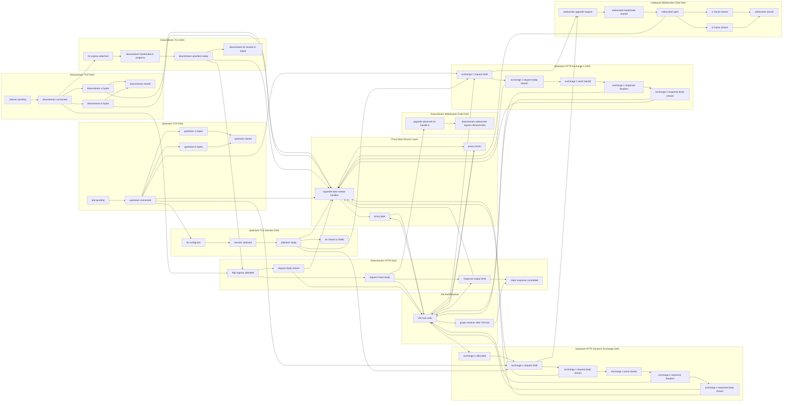

# Full DAG Graph

This page collects the currently supported protocol DAGs into one conceptual graph.

Notes:

- `exchange 1` is the reserved default upstream HTTP exchange.
- `exchange n` represents additional outbound exchanges allocated with `http::exchange::new()`.
- The proxy layer is a capability layer, not a protocol DAG. It connects exported byte streams from TCP, TLS plaintext, HTTP bodies, and WebSocket binary adapters.
- The graph is intentionally conceptual. It shows ingress and egress connections between DAGs, not every internal transition implemented by each subsystem.

