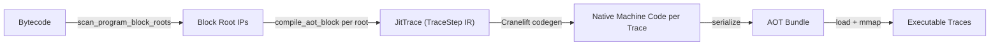

# Effort Evaluation: Whole-Program AOT Native Code Emission

## Current Architecture (Trace-Based AOT)

The existing AOT pipeline works as follows:

| Property | Current Value |
|---|---|
| **Compilation unit** | Individual linear traces (straight-line code, forward guards only) |
| **IR** | `TraceStep` — 22 variants, 1:1 with opcodes except branches become `GuardFalse`/`JumpToRoot`/`JumpToIp` |
| **Codegen backend** | Cranelift (via `cranelift-codegen` crate, no `cranelift-jit` module used directly) |
| **Opcode coverage** | All 25 `OpCode` variants handled; `Brfalse` with backward target is rejected as NYI |
| **Branch model** | Traces are linear; `Brfalse` becomes a forward guard, backward `Br` terminates the trace |
| **Call model** | All `Call` ops dispatch to host functions via a bridge ([pd_vm_cranelift_step](pd-vm/src/vm/jit/native/bridge.rs#53-247)); no intra-program call frames |
| **Dispatch** | Interpreter loop enters traces at known root IPs; traces exit back to interpreter on guard failure, backward branch, or halt |
| **Yielding/Async** | `CallOutcome::Yield` rewinds IP and re-pushes args (unsupported in native-only AOT); `Pending` advances IP |

### Key Files and Sizes

| File | Lines | Role |
|---|---|---|
| [trace.rs](pd-vm/src/vm/jit/trace.rs) | 1200 | Trace recording, `TraceStep` IR, [prepare_aot](pd-vm/src/vm/jit/trace.rs#198-244), block-root scanning |
| [aot.rs](pd-vm/src/vm/jit/aot.rs) | 927 | AOT bundle encode/decode, entry points |
| [codegen.rs](pd-vm/src/vm/jit/native/codegen.rs) | 2085 | Cranelift IR emission for each `TraceStep` |
| [bridge.rs](pd-vm/src/vm/jit/native/bridge.rs) | 247 | Runtime helper called from native code for non-inlined ops |
| [runtime.rs](pd-vm/src/vm/jit/runtime.rs) | 809 | Trace execution loop, native trace caching, chained dispatch |
| [cranelift.rs](pd-vm/src/vm/jit/native/cranelift.rs) | ~400 | Cranelift function builder, layout probing |
| [exec.rs](pd-vm/src/vm/jit/native/exec.rs) | 155 | Executable memory allocation (mmap/VirtualAlloc) |
| [mod.rs (vm)](pd-vm/src/vm/mod.rs) | 2600+ | Interpreter loop (calls [execute_jit_entry](pd-vm/src/vm/jit/runtime.rs#459-484) for hot IPs) |

---

## What "Whole-Program" AOT Means

Instead of producing a bag of traces that individually cover straight-line code regions and exit to an interpreter, the goal is to emit **a single native function (or small set of functions) that can execute the entire bytecode program** without needing a bytecode interpreter at all.

This requires handling:
1. **All control flow** — including backward `Brfalse` branches, arbitrary loops, and irreducible CFGs
2. **All opcodes** — no "unsupported opcode" bail-out
3. **Suspension/resumption** — yield, pending, and fuel interrupts from arbitrary program points
4. **Dynamic stack management** — the VM operand stack and locals are still dynamically typed `Value` objects

---

## Gap Analysis

### 1. Control-Flow Graph Construction *(New — not present today)*

| Aspect | Current | Required |
|---|---|---|
| CFG | Not constructed; traces are linear | Must build a full CFG from bytecode |
| Backward branches | `BackwardGuard` → NYI rejection | Must become normal conditional branches in native code |
| Forward branches | `GuardFalse` (side exit) | Must become standard Cranelift `brif` with both targets |
| Irreducible loops | Not relevant | Must handle (or prove the compiler never emits them) |

**Effort**: New module (~300–500 lines) to build a basic-block CFG from the bytecode, identify loop headers, and produce a Cranelift block layout. Can partially reuse [scan_program_block_roots](pd-vm/src/vm/jit/trace.rs#1066-1130) and [scan_loop_headers](pd-vm/src/vm/jit/trace.rs#1131-1174).

### 2. Cranelift Codegen Refactor *(Heavy — rewrite of codegen.rs)*

The current [codegen.rs](pd-vm/src/vm/jit/native/codegen.rs) (2085 lines) emits Cranelift IR by walking a flat `Vec<TraceStep>` sequentially. For whole-program compilation:

- **Block structure**: Must create one Cranelift block per basic block and wire `brif`/[jump](pd-vm/src/vm/jit/native/codegen.rs#1823-1831) instructions between them.
- **Guard removal**: `GuardFalse` with side-exit becomes a normal conditional branch to the "false" basic block.
- **Loop back-edges**: Must become normal jumps to loop-header blocks.
- **Entry from any IP**: For fuel-interrupt resumption, must support entering execution at an arbitrary block, not just a single trace root.

**Effort**: ~70% rewrite of [codegen.rs](pd-vm/src/vm/jit/native/codegen.rs). The per-opcode inline emitters (Ldc, Add, Ldloc, etc.) are reusable as-is, but the top-level function that builds the Cranelift function needs to be restructured around a block-per-basic-block approach. Estimated: **1,000–1,500 lines of rework**.

### 3. TraceStep IR Elimination or Generalization

Currently `TraceStep` is trace-centric (no backward branches, `GuardFalse` as a unidirectional side exit, `JumpToRoot`). For whole-program:

- **Option A**: Keep `TraceStep` and add new branch variants (`BrFalse { true_bb, false_bb }`, `Br { target_bb }`). ~100 lines of new IR + updates.
- **Option B**: Skip `TraceStep` entirely and lower bytecode directly to Cranelift IR. This removes a layer and simplifies the pipeline but loses the interpreter-mode JIT fallback.

**Recommended**: Option A for incremental adoption — keep trace-based JIT working alongside whole-program AOT.

### 4. Suspension/Resumption from Any Program Point *(Hardest change)*

> [!CAUTION]
> This is the most architecturally challenging part of the conversion.

Today, when a native trace encounters `STATUS_OUT_OF_FUEL` or `STATUS_YIELDED`, it simply returns to the interpreter, which knows where the IP is and resumes from there in the interpreter loop. In a **whole-program** native bundle there is no interpreter to fall back to.

Two approaches:

| Approach | Description | Effort |
|---|---|---|
| **Re-entry dispatch table** | Emit a `switch` on the IP at function entry that jumps to the correct Cranelift block. After any suspension (fuel, yield, pending), the native function returns, and the next [run()](pd-vm/src/vm/jit/native/bridge.rs#3-22) call re-enters the same native function which dispatches to the correct block via the switch. | Medium (~300 lines). Similar to what Wasm engines do for resumable coroutines. The existing [collect_resumable_aot_roots](pd-vm/src/vm/jit/aot.rs#257-278) already identifies fuel-interrupt re-entry points. |
| **Stackful coroutines / setjmp** | Use `setjmp`/`longjmp` (or Cranelift's stack switching) to save/restore the native call frame on suspension. | Very high complexity, platform-specific, and hard to debug. Not recommended. |

**Recommended**: Re-entry dispatch table. The current AOT already generates "resume root" traces for fuel-checkpoint IPs; this can be unified into a single Cranelift function with a block per resume point.

### 5. `CallOutcome::Yield` IP-Rewind Semantics

The KI documents note:
> `CallOutcome::Yield` is currently **unsupported in native-only AOT bundles** as it requires bytecode replay which is unavailable.

For whole-program AOT this remains a design decision:
- **Keep unsupported**: Host functions that return `Yield` must be handled by the caller (pd-edge) without relying on IP rewind. This is the path of least resistance.
- **Support it**: The re-entry dispatch table (approach from §4) naturally supports re-executing from the `Call` instruction's block entry. Would require the native code to "undo" the call's arg pops (same as interpreter does today). Adds ~100–200 lines.

### 6. AOT Bundle Format *(Moderate — mostly additive)*

Current bundle format stores a list of traces with per-trace machine code. For whole-program:

- Replace `traces: Vec<EncodedAotTrace>` with a single `program_code: Vec<u8>` blob.
- Must still store re-entry point metadata (IP → offset into native code) for the dispatch table.
- Constants, imports, local_count, interrupt settings remain the same.
- **AOT_VERSION** bump required.

**Effort**: ~200–300 lines of changes in [aot.rs](pd-vm/src/vm/jit/aot.rs). Mostly simplification (one code blob instead of N trace blobs).

### 7. Runtime Changes *(Moderate)*

- [execute_jit_native](pd-vm/src/vm/jit/runtime.rs#485-611) currently loops over traces, chaining them. For whole-program, it calls one function and handles the return status. This is simpler.
- [from_aot_bundle_bytes](pd-vm/src/vm/jit/aot.rs#160-222) must reconstruct the re-entry dispatch metadata instead of per-trace data.
- Thread-local native trace cache becomes a whole-program code cache (simpler).

**Effort**: ~300–400 lines of rework in [runtime.rs](pd-vm/src/vm/jit/runtime.rs).

### 8. Testing *(Significant)*

The existing test suite exercises the trace-based JIT extensively. Whole-program AOT needs:
- All existing interpreter tests must also pass in whole-program-native mode
- Control-flow edge cases: nested loops, if-else chains, loop-with-break, early return
- Fuel interruption and resumption at every basic-block boundary
- Yield and Pending from host calls
- AOT bundle round-trip (encode → decode → execute)

---

## Effort Summary

| Component | Lines Changed/New | Difficulty | Dependencies |
|---|---|---|---|
| CFG construction | ~400 new | Medium | None |
| IR changes (`TraceStep`) | ~150 | Low | CFG |
| Codegen rewrite | ~1,200 rework | **High** | CFG, IR |
| Re-entry dispatch table | ~300 new | Medium-High | Codegen |
| AOT bundle format | ~250 rework | Low | Codegen, dispatch |
| Runtime ([runtime.rs](pd-vm/src/vm/jit/runtime.rs)) | ~350 rework | Medium | Bundle format |
| Yield/Pending support | ~150 new | Medium | Dispatch |
| Test coverage | ~500–800 new | Medium | All above |
| **Total** | **~2,800–3,500 lines** | | |

### Time Estimate

Assuming familiarity with the codebase and Cranelift:

| Phase | Estimated Time |
|---|---|
| Design + CFG construction | 2–3 days |
| Codegen rewrite + dispatch table | 4–6 days |
| Bundle format + runtime | 2–3 days |
| Testing + debugging | 3–5 days |
| **Total** | **~2–3 weeks** |

## Simplifying Factors

Several properties of the existing codebase make this easier than a general-purpose VM:

1. **Small opcode set** — Only 25 opcodes, all already have Cranelift emission code
2. **No intra-program call stack** — All `Call` goes to host functions; no recursive dispatch or stack frames to manage in native code
3. **Structured control flow from compiler** — The RustScript/JS/Scheme/Lua frontends all emit structured control flow (`Br`/`Brfalse`); irreducible CFGs are unlikely
4. **Existing Cranelift infrastructure** — Layout probing, helper bridge, executable memory management are all production-ready
5. **Existing fuel-checkpoint resume roots** — [collect_resumable_aot_roots](pd-vm/src/vm/jit/aot.rs#257-278) already identifies the exact IPs where the re-entry dispatch table needs entries

## Complicating Factors

1. **Dynamic typing on the stack** — Every `Value` is a tagged union with heap variants (`String`, `Array`, `Map`). The codegen must always handle slow paths via the bridge helper — this is already the case and won't change
2. **Yield IP-rewind** — Deciding whether to support this affects the dispatch table design
3. **Backward `Brfalse`** — Currently NYI; must be supported, which means proper loop-header identification and Cranelift block placement
4. **Two compilation modes** — Must keep trace-based JIT working alongside whole-program AOT (unless you're willing to remove the trace JIT)
