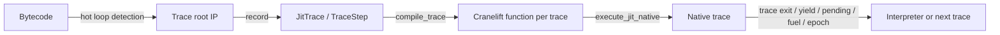

# Re-evaluation: Whole-Program AOT Native Code Emission

## Status Update

This plan started from a trace-JIT-only baseline. The current codebase has moved past that point.

Implemented:

- whole-program AOT lives under `src/vm/aot/`
- neutral shared native helpers live under `src/vm/native/`
- in-memory whole-program native execution is working
- self-contained persisted PAT bundles are working
- `pd-vm-run --aot-load <artifact.pat>` can construct and run the VM without a source path
- the ignored AOT placeholder tests were replaced with real coverage
- CLI and runtime builtin product surface now expose AOT compile/load/save/introspection paths
- CLI host binding now goes through `Program.imports` and a shared registry plan; the old name-based binding path is gone

Remaining phase-3 work is mostly cleanup and optimization:

- extract additional reusable codegen helpers from `vm/jit` and `vm/aot` into the neutral shared layer
- continue perf characterization and tuning now that interpreter, trace-JIT, and AOT are all runnable surfaces

## Bottom Line

The previous AOT implementation is gone. There is no live `src/vm/jit/aot.rs`, no
`prepare_aot`, no bundle loader/decoder, no `AOT_VERSION`, and no encoded-trace machinery left in
`src`. The current baseline is a trace JIT with optional per-trace native emission through
Cranelift.

That changes the scope materially:

- Whole-program AOT is no longer an extension of an existing AOT pipeline.
- It is a new compiler/runtime path that can reuse current native opcode lowering, bridge helpers,
  interruption plumbing, and program hashing, but it should not be built under
  `src/vm/jit`.
- The highest-leverage plan is to build whole-program native execution in memory first, then add
  serialization/load only if persisted AOT artifacts are still a product requirement.
- The implementation boundary should be explicit:
  - new AOT-specific code lives under `src/vm/aot/`
  - trace-JIT-specific code stays under `src/vm/jit/`
  - shared native helpers move to a neutral shared directory such as `src/vm/native/`
    and must not branch on "jit vs aot"

## Historical Baseline (Trace JIT Only)

| Property | Current Value |
| --- | --- |
| Compilation unit | Individual hot-loop traces only |
| IR | `JitTrace` plus trace-oriented `TraceStep` |
| Native backend | Cranelift, one native function per trace |
| Runtime model | Trace executes natively, then usually exits back to interpreter or chains to another trace |
| Branch model | Trace guards, loop back-edges inside a trace, explicit trace exits for non-trace control flow |
| Interrupt model | Fuel/epoch checks injected into trace code and surfaced as status returns |
| Call model | Host and builtin calls only; no intra-program script call frames |
| AOT surface | Removed at the time of this re-evaluation; now reintroduced under `src/vm/aot/` |
| Artifact format | Removed at the time of this re-evaluation; now reintroduced as self-contained `.pat` whole-program bundles |
| Test state | Historical note: ignored placeholders existed then; they have since been replaced with real AOT coverage |

### Relevant Files and Sizes

`repo-analysis.md` currently reports `pd-vm/vm/jit` at `6929` LOC inside a `50809` LOC `pd-vm`
crate with `501` detected tests.

| File | Lines | Role |
| --- | ---: | --- |
| `src/vm/jit/trace.rs` | 1312 | Trace recording, loop-header detection, trace IR |
| `src/vm/jit/runtime.rs` | 1040 | Interpreter trace execution and native trace runtime |
| `src/vm/jit/native/codegen.rs` | 3685 | Per-step Cranelift lowering helpers and inline/native helpers |
| `src/vm/jit/native/cranelift.rs` | 405 | `compile_trace` entry point and Cranelift function assembly |
| `src/vm/jit/native/bridge.rs` | 278 | Helper bridge for generic/native fallback operations |
| `src/vm/jit/native/layout.rs` | 323 | Native stack/value layout probing |
| `src/vm/jit/native/exec.rs` | 160 | Executable memory management |
| `src/vm/jit/native/mod.rs` | 146 | Native backend surface and status codes |

### Target Directory Layout

The plan should target this shape rather than extending `vm/jit`:

- `src/vm/aot/`
  - whole-program CFG construction
  - AOT IR
  - program-level Cranelift lowering
  - AOT runtime entry/resume
  - optional artifact encode/decode
- `src/vm/jit/`
  - trace recording
  - trace runtime
  - trace-specific native compilation entry points
- `src/vm/native/` or equivalent shared-neutral directory
  - executable buffer management
  - native layout probing
  - Cranelift signatures and low-level emit helpers
  - helper bridge ABI utilities

Shared code in that neutral layer should not contain "if this is JIT do X, else if this is AOT do
Y". If behavior differs, the caller-specific code should live in `vm/jit` or `vm/aot`, while the
shared layer exposes smaller neutral primitives.

## What "Whole-Program AOT" Means From This Baseline

From the current codebase, whole-program AOT means emitting one native program entry point, or a
small fixed set of native entry points, that can execute the full bytecode program without
interpreter participation at normal control-flow boundaries.

That requires:

1. Building a full CFG from bytecode instead of recording hot traces.
2. Supporting arbitrary branch targets and loop back-edges as normal native control flow.
3. Re-entering native code from an arbitrary bytecode IP after yield, pending host ops, fuel
   interruption, or epoch interruption.
4. Preserving existing VM semantics for the dynamic operand stack, locals, drop-contract side
   effects, and host-call behavior.
5. Optionally serializing and reloading the compiled native program if persisted AOT remains a
   requirement.

## Reusable Pieces

- The current Cranelift backend already knows how to lower most VM operations and interact with the
  real `Vm` layout.
- `src/vm/jit/native/codegen.rs` contains the expensive opcode-specific logic; parts of that
  are reusable, but only after being extracted into neutral helpers outside `vm/jit`.
- Host call bridging already returns stable statuses for continue, halt, yield, pending, error, and
  interruption.
- Program hashing and cache invalidation already exist through `program_cache_key`.
- The VM already preserves enough state for resumption:
  `CallOutcome::Yield` rewinds `ip` to the call site, pending host ops advance `ip` to the resume
  point, and fuel/epoch yield through VM status transitions.

Practical consequence:

- Do not add `vm/jit/aot.rs`.
- Do not make `vm/jit/native/*` the permanent home of whole-program AOT code.
- If `layout.rs`, `exec.rs`, helper ABI signatures, or opcode emit fragments are shared, move them
  into a neutral shared layer and have both `vm/jit` and `vm/aot` call into it.
- Avoid shared enums or helpers whose main purpose is to switch on `Jit` versus `Aot`.

## Main Gaps

### 1. Product Surface and Compile Mode

Current code only has `NativeCompileProfile::Jit`. There is no whole-program compile API, no load
API, no persistent artifact type, and no runtime switch that prefers a program-level native entry.

Required work:

- Create a new `src/vm/aot/` module tree.
- Introduce an explicit whole-program native mode.
- Add program-level compiled artifact structs and runtime ownership.
- Decide whether this lives under the existing `cranelift-jit` feature or a more general native
  backend feature.
- Define the shared-neutral layer up front so AOT does not accrete inside `vm/jit`.

Effort: `200-400` lines plus some public API churn.

### 2. CFG Construction and Resume-Point Inventory

The current trace recorder only scans loop headers and records straight-line traces rooted at hot
IPs. Whole-program AOT needs a true basic-block CFG plus a map of every native re-entry location.

Required work:

- Split bytecode into basic blocks using branch targets and fallthrough edges.
- Record normal control-flow edges for `Br`, `Brfalse`, and `Ret`.
- Compute re-entry points for:
  - initial entry
  - branch targets
  - post-call resume IPs
  - call-site replay IPs for `Yield`
  - interruption checkpoints

Reusing `scan_loop_headers` helps only a little. Most of this is net-new.

Effort: `400-700` lines new.

### 3. AOT IR

The old note recommended extending `TraceStep`. I no longer think that is the right default.

`TraceStep` is deeply trace-specific:

- `JitTraceTerminal` is trace-oriented.
- `JumpToRoot`, `JumpToIp`, `GuardFalse`, `GuardTrue`, and `LoopIfFalse` encode trace exit
  behavior, not whole-program CFG behavior.
- The trace runtime and many tests assume `root_ip`, `step_ips`, and trace termination semantics.

Recommended direction:

- Keep trace JIT unchanged.
- Add a separate whole-program IR such as `AotProgram`, `AotBlock`, and `AotStep`, or lower
  directly from CFG blocks to Cranelift if the IR proves unnecessary.
- Keep that IR under `src/vm/aot/`, not under `src/vm/jit/`.

Effort: `250-450` lines new.

### 4. Cranelift Program Codegen

This is still the largest engineering slice.

Today `compile_trace` in `src/vm/jit/native/cranelift.rs` builds one Cranelift function with:

- one root block
- one exit block
- optional loop-target blocks for `LoopIfFalse`
- trace-exit returns through `STATUS_TRACE_EXIT`

Whole-program AOT needs a new `compile_program` path that:

- creates one Cranelift block per bytecode basic block
- emits a dispatch block that jumps by current `vm.ip`
- lowers `Brfalse` to a normal two-way branch
- lowers `Br` to a normal jump
- keeps yield/pending/error/interruption as native status returns
- reuses existing per-op inline/helper emitters where possible, after extracting them to a neutral
  shared layer

Most opcode-specific emitters in `codegen.rs` are still valuable, but they should be split into:

- AOT/JIT-agnostic primitives in a neutral shared directory
- trace-specific orchestration in `vm/jit`
- whole-program orchestration in `vm/aot`

The top-level builder and branch lowering strategy need a separate path rather than a small edit to
`compile_trace`.

Effort: `900-1500` lines new/refactored. Difficulty: high.

### 5. Runtime Entry, Resume, and Caching

Current native runtime assumes trace execution:

- `STATUS_TRACE_EXIT` means bounce to interpreter or chain into another trace.
- native artifacts are cached per trace shape, root IP, interrupt settings, and compile profile.

Whole-program AOT needs:

- one program-level executable object instead of many trace objects
- entry by program start or current `vm.ip`
- a resume path that re-enters native code after yield, pending, fuel, and epoch events
- program-level cache keys layered on top of the existing `program_cache_key`
- an AOT-owned runtime under `src/vm/aot/`, not a special mode hidden inside
  `src/vm/jit/runtime.rs`

This is simpler than the old trace-AOT runtime in one sense, because there is only one native
program body to manage. It is harder in another sense, because none of the old AOT load/execute
surface still exists.

Effort: `400-700` lines new/refactored.

### 6. Persisted Artifact Format (Optional Phase 2)

If the actual goal is "native whole-program execution" rather than "serialized AOT bundles", this
should be deferred until after the in-memory path is working.

Why:

- No serializer/deserializer survives in the current tree.
- A new format will need versioning, metadata, validation, and executable mapping anyway.
- Doing serialization first adds surface area before semantic correctness is proven.

If persisted AOT is still required, the new artifact should store:

- one code blob
- one IP-to-entry-offset table
- program hash / layout compatibility metadata
- interrupt-mode compatibility metadata
- enough embedded program payload to reconstruct a `Vm` without the original source file

Effort: `300-600` lines new after the in-memory path exists.

### 7. Tests

Current test coverage is strong for interpreter and trace JIT, but whole-program AOT has to be
rebuilt from scratch.

Minimum new coverage:

- re-enable the five ignored AOT placeholders in `tests/jit/jit_tests.rs` and
  `tests/jit/jit_nyi_edge_tests.rs`
- whole non-loop program execution
- branch diamonds and nested loops
- backward `Brfalse` to non-root targets
- host call return, yield, and pending semantics
- fuel and epoch interruption with arbitrary-IP re-entry
- drop-contract-sensitive locals/stack updates
- roundtrip encode/decode/load tests if serialization is added

Effort: `400-800` lines new tests.

## Important Design Change vs The Old Note

The old note treated `CallOutcome::Yield` as potentially unsupported in native-only AOT.

From the current codebase, I would plan to support it.

Reason:

- bound host functions already restore args and rewind `ip` to the call site on `Yield`
- args-slice host functions already leave args on the stack and rewind `ip`
- a whole-program native dispatch block can simply re-enter at that `ip`

So this is no longer a blocker that requires bytecode replay machinery. It is mainly a dispatch and
resume-table requirement.

## Recommended Implementation Plan

### Phase 1: In-Memory Whole-Program Native Execution

Goal: prove correctness without serialization.

1. Create `src/vm/aot/` and define its module boundaries first.
2. Extract neutral native helpers into a shared directory such as `src/vm/native/`.
3. Add a program CFG builder and resume-point inventory under `vm/aot`.
4. Add a separate whole-program IR or direct CFG-to-Cranelift lowering path under `vm/aot`.
5. Implement `compile_program` in `vm/aot`, using only neutral shared helpers.
6. Add a program-level native runtime entry under `vm/aot` that dispatches by `vm.ip`.
7. Pass interpreter parity tests for control flow, yield, pending, fuel, and epoch cases.

### Phase 2: Persisted AOT Artifact

Goal: make the native program portable across process boundaries.

1. Define a new artifact version and metadata format.
2. Encode one code blob plus IP-entry metadata and the embedded program payload.
3. Validate layout and compatibility on load.
4. Add roundtrip tests, standalone load tests, and corrupted-artifact rejection tests.

### Phase 3: Optimization and Cleanup

Goal: reduce duplication and improve compile/runtime quality.

1. Share reusable opcode emitters between trace JIT and whole-program codegen only through neutral
   shared helpers.
2. Move any newly discovered shared logic out of `vm/jit` or `vm/aot` rather than layering mode
   switches into shared files.
3. Add perf coverage for whole-program native mode against interpreter and trace JIT.

## Effort Summary

| Component | Lines Changed/New | Difficulty |
| --- | ---: | --- |
| Product surface / compile mode | `200-400` | Medium |
| CFG construction + resume inventory | `400-700` | Medium |
| Separate AOT IR | `250-450` | Medium |
| Program codegen path | `900-1500` | High |
| Runtime entry + cache | `400-700` | Medium-High |
| Persisted artifact format (phase 2) | `300-600` | Medium |
| Tests | `400-800` | Medium |
| Total without serialization | `2150-3550` | |
| Total with serialization | `2450-4150` | |

## Time Estimate

Assuming familiarity with this VM and Cranelift:

| Scope | Estimated Time |
| --- | --- |
| In-memory whole-program native execution | `2-3 weeks` |
| Persisted/loadable AOT on top of that | `+1-2 weeks` |
| Full end-to-end whole-program AOT with serialization | `3-5 weeks` |

## Simplifying Factors

- The opcode surface is still small enough to make whole-program lowering tractable.
- Host calls are still the only call shape in the current VM.
- The existing Cranelift backend already knows the real `Vm`, stack, local, and `Value` layouts.
- Fuel and epoch semantics are already implemented and tested in the native trace path.

## Complicating Factors

- Trace-specific assumptions are baked into both runtime and tests.
- No old AOT serializer, loader, or runtime surface remains to extend.
- Arbitrary-IP resume is mandatory for correctness, not an optional optimization.
- Dynamic `Value` semantics and drop-contract side effects limit how aggressive native lowering can
  be.

## Final Assessment

Whole-program AOT is still feasible, but the current codebase changes the nature of the work.

This is not a "revive the old AOT bundle path" task. It is a new whole-program native compiler and
runtime track built beside the existing trace JIT, with its own `src/vm/aot/` tree. The good
news is that the hardest per-op native lowering work is already present. The missing pieces are the
product shell around it: CFG building, program-level dispatch/re-entry, runtime ownership, and
optionally a new persisted artifact format.

The structural rule matters here:

- AOT should not piggyback on `src/vm/jit/`.
- Shared code should move to a neutral shared directory.
- Shared code should expose reusable primitives, not `if jit { ... } else { ... }` control flow.

If the real goal is runtime performance rather than offline bundle portability, the right scope is
Phase 1 only: in-memory whole-program native execution first, persisted AOT second.
