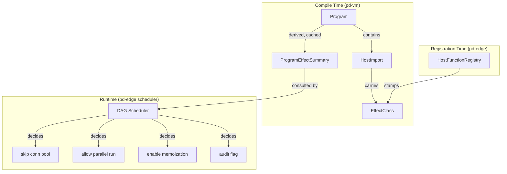

# Effect Metadata for Host Imports

## Motivation

pd-edge scripts are currently opaque to the host. The DAG scheduler cannot distinguish a read-only
header-inspection script from one that initiates upstream connections and mutates the response. This
forces worst-case assumptions everywhere: every script gets a full VM setup, a connection pool
handle, an async bridge, and a deep-cloned fork.

A lightweight effect metadata system, layered onto the existing host import model, would let the
host answer questions like:

- Is this script pure? (memoize, cache, run speculatively)
- Does it touch upstream? (skip connection pool setup if not)
- Is it read-only? (run multiple read-only scripts concurrently)
- Does it do I/O? (audit, reject in production)

The key insight is that pd-vm already has the right structure for this: every side effect flows
through a `Call` opcode into a host function. Effect metadata tags those call targets and propagates
a summary to the program level. No bytecode changes, no interpreter changes, no execution model
changes.

## Design

### Effect Classes

A bitflag set attached to each host import:

```rust
bitflags::bitflags! {
    pub struct EffectClass: u8 {
        const PURE       = 0b0000_0000;
        const READ_CTX   = 0b0000_0001; // reads request/connection context
        const WRITE_CTX  = 0b0000_0010; // mutates headers, sets response body
        const NETWORK    = 0b0000_0100; // upstream connect, DNS lookup
        const IO         = 0b0000_1000; // filesystem, child process
    }
}
```

These are intentionally coarse. The goal is host-level scheduling decisions, not a full effect
system. Finer granularity (e.g., separating "read request header" from "read response header") can
be added later by widening the bitflag without breaking the model.

### Where It Lives



### Data Model Changes

#### `HostImport` (pd-vm bytecode)

```diff
 pub struct HostImport {
     pub name: String,
     pub arity: u8,
+    pub effects: EffectClass,
 }
```

Default is `EffectClass::PURE` for backward compatibility. Existing programs that don't carry
effect metadata behave exactly as before.

#### `HostFunctionRegistry` (pd-vm host binding)

Registration methods gain an optional effect annotation:

```rust
registry.register_static("http::get_header", 1, get_header_fn)
    .with_effects(EffectClass::READ_CTX);

registry.register_static("http::set_response_body", 2, set_body_fn)
    .with_effects(EffectClass::WRITE_CTX);

registry.register_static("http::upstream_request", 1, upstream_fn)
    .with_effects(EffectClass::NETWORK);
```

Unannotated registrations default to `PURE`. This is safe because a missing annotation just means
the host won't optimize around that call — it's a conservative default for scheduling purposes.

Builtin functions registered in `src/builtins/` can carry effect annotations directly:

| Builtin Namespace | Default Effect |
| --- | --- |
| `string::*`, `array::*`, `map::*`, `json::*`, `math::*` | `PURE` |
| `io::*` | `IO` |
| `print` | `IO` (or a separate `CONSOLE` if desired) |

#### `ProgramEffectSummary` (derived, cacheable)

Computed once per program (or lazily on first query), cached alongside `program_cache_key`:

```rust
pub struct ProgramEffectSummary {
    /// Union of all effects reachable from this program's call sites
    pub effects: EffectClass,
    /// Per call-site detail: (bytecode offset, import index, effect class)
    pub call_sites: Vec<CallSiteEffect>,
}

pub struct CallSiteEffect {
    pub offset: usize,
    pub import_index: u16,
    pub effects: EffectClass,
}
```

Computation is a single linear scan of the bytecode:

```
for each Call opcode at offset `ip`:
    import_index = read_u16(code, ip + 1)
    effect = program.imports[import_index].effects
    summary.effects |= effect
    summary.call_sites.push(CallSiteEffect { offset: ip, import_index, effect })
```

This runs in `O(n)` over bytecode length and produces a fixed-size summary.

### Host-Side Usage (pd-edge)

The DAG scheduler queries the summary before running a script:

```rust
let fx = script.effect_summary().effects;

// Pure scripts: memoizable, speculatively executable, zero-cost fork
if fx == EffectClass::PURE {
    if let Some(cached) = memo_cache.get(&script_input_hash) {
        return cached.clone();
    }
}

// No network: skip connection pool allocation
if !fx.contains(EffectClass::NETWORK) {
    vm_config.skip_connection_pool = true;
}

// Read-only: safe to run concurrently with other read-only scripts
if !fx.contains(EffectClass::WRITE_CTX) {
    scheduler.mark_parallelizable(script_id);
}

// I/O scripts: audit log in production
if fx.contains(EffectClass::IO) {
    audit_log.record(script_id, "uses filesystem/process I/O");
}
```

### Fork-Point Optimization

Combined with the fork-friendly VM design (owned `Value` clones, copy-capture closures, `Arc<Program>`):

| Script Effect Profile | Fork Strategy |
| --- | --- |
| `PURE` | No fork needed — memoize result |
| `READ_CTX` only | Shallow fork: clone locals, share everything else |
| `READ_CTX \| WRITE_CTX` | Standard fork: clone locals + stack |
| `... \| NETWORK` | Full fork: clone state + allocate connection pool handle |
| `... \| IO` | Full fork + audit trail |

## Implementation Plan

### Phase 1: Core Data Model

**Goal:** `EffectClass` exists, `HostImport` carries it, summary is computable.

1. Add `EffectClass` bitflags type under `src/bytecode/` (or a new `src/effects.rs`).
2. Add `effects: EffectClass` field to `HostImport` with a `PURE` default.
3. Add `ProgramEffectSummary` struct and a `Program::effect_summary()` method that performs the
   linear bytecode scan.
4. Cache the summary alongside `program_cache_key` (lazy, computed on first access).
5. Tag all existing builtins in `src/builtins/runtime/` with appropriate effect classes.

Effort: ~200-300 lines new. Low risk — purely additive, no existing behavior changes.

### Phase 2: Registry Propagation

**Goal:** `HostFunctionRegistry` stamps effect metadata onto host functions, and `bind_vm_cached`
propagates effects into `HostImport` during binding.

1. Add `effects: EffectClass` to `RegistryEntry`.
2. Add `.with_effects()` builder method to registration calls.
3. During `bind_vm_cached` / `bind_vm_with_plan`, verify effect annotations match between registry
   and program imports (or stamp them if the program doesn't carry its own).
4. Update `HostBindingPlan` to include effect data so it survives plan caching.

Effort: ~150-250 lines changed. Low risk — extends existing binding machinery.

### Phase 3: pd-edge Integration

**Goal:** The DAG scheduler uses effect summaries for real scheduling decisions.

1. Query `ProgramEffectSummary` in the HTTP request path before VM execution.
2. Implement skip-connection-pool optimization for non-`NETWORK` scripts.
3. Implement parallel-execution for `READ_CTX`-only scripts on the same request.
4. Add audit logging for `IO`-bearing scripts in production mode.
5. Implement memoization cache for `PURE` scripts keyed on input hash.

Effort: ~300-500 lines in pd-edge. Medium risk — scheduling changes require careful testing.

### Phase 4: Compile-Time Propagation (Optional)

**Goal:** The compiler propagates effect annotations through the IR so user-defined helper
functions inherit their callees' effects.

This phase matters only if the language supports user-defined functions that wrap host calls. For
flat scripts where every call is directly to a host import, Phase 1-3 is sufficient.

1. Add effect inference to the compiler IR: union callee effects at each call site.
2. Emit per-function effect summaries into the program metadata.
3. Support cross-function effect queries for whole-program analysis.

Effort: ~400-600 lines in pd-vm compiler. Medium-high complexity.

## Effort Summary

| Phase | Lines Changed/New | Difficulty | Dependencies |
| --- | ---: | --- | --- |
| Core data model | 200-300 | Low | None |
| Registry propagation | 150-250 | Low | Phase 1 |
| pd-edge integration | 300-500 | Medium | Phase 2 |
| Compile-time propagation | 400-600 | Medium-High | Phase 1 |
| **Total (Phases 1-3)** | **650-1050** | | |
| **Total (all phases)** | **1050-1650** | | |

## What This Does NOT Change

- **Bytecode format**: `Call` opcode unchanged. Effect metadata is on `HostImport`, not in the
  instruction stream.
- **Interpreter loop**: zero changes. The interpreter never reads effect metadata.
- **JIT / AOT**: unaffected. Effect metadata is a host-side scheduling concern.
- **Value model**: still owned clones, still fork-friendly.
- **Host function dispatch**: same `VmHostFunction` enum, same call path, same ABI.
- **Existing scripts**: default `PURE` annotation preserves backward compatibility.

## Risks and Mitigations

| Risk | Mitigation |
| --- | --- |
| Effect annotations are wrong (e.g., a host fn tagged `PURE` that actually does I/O) | Annotations are set by the host, not guessed. Wrong tags cause incorrect scheduling, not crashes. Add a debug mode that validates annotations against actual runtime behavior. |
| Granularity too coarse for useful optimization | Start coarse, widen the bitflag later. 4-5 bits is enough for the scheduling decisions pd-edge actually needs today. |
| Phase 4 complexity (cross-function inference) | Defer until user-defined function calls are common. For flat scripts, per-import annotations are sufficient. |
| `HostImport` size increase | One byte per import. Negligible. |
